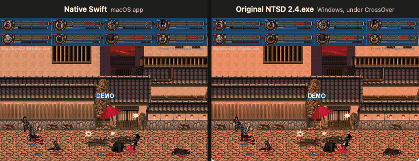

# NTSD 2.4 for macOS

A native Swift port of **Naruto: The Setting Dawn 2.4**, the fan game built on
*Little Fighter 2*. It is not an emulator and not Wine: the game logic of the
original Windows `NTSD 2.4.exe` has been rebuilt from the executable and checked
against it piece by piece. That covers data loading, the tick loop, physics,
combat, computer AI, menus, recordings, drawing and sound.

<p align="center">
  
</p>

<p align="center"><sub>
<b>The same Demo match, tick for tick.</b> Left: the native Swift app. Right: the original
<code>NTSD 2.4.exe</code> running under CrossOver. Both start from the same random table. At every frame
shown (every third tick, ticks 603–837) the game's random index and counter are identical in the two programs.<br>
<a href="docs/media/demo-side-by-side.mp4">Full 24-second video</a> ·
<a href="docs/media/demo-tick-600.png">still at tick 600</a> ·
<a href="docs/evidence/readme-demo-frames.json">frame-by-frame log</a>
</sub></p>

## What you get

- **All game modes.** VS, Mission (Stage), Tournament, Team Tournament, War,
  Demo and Playback Recording, with the original menus, selection screens,
  HUD, Summary and Stage ENDING.
- **The whole roster.** All 25 playable characters, 17 backgrounds and all 25
  stages / 138 phases of the distribution's `stage.dat`.
- **Recordings that travel.** `.lfr` files recorded on the Mac play in the
  original, and the original's recordings play on the Mac, with the same result.
- **The original's look and sound.** Its own bitmaps, palette, bitmap fonts,
  WAV effects and music, at the original's 30 ticks per second. Alt+Enter
  behaves as in the original.

## How we know it plays the same

The original runs next to the port as a reference. That happens in two places:
inside a [Unicorn](https://www.unicorn-engine.org/) emulator for single
functions, and as the real game under CrossOver for whole matches. In the
whole-match checks, both programs play the same recording, and the Summary
values (Kill, Attack, HP Lost, MP Usage, Picking, status, time, War totals)
are read from the memory of each.

| Check against the original | Result |
| --- | --- |
| Whole matches, recorded on the Mac and played in the original | 42 random matches across VS, Stage and War, plus 11 earlier ones: all equal |
| Whole matches, recorded by the original and played on the Mac | 5 of 5 equal (1 to 7 computer players) |
| Characters and backgrounds | all 25 characters and all 17 backgrounds took part in an equal match |
| Difficulty | Easy, Normal and Difficult with eight fighters |
| War | 4 troop setups, the longest 35,272 ticks; random state equal at every sampled tick |
| Stage | the first phase of every stage group, 1-1 to 5-1 |
| Demo (above) | random index and counter equal at every third tick from 150 to 879 |
| Game code of the EXE | 157 of 174 functions (92.4% of the instructions) have reference cases run against the original; 51.4% of the instructions are recorded as executed in them ([measurement](docs/research/EXE_COVERAGE_2026-10-02.md)) |

Details are in the [cross-check matrix](docs/research/CROSSPLAY_MATRIX.md), the
[evidence files](docs/evidence/) and the research cards under
[docs/research](docs/research/).

### Known differences

- **Text drawn by Windows GDI** (a few menu labels) uses the macOS system font
  instead of the Windows `SYSTEM_FONT`. Position, size and colour are kept.
- **Demo music** uses a declared stand-in for the track the original picks
  from a stray register value.
- **Not yet checked against the original:**
  - whole Tournament brackets;
  - Stage beyond the first phase of each group;
  - the hidden *CRAZY!* difficulty;
  - online play, which is still in progress.

## Build and run

You need macOS 14 or later, Xcode (its Swift toolchain), Python 3 and Git LFS.
The original distribution under `downloads/` is stored in LFS.

```sh
git lfs pull
./run-native.sh            # builds "build/NTSD Native.app" on first use, then starts it
./run-native.sh --build    # rebuild
```

The app opens the original game directly. Controls are the original's own; you
can change them in its CONTROL SETTINGS screen.

## Repository

| Path | Contents |
| --- | --- |
| `native/Sources/NTSDCore` | the ported game: state layout, catalog loader, tick, physics, combat, AI, menus, recordings |
| `native/Sources/NTSDMacPlatform` | macOS stand-ins for the Windows services the EXE uses (window, DirectDraw, sound, input, files, clock) |
| `native/Sources/NTSDApp` | the app, with options for scripted, reproducible runs (`--script`, `--virtual-clock`, `--summary-json`, …) |
| `native/Tests` | unit and reference tests |
| `tools/` | importers, Unicorn oracles, end-to-end runs (`app_e2e.py`) |
| `tools/crossover_drive` | drivers for the original under CrossOver: playback, recording, Summary from memory, per-tick traces |
| `docs/` | [plan](PLAN.md), [goal and status](docs/GOAL_100.md), research cards, evidence, [research log](docs/RESEARCH_LOG.md) |

### Reproducing the clip

1. **Mac.** Run the app's Demo with the frame dump. The exact command is in
   the [frame log](docs/evidence/readme-demo-frames.json): `--virtual-clock 777 8`,
   `--body-captures`, `--body-capture-every 3`, `--network-trace`.
2. **Original.** Capture its frames at the same ticks with
   `tools/crossover_drive/demo_frames.py`. It writes the Mac's random table and
   phase counter into the original through `winedbg`. It then stops the game at
   each tick with a conditional breakpoint and captures the window.
3. **Assemble.** `tools/readme_media/make_demo_gif.py MAC_DIR ORIG_DIR 603 3 837 out.gif 420`.

## Credits

*Naruto: The Setting Dawn* is a fan game by its own authors, built on
*Little Fighter 2* by Marti Wong and Starsky Wong. This repository is a
research and preservation port. The game's content belongs to its authors.
