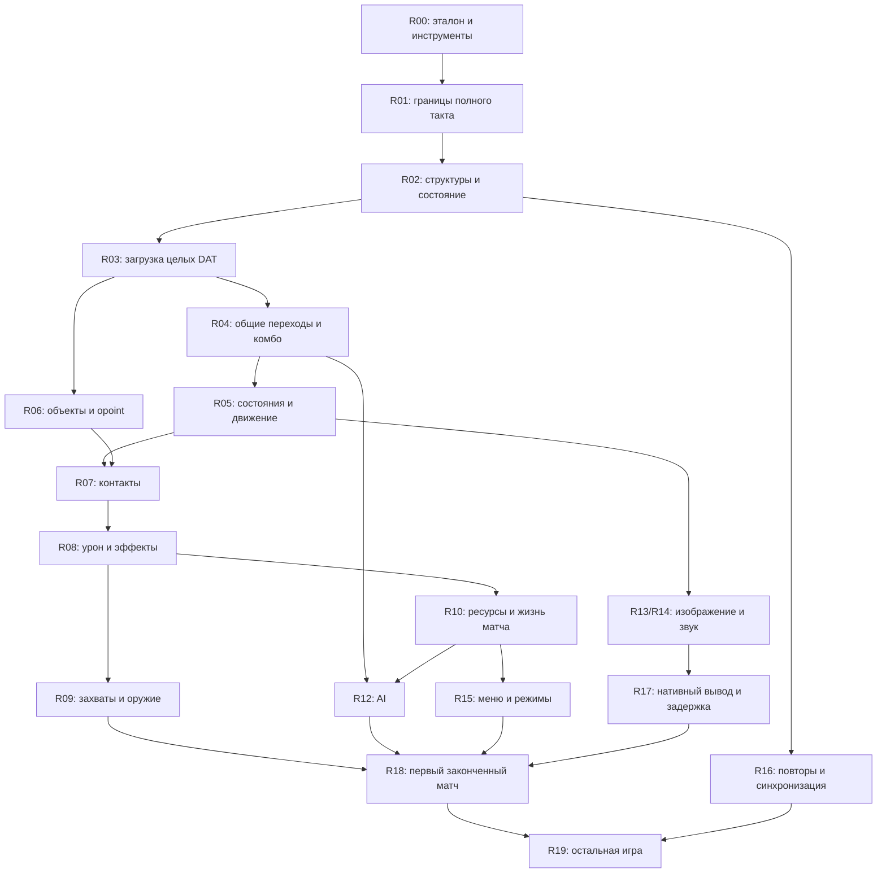

# Карта исследования и переноса NTSD 2.4

Дата исходного среза: 2026-09-07. Код этого среза: `a9f2cfe`, приложение 0.4.0.
Это рабочая очередь исследования **механизмов оригинального движка**.
Продуктовые цели находятся в [PLAN.md](../PLAN.md), адреса — в
[ADDRESS_BOOK.md](research/ADDRESS_BOOK.md).

**Следующая задача: [R02.1 — состояние полного такта](research/R02.1.md).**
Она начата: [конструкторы, словарь и сырой снимок](research/STATE_LAYOUT.md).
Также перенесён [загрузочный пул](research/BOOTSTRAP.md) и найдены основные
области каталога. [Родитель каталога](research/CATALOG_REGISTRY.md) перенесён с
непрозрачными дочерними загрузчиками. [Object loader](research/OBJECT_LOADER.md)
теперь проверен отдельно на трёх исходных файлах и контрольном потоке.
[BG loader](research/BACKGROUND_LOADER.md) перенесён для всех 17 исходных арен
с отдельной загрузкой/выгрузкой слоёв. [Stage loader](research/STAGE_LOADER.md)
теперь также перенесён: весь исходный stage.dat, 25 стадий / 138 фаз, все байты
60 записей. [MSVCR80](research/CRT_SCANNER.md) теперь подтвердил целочисленное
переполнение и потребление знака; правило перенесено в общий сканер. Исследовательский
проход выполнил все 137 Object в исходном порядке. [Сырые Frame](research/RAW_FRAME_STORAGE.md),
перекрытия имени/указателя/индекса и десятый лист теперь перенесены: весь реестр
совпал с Swift, включая маски и старые выделения памяти.
[Совместный каталог](research/LOADED_CATALOG.md) теперь выполняет родителя с
настоящими Object/BG/Stage/bitmap/sound children. Весь исходный реестр при
text/a5 и raw/00, а также чередование/повторные ID совпали с Native Core по
полным записям/маскам и общей сумме/звукам при каждом дочернем возврате.
[Общая подготовка матча](research/MATCH_PREPARATION.md) теперь соединяет этот
каталог с World/400 Actor и участком `42d1ff..42d6ed`: 50 случаев совпали с Swift,
включая RNG, позиции, перезапуски, слои арен и сброс ввода. Входы меню/RNG пока
заданы явно. [Создание буфера повтора](research/REPLAY_INITIALIZATION.md) теперь
также перенесено: весь `43d2c0` через настоящий вызов меню, 50 целых буферов,
включая сброс счётчика RNG перед дальнейшим запуском.
[Пролог подтверждённого запуска](research/MATCH_PRELUDE.md) теперь также
сравнивается в цепочке до `42d704`: 50 случаев, режим/Stage-сбросы, имя повтора,
реальный VC80 sprintf, звуковой helper и очистка поверхности до device boundary.
[Продолжение меню](research/MATCH_CONTINUATION.md) теперь проверено до настоящего
`ret 12`: 222 возврата, общий подбор персонажей, все 30 схем команд в ветви
`450c2c==1`, команды 1–5 и полные записи/маски.
[Завершение меню](research/MENU_PRESENTATION.md) продолжает восстановленные
CRT initialization и главные пункты меню через настоящий ret4 и следующий
вызов World=1→2. Совпали1482 возврата,66 переходов,177955008 байт/масок,
5382 события и184 actual CRT formats; затем50 полных подготовок/записей.
Общий tail/volume/overlay/present/shutdown перенесён до платформенных границ.
Далее — остальные экраны/входы/ресурсы, ветвь World2 к429730, жизненный цикл
CRT, оставшиеся типы и широкий такт. Эта основа ещё не подключена к Practice.
[Непрерывная первая загрузка](research/INITIAL_LOADING.md) теперь соединяет
41bc90..41c581:36 common/800 registry WAVs,274 Objects,816 Actor/20 UI
constructors в двух полных исходных проходах. Совпали362760002 bytes/masks;
phase/pause, существующий sound-cache backing,4231 progress calls на проход
и настоящий44d05c=0 получены без подстановки загруженного состояния. Далее
41c581/419a60→429730, animated loading и остальные platform/menu inputs.
[Локальный ввод](research/LOCAL_INPUT.md) продолжает настоящую первую загрузку
до41c5e5:606 случаев/601 ret12,567956264 bytes/masks. Проверены keyboard/
joystick, phase/status/packing и запросы хвоста по всем137 исходным Object;
тела AI/object children остаются явными границами. Далее phase0 network/hotkeys,
remote/replay и пауза/меню к429730. OS polling и окно Practice ещё не соединены.
[Применение полученных команд](research/RECEIVED_INPUT.md) теперь проверяет
4198f0/4197a0 и caller41d469:1452 случая,757 remote/710 playback returns,
1373541288 bytes/masks. Совпали status−1 remote, все восемь playback, сырые
previous, phase0 current, полный байт записи и порядок повторных Actor-ссылок.
Основной первый phase1 путь непрерывен от загрузки; первый phase0 control
начинает с явно предоставленной41d469. Network/hotkeys, источник playback
packet, checksum/recording и пауза/меню к429730 остаются открытыми.
[Горячие клавиши и обмен](research/INPUT_CONTROL.md) теперь перенесены:
5 986 случаев после двух заново исполненных полных загрузок совпали с Swift.
Проверены общие helpers, оба порядка send/receive, проверки пакета, shared
shutdown и восстановление настроек после повтора. Первый phase0 путь теперь
также непрерывен от загрузки до received-input continuation. Реальная сеть,
playback startup, источник пакета/запись и дальнейший полный такт остаются открытыми.
[Команды и запись повтора](research/REPLAY_TICK.md) теперь продолжают этот путь
до41d714: 2 268 случаев, 630 чтений/1 026 записей пакета, 1 224 операции
контрольной суммы и 614 связанных цепочек ввода совпали с Swift. Перенесены
очистка обоих command buffers, источник43dc50, запись43db40, checksum error
и счётчик с исходным порядком операций/перекрытиями. Оба исходных родителя
заново воспроизведены; старая загрузка/local/control по-прежнему проверяются.
Продолжение после41d714 описано ниже. Ранний playback prefix/camera, файловый
жизненный цикл, Practice и W ещё открыты.
[Исход раунда](research/MATCH_ROUND.md) теперь переносит общий обработчик
после41d714 до выходов41e339/4229cc/422a95: 4 148 случаев после двух свежих
loading/input/replay цепочек совпали с Swift, включая90 настоящих конструкторов.
Проверены живые команды всех400 мест, таймеры80/145/350, подтверждение,
восстановление по исходному каталогу и оригинальное исключениеID50→6.
Паузная ветвь пока заканчивается перед отрисовкой41d73b. Далее нужны её
настоящие render helpers, menu4229cc→429730 и игровые проходы после41e339.
[Включённая музыка](research/MUSIC_PLAYBACK.md) теперь продолжает основной
4229cc→429730 через настоящий402020 до4297ae:748 случаев после двух свежих
loading/input/replay/round родителей совпали с Swift. Проверены2 450 helper
returns,11 912 событий,438 allocation requests и438 actual CRT formats.
Music44d010 остаётся1; control menu entry явно предоставлен после паузной
остановки. Shared release/volume используются прежним меню;14 старых fixtures
сохраняются. Музыкальный вывод/Windows ещё не проверены.
[Ресурсы меню](research/MENU_RESOURCES.md) теперь продолжают4297ae..429e5a:
374 случая после свежих loading/input/round/music родителей совпали с Swift.
Проверены2098 настоящих43ee50,3376 checkpoints,8936 событий, все11 global
stores и частичная SPARK-разметка. Старые wrappers и нетронутые bytes/masks
сохраняются;12 null-SPARK проб останавливаются перед разыменованием. Все16
прежних fixtures неизменны. Далее настоящий dispatch429e5a/431d10, паузный
вывод и gameplay; пиксели, Practice и Windows ещё открыты.
[Общий bitmap draw](research/BITMAP_DRAWING.md) отдельно переносит всё тело
43f010/43ef70 до Blt/ret24:3971 случай,3330 clip returns и2297 Blt совпали
с Swift. Сохранены отрицательные/wrapped индексы,198 двойных рисований,
чтения untouched backing и20 invalid-access boundaries. Это изолированный
корпус с явными входами; непрерывный menu caller, ранние ресурсы и пиксели
ещё не проверены.
[Ранние ресурсы меню](research/FRONT_MENU_RESOURCES.md) теперь отдельно
продолжают настоящий World constructor и4246b0 до вызова настроек423480:
290 случаев,4090 реальных43ee50 и995170 записей родителя совпали с Swift.
Проверены24 wrappers/23 DIB,151 буквальный UI rectangle и шесть256-glyph таблиц,
частичные записи имён, null/error branches и сохранение старых выделений.
Все19 прежних fixtures неизменны. Следом нужны423480/сброс44d068 и ранний
экран, затем соединение с прежним loading/menu; пиксели и Windows открыты.
[Настройки](research/SETTINGS_LOADING.md) теперь продолжают оба свежих ранних
родителя через423480 и настоящие VC80 fscanf/fgets/feof на том же CPU/стеке
до42709b.188 случаев совпали с Swift, включая повтор последней строки при EOF,
перекрытия имён, сохранение старых данных и зависимость427092 от caller EBX.
Файловые/потоковые границы объявлены явно; все21 прежних fixtures неизменны.
Следом ранний экран42709b, фон423840 и настоящий bitmap caller42710f.
[Первый рисунок раннего экрана](research/FRONT_SCREEN_PRELUDE.md) теперь
продолжает свежие World/resources/settings до427127/4275cb на том же CPU/стеке.
356 случаев совпали с native:13 фонов,64 новых конструктора/66 actual sprintf,
354 заливки/474 bitmap Blt,26 thread requests и6 invalid-access boundaries.
Сохранены untouched bitmap/FX bytes и порядок запросов; все23 прежних fixtures
неизменны, старые settings source corpora воспроизведены целиком.
Следом4236d0 и тело раннего экрана; worker, реальный вывод и Windows открыты.
[Данные информационной панели](research/MENU_CONTENT.md) теперь переносят весь
43c780 отдельно:704 случая с actual VC80 sprintf/fgets/sscanf совпали с native.
Проверены24 ba/8 ta/un/y/end, сохранение частичных полей и1104-byte scratch,
6 границ без NUL; исходные ad0/ad1 отсутствуют, успешные входы контрольные.
Следом43cc60/43c690/43c710, затем соединение всего4236d0 с настоящим427127.
Старые25 fixtures неизменны; этот helper ещё не подключён к приложению.
[Bitmap информационной панели](research/MENU_PANEL_BITMAP.md) теперь переносит
весь43cc60 отдельно:118 случаев,102 constructors/100 destructors, fixed11-frame
atlas и44 повторные выдачи адреса совпали с native. Сохранены все live/dead
поколения и порядок освобождения/создания; исходные ad0/ad1 остаются отсутствующими.
Старые27 fixtures неизменны. Следом43c690/43c710, затем весь4236d0 через427127;
этот участок ещё не соединён с родителем или оконным интерфейсом.
[Запись настроек панели](research/MENU_INFO_WRITING.md) теперь переносит оба
43c690/43c710 отдельно:534 случая,1068 sprintf/518 fprintf/518 fclose,
2618 низкоуровневых writes/148 short/error совпали с native. Сохранены defaults
после failed open, FILE/buffer state и остаток после failed flush. Все29 прежних
fixtures неизменны; user-buffered FILE/descriptor IO — явные границы.
[Обновление панели целиком](research/MENU_PANEL_UPDATE.md) теперь соединяет
все четыре helper во всём4236d0 через настоящий427127 после свежего раннего
parent, с возвратом42712c.266 случаев совпали с native:828 child returns,
94 constructors/92 destructors,43156 records/734441674 bytes/masks. Проверены
signed version/toggle, сохранение старой даты при fallback, defaults затем cache,
все live/dead поколения и две остановки до unsupported scanf без Leave.
Старые31 fixtures неизменны; прежние content/bitmap source corpora воспроизведены
целиком. Следом тело42712c и альтернативы4275cb, затем соединение с поздним меню
и загрузкой. Worker, реальный вывод и Windows ещё открыты.
[Тело раннего экрана](research/FRONT_SCREEN_BODY.md) теперь продолжает свежий
parent через42712c..4275cb с настоящими text/sound/bitmap children.1142 случая,
8650 helper returns и180886 ordered events совпали с native. Перенесены исходные
строки/подсветка/ссылки, кнопка панели, shared GDI-text helper и полный bitmap
clipping. Сохранены192 caller local bytes/masks, World и25 ранних bitmap.
Старые33 pinned fixtures неизменны; две null-text остановки оставляют частичное
состояние. Selector−3/−1 продолжены отдельным исследованием ниже; соединение
main-menu/tail, реальный вывод, оконное меню и Windows открыты.
[Сохранение настроек](research/SETTINGS_WRITING.md) теперь переносит весь423230
отдельно:452 случая с actual VC80 fprintf/fclose совпали с native. Сохранены
перекрывающиеся имена, временное кодирование/восстановление, defaults и порядок
вывода44 чисел/metadata. Первый файл совпадает с исходным control.txt после
заявленной text translation. Исправлен общий printf: после ошибки sign prefix
оригинал может продолжить digits и вернуть положительный count. Прежние
menu-info/panel проверки проходят с тем же механизмом. Восемь null-FILE и две
no-NUL остановки остаются явными границами. Его настоящие menu callers
продолжены ниже; реальный file IO/Windows ещё открыты.
[Альтернативы раннего экрана](research/FRONT_SCREEN_ALTERNATE.md) теперь исполняют
4275cb..42790f вместе с настоящими bitmap/clip/sound/fill/worker-gate children
и writer423230 в обоих callers.1066 случаев/6842 helper returns совпали с native,
включая164 settings calls,148 возвратов и7992 actual fprintf. Сохранены signed
анимация/remainder, unsigned timer delta>150, hitboxes и порядок кликов; World,
25 bitmap, caller stack и полные writer snapshots. Общий worker gate используется
также prefix.24 остановки до null bitmap/fill/FILE сохраняют частичное состояние.
Далее соединить эти живые ранние ресурсы с427915/main-menu и42873e/tail до полного
возврата экрана. Меню приложения, реальный вывод, worker и Windows ещё открыты.
[Возврат раннего меню](research/FRONT_MENU_COMPLETION.md) теперь соединяет
свежий startup/body/dispatch с427915 и42873e до настоящего ret4.806 возвратов,
6996 helper returns,234000 actual DLL rand и395787072 bytes/masks совпали
с native. Все bitmap/clip children исполняются с25 ранними ресурсами; сохранены
network error exits, overlay/volume/present/shutdown и2 полных World1→2 с
освобождением настоящего фона. Общий MainMenu теперь принимает World/globals
без зависимости от загруженного match catalog; старый API делегирует ему.
Повторные полные screen iterations, остальные selectors, World2→41bc90 и
связь с приложением/Windows остаются открытыми.
[Повторные ранние вызовы](research/FRONT_MENU_LOOP.md) теперь соединяют
собственные результаты свежего первого ret4 с последующими полными4246b0.
238 вызовов/1094 фаз совпали с native:228 ret4,8 selector/FILE boundaries и2
настоящих входа41bc90. Внутренние PC/register inputs больше не подставляются;
нативный dispatcher сам выбирает prefix/update/body/alternate/main/tail.
Проверены последовательные настройки/анимация/waiting/clicks,30000 actual rand,
3945 helpers/24951 событий и376899720 bytes/masks. Ресурсы и CRT сохраняются;
новый фон и последующее освобождение используют общую ownership memory.
Следом соединить World2 с настоящим loading/catalog/input, затем остальные
selectors и приложение. Worker/status2 children в повторном потоке, вывод и W открыты.
[Загрузка от раннего меню](research/MENU_LOADING.md) теперь продолжает этот
же World2 через настоящий424741/41bc90 до41c581. Оба прохода собственного
раннего состояния совпали с native:36 common/800 registry WAVs,274 Objects,
816 Actor/20 UI constructors;363365426 bytes/masks после меню. Настоящий
MENU_WAIT использует ранний wrapper; все старые bitmap и CRT сохраняются.
Стек, регистры, World и globals не заменяются при подключении загрузочного
наблюдателя. Следом продолжить это объединённое состояние через input/round/menu
после41c581; animated loading, остальные selectors, приложение и W открыты.
[Продолжение собственного startup](research/MENU_STARTUP.md) теперь соединяет
41c581→local/control/received/replay/round→4229cc/429730→music→429e5a.
Оба ранних World продолжаются без новых game-state stimuli; оба natural пути
phase1/pause0. Совпали44 checkpoint,136 events,6824 records/11897268 bytes+masks,
2 local/2 received ret12,10 music helpers и22 bitmap constructors. Все ранние
wrappers/CRT сохранены; искусственных replay buffers нет. Следом — настоящий
dispatch429e5a и431d10 с уже существующими ранними и character-menu ресурсами.
Выбор персонажей, остальные пути такта, приложение и Windows ещё открыты.
[Общий ввод и выбор режима](research/MODE_SELECTION.md) отдельно переносят
431b70 и4322ad..4328f8 с настоящими sound/background/device releases:
2690 случаев,40350 records/176765280 bytes+masks совпали с native. Сохранены
приоритеты восьми мест, удержание/alias, signed navigation, исходный Quit и
46 границ перед playback.431d10 — экран режимов, предшествующий выбору персонажей.
Следом весь этот экран из собственного429e5a с рисованием/panel/help/tail;
данный самостоятельный корпус не подменяет собственный startup.
R01.1 завершена как исследование обычного пути: [порядок стадий](research/TICK_PIPELINE.md),
[пропуски переноса](research/TICK_GAPS.md). Это не завершение переноса R01.
Далее: R03.1 → R01.2 (широкий эталон), R04.1 → R06.1. Условия перехода ниже.

## Эталон и архитектурное правило

Единственный поведенческий эталон:
`downloads/NTSD_2.4_2.0a_clean/NTSD 2.4_2.0a/NTSD 2.4.exe`.
SHA-256: `3f7ac67c5890ef979ee24a6dae5528056e7f631725c292cf9cb0a928ebeff71c`.

Целевая реализация: общий нативный движок, читающий исходные DAT/BMP/WAV,
с сохранением исключений, действительно обнаруженных в EXE. Поддержка нового
персонажа, использующего уже перенесённые правила, не должна требовать изменения
Swift-кода. Имена персонажей и названия техник не являются единицами переноса.
Наруто, Саске и другие исходные объекты служат примерами и проверками правил.

Важны три разных основания для условий в коде:

| Основание | Пример | Как с ним работать |
| --- | --- | --- |
| Общее правило EXE | `state`, `itr.kind`, `effect`, переход по `hit_Fa`, стоимость `mp` | Переносить общий обработчик с исходным порядком операций |
| Исключение EXE | Проверка ID 224 при отрисовке тени | Записать адрес, контекст и условия; сохранить правило, добавить проверку |
| Ограничение прототипа | `name == "Sasuke" && target == 261`, список двух снарядов | Отмечать как границу доступной реализации; заменять проверкой поддержанных механизмов по мере переноса |

Ограничения прототипа нельзя просто удалить: ранее недоступные кадры могут
требовать ещё не перенесённых правил. Неподдержанный механизм должен иметь
явную диагностику; откат всего такта сохраняется. Исходные данные не исправляем
ради обхода ошибки. Общий обработчик также сохраняет особые номера состояний
и кадров, если они являются правилами самого EXE.

## Как читать прогресс

Для каждого блока учитываются отдельно:

- **Разбор:** неизвестно → найдены адреса → описан ограниченный участок → описан
  весь объявленный объём. Одна инструкция сравнения ID не раскрывает всю ветку.
- **Перенос:** нет → ограниченная реализация → общий обработчик объявленного объёма.
- **Проверка:** S — статическое наблюдение; D — сравнение с выполнением оригинальных
  инструкций; W — воспроизводимая проверка целой игры в Windows. D относится только
  к перечисленным входам, полям и границам стенда. W пока отсутствует.

«Закрыто» означает выполнение критериев конкретной карточки. Если закрывается
узкий участок, остальная работа остаётся отдельной открытой карточкой. Наличие
Swift-кода, число кадров или количество совпавших тактов не дают процент готовности
полной игры. Расширение корпуса не меняет статус непроверенных ветвей.

## Существующая опора

Ниже перечислены принятые результаты. Полные числа игровых корпусов относятся
к прежним этапам; регрессия `swift test` повторно проверена вместе с R02.1.
Широкие трассы выполняют исходный EXE, без сравнения полного пути с Swift.
Корпуса пересекаются: числа **не суммируются**.

| Проверенная область | Принятый результат | Доказательство / граница |
| --- | --- | --- |
| Идентичность EXE и ресурсы | PE32; 163 импорта; извлечены 64 bitmap-ресурса | [ORIGINAL_ENGINE.md](ORIGINAL_ENGINE.md) |
| Расшифровка DAT | Побайтное совпадение четырёх файлов | [decoder-oracle.json](evidence/decoder-oracle.json) |
| Секции кадров | 15 044 исходных определения + 12 контрольных примеров | [FRAME_LOADER.md](FRAME_LOADER.md), [frame-corpus-oracle.json](evidence/frame-corpus-oracle.json); не загрузка целых объектов |
| Движение | 8 506 тактов / 58 сценариев | [MOVEMENT.md](MOVEMENT.md), [movement-oracle.json](evidence/movement-oracle.json) |
| Ближний бой и RNG | 12 215 тактов / 524 сценария, включая движение; 6 500 вызовов RNG отдельно | [COMBAT.md](COMBAT.md), [combat-oracle.json](evidence/combat-oracle.json) |
| Конвейер с объектами | 16 685 тактов / 575 сценариев, включая предыдущие; новых 4 470 / 51 | [PROJECTILES.md](PROJECTILES.md), [projectiles-oracle.json](evidence/projectiles-oracle.json) |
| Внешний таймер и фон | 36 отсчётов таймера с заменённым диспетчером; 120 списков отрисовки District | [MOVEMENT.md](MOVEMENT.md), [original-presentation.json](../native/Tests/NTSDCoreTests/Fixtures/original-presentation.json); не задержка ввода и не пиксели Windows |
| Граница обычного матча R01.1 | S: четыре функции, тело матча 6 822 инструкции; D: 32 наблюдения / 29 вызовов матча, шесть случаев | [TICK_PIPELINE.md](research/TICK_PIPELINE.md), [tick-trace.json](evidence/tick-trace.json); синтетическая загрузка, границы ОС/графики, не полное состояние и не сравнение с Swift |
| Конструкторы Actor/World R02.1 | S/D: 16 случаев, 24 512 байт и масок совпали с Swift | [STATE_LAYOUT.md](research/STATE_LAYOUT.md), [state-constructors.json](evidence/state-constructors.json); не начальное состояние целого матча |
| Сырой снимок R02.1 | D: 38 снимков по 409 областей, шесть прежних случаев | [state-trace.json](evidence/state-trace.json), [globals](evidence/state-global-accesses.json); неизвестные байты сохранены, provenance и нормализация ещё неполны |
| Загрузочный пул R02.1 | D против Swift: 8 случаев / 16 точек, все 400 Actor и World; S основных областей каталога | [BOOTSTRAP.md](research/BOOTSTRAP.md), [bootstrap.json](evidence/bootstrap.json), [catalog-layout.json](evidence/catalog-layout.json); загрузка файлов и начало выбранного матча ещё открыты |
| Родитель каталога R02.1 | D против Swift: 12 случаев, 48 записей / 83 232 байта и маски, 3446 запросов; исходные 137 объектов / 17 фонов | [CATALOG_REGISTRY.md](research/CATALOG_REGISTRY.md), [catalog-registry.json](evidence/catalog-registry.json); дочерние загрузчики непрозрачны, CRT ограничен, не загруженный каталог |
| Целый Object R02.1/R03.1 | D против Swift: 3 исходных файла + контроль, 6 загрузок с явными stdio/device-вариантами; 308 688 байт/масок заголовков/bitmap, 1233 определения кадров, shared sound/checksum | [OBJECT_LOADER.md](research/OBJECT_LOADER.md), [object-loader.json](evidence/object-loader.json); настоящий CRT, raw Frame pointers/padding, полный каталог и W открыты |
| Загрузка и ресурсы BG R02.1/R03.1 | D против Swift: все 17 исходных арен, повторные load/release и контроль; 149 вызовов, 5 759 520 байт/масок BG/bitmap, checksum и порядок ресурсов | [BACKGROUND_LOADER.md](research/BACKGROUND_LOADER.md), [background-loader.json](evidence/background-loader.json); отдельные stdio/device-контракты, не меню/пиксели/W |
| Целый Stage R02.1/R03.1 | D против Swift: 25 исходных стадий / 138 фаз и контроль; 6 загрузок, 436 checkpoints, 796 целых записей/масок | [STAGE_LOADER.md](research/STAGE_LOADER.md), [stage-loader.json](evidence/stage-loader.json); полный участок из 60 Stage при EOF, CRT-границы, не игровой режим или W |
| Числовой сканер VC80 R03.1 | D против Swift: 5364 случая / 16092 исполнения, все 867 целочисленных токенов исходников; 4 целых Object с настоящим scanf | [CRT_SCANNER.md](research/CRT_SCANNER.md), [crt-integers.json](evidence/crt-integers.json), [object-loader-msvcr80.json](evidence/object-loader-msvcr80.json); DLL .6195, C locale, границы `_read`/TLS, не Windows startup |
| Весь исходный Object-реестр R03.1 | Исполнение EXE + VC80: 137 объектов, 15388 определений, 808 bitmap, 400 звуков | [object-registry-research.json](evidence/object-registry-research.json); **без нативного сравнения**: 38 кадров с непрозрачными указателями, десятый лист; родитель/BG/Stage ещё отдельно |
| Сырой Frame и нативный Object-реестр R02.1/R03.1 | D всех 137 исходных Object и двух контролей; 71006 полных Frame, 14598 аллокаций, 37036545 байт/масок | [RAW_FRAME_STORAGE.md](research/RAW_FRAME_STORAGE.md), [object-loader-raw.json](evidence/object-loader-raw.json); supplied malloc addresses, header refs normalized separately; родитель/BG/Stage не соединены, W открыт |
| Совместный каталог R02.1/R03.1 | D против Swift: два полных исходных реестра и контроль; 277 Object / 36 BG / 75 Stage, 306217431 байт/масок | [LOADED_CATALOG.md](research/LOADED_CATALOG.md), [loaded-catalog.json](evidence/loaded-catalog.json); настоящий parent/children/scanf, общие checksum/sounds и ресурсы; supplied allocator/file/device boundaries, не выбранный матч или W |
| Общая подготовка матча R02.1 | D против Swift: загруженный каталог → bootstrap → 50 последовательных подготовок; 52102 записи, 79596336 байт/масок, 720 RNG calls, 796 bitmap / 766 releases | [MATCH_PREPARATION.md](research/MATCH_PREPARATION.md), [a5](evidence/match-preparation.json), [ramp](evidence/match-preparation-ramp.json); menu/RNG inputs supplied, music disabled, остановка до replay init; не весь запуск/такт/W |
| Создание буфера повтора R02.1/R16 | D против Swift: 50 полных буферов / 324583600 байт/масок, 50 alloc/free; связанная подготовка — 77252 записи / 115486336 байт/масок | [REPLAY_INITIALIZATION.md](research/REPLAY_INITIALIZATION.md), [a5](evidence/replay-initialization.json), [ramp](evidence/replay-initialization-ramp.json); реальный caller и весь 43d2c0, RNG reset; metadata/allocator inputs supplied, не запись тактов/playback/W |
| Пролог запуска R02.1 | D против Swift: 50 цепочек пролог → подготовка → запись; 4614400 global bytes/масок пролога, 130 actual CRT calls, 60 sound methods, 10 fills | [MATCH_PRELUDE.md](research/MATCH_PRELUDE.md), [a5](evidence/match-prelude.json), [ramp](evidence/match-prelude-ramp.json); реальные 42cf8a..42d1ff/401a30/415160 и sprintf; supplied time/menu/device, не полный UI/звук/пиксели/W |
| Продолжение меню R02.1/R15 | D против Swift: 222 возврата, 225298 записей / 327834160 байт/масок, 1998 RNG, 544 конструктора, 960 bitmap; все 30 схем команд | [MATCH_CONTINUATION.md](research/MATCH_CONTINUATION.md), [a5](evidence/match-continuation.json), [ramp](evidence/match-continuation-ramp.json); реальные 42d704..42e0f9/ret12, state/candidates/call order; ранний ввод/музыка/Windows output открыты |
| Генерация таблицы RNG R02.1 | D против Swift: 50 таблиц, 40 seed, 176178 actual CRT draws/state, 4614400 global bytes/масок; затем 77124 записей подготовки и 50 полных буферов записи | [RANDOM_INITIALIZATION.md](research/RANDOM_INITIALIZATION.md), [a5](evidence/random-initialization.json), [ramp](evidence/random-initialization-ramp.json); PE/BSS → настоящий CRT/table → match/replay, без таблицы из повтора; timer/thread/intervening draws/menu supplied, не полный startup/W |
| Главные пункты меню и мышь R02.1/R15/R16 | D против Swift:1020probes/450mouse messages,139759680bytes/масок,4150events,250menu-generated tables,46CRT formats,14network error exits; затем50match/recording chains | [MAIN_MENU.md](research/MAIN_MENU.md), [a5](evidence/main-menu.json), [ramp](evidence/main-menu-ramp.json); настоящий WndProc ret16, все5пунктов и сетевой init/address selection; draw/OS/empty-panel boundaries, не полный menu loop/сеть/W |
| Завершение меню R02.1/R14/R15 | D против Swift:1482returns/66World1→2,177955008bytes/масок,5382events,184CRT formats,8frees/12quit requests; затем50match/recording chains | [MENU_PRESENTATION.md](research/MENU_PRESENTATION.md), [a5](evidence/menu-presentation.json), [ramp](evidence/menu-presentation-ramp.json); real tail/ret4 и dispatcher branch, volume/overlay/text/present/shutdown до COM/GDI/free/PostMessage; раньше экраны и контекст429730 supplied, не полный loop/вывод/W |
| WAV и первая загрузка общих звуков R02.1/R14 | D против Swift:409 исходных файлов/431 случаев,3 прохода/54 child loads,75829038 байт/масок,6982 события | [WAVE_LOADING.md](research/WAVE_LOADING.md), [wave-loader.json](evidence/wave-loader.json); настоящий4014e0 и caller41be98..41bfeb, full PCM/format/ownership/globals, MMIO/COM boundaries;44d05c остаётся1, остальной loading path и вывод/W открыты |
| Первые UI bitmap R02.1/R13/R15 | D против Swift:13 проходов,10 embedded DIBs,114 bitmap/5304 Actor constructors,5470 записей/13029720 байт/масок,519 событий | [INITIAL_INTERFACE.md](research/INITIAL_INTERFACE.md), [initial-interface.json](evidence/initial-interface.json); настоящий пул→10 bitmap→44d05c=0, allocation/device/key failures и whole storage/ABI; catalog[0]/frame/43ed10/COM supplied, не полный startup/пиксели/W |
| Каталог с включённым звуком R02.1/R03.1/R14 | D против Swift:400 source +29 control WAV calls через реальные Frame/weapon callers;70367522 audio и194153692 catalog bytes/masks,6892 audio events | [CATALOG_SOUNDS.md](research/CATALOG_SOUNDS.md), [полный](evidence/catalog-sounds.json), [контроль](evidence/catalog-sounds-interleaved.json); same CPU/stack, cache/index/SetVolume/full PCM и весь каталог; MMIO/COM boundaries, не первый41bc90/микшер/W |
| Непрерывная первая загрузка R02.1/R03.1/R14 | D против Swift:2 full-source41bc90..41c581,36+800 WAVs,816 Actor/20 UI constructors,362760002 bytes/masks | [INITIAL_LOADING.md](research/INITIAL_LOADING.md), [основной](evidence/initial-loading.json), [контроль](evidence/initial-loading-control.json); real prologue/phase/pause/44d05c=0, full catalog/pool/UI, frozen progress; не полный tick/W |
| Локальный ввод R02.1/R04/R17 | D против Swift:606 cases/601 ret12,485214 records/567956264 bytes/masks,1512 AI/618 object requests | [LOCAL_INPUT.md](research/LOCAL_INPUT.md), [основной](evidence/local-input.json), [контроль](evidence/local-input-control.json); оба full-loading parent повторены; typed input/packing/dispatch, AI bodies и OS polling открыты |
| Hotkeys и обмен командами R02.1/R04/R16 | D против Swift: 5 986 случаев, 25 984 helpers, 996 send/1 096 receive, 152 сообщения, 4 restore/30 reset | [INPUT_CONTROL.md](research/INPUT_CONTROL.md), [основной](evidence/input-control.json), [контроль](evidence/input-control-control.json); обе первые цепочки непрерывны от загрузки, полные буферы/World/Actor/ABI; platform IO и playback startup открыты |
| Команды и запись повтора R02.1/R16 | D против Swift: 2 268 случаев, 630 чтений/1 026 записей пакета, 1 224 checksum operations, 614 связанных input chains | [REPLAY_TICK.md](research/REPLAY_TICK.md), [основной](evidence/replay-tick.json), [контроль](evidence/replay-tick-control.json); два свежих loading/local/control родителя, полные буферы/маски, ABI и исходные наложения/предел; playback startup, полный такт и W открыты |
| Исход раунда R02.1/R10/R11 | D против Swift: 4 148 случаев,90 конструкторов,3 491 team/480 stage scans,914 reset/22 restore | [MATCH_ROUND.md](research/MATCH_ROUND.md), [основной](evidence/match-round.json), [контроль](evidence/match-round-control.json); два свежих loading/input/replay родителя, общие правила и50→6, полные записи/ABI; paused rendering, тела menu/gameplay и W открыты |
| Включённая музыка R02.1/R14/R15 | D против Swift:748 случаев,2 450 helper returns,11 912 событий,438 alloc requests/CRT formats,36 310 764 байта/маски | [MUSIC_PLAYBACK.md](research/MUSIC_PLAYBACK.md), [основной](evidence/music-playback.json), [контроль](evidence/music-playback-control.json); свежие round parents, основной menu prefix с music=1, shared release/volume, retained buffers; control entry supplied, menu resources/body, device/file/codec и W открыты |
| Ресурсы меню R02.1/R13/R15 | D против Swift:374 случая,2098 constructor returns,3376 checkpoints,8936 событий,164726 полных записей/1463499872 байта и маски | [MENU_RESOURCES.md](research/MENU_RESOURCES.md), [основной](evidence/menu-resources.json), [контроль](evidence/menu-resources-control.json); свежие родители до музыки,11 общих bitmap, повторные загрузки и12 null-SPARK boundaries; dispatch/431d10, пиксели и W открыты |
| Общий bitmap draw R13/R02.1 | D против Swift:3971 случай,34 исходных DIB/76 constructors,3330 clip returns,2297 Blt,8038 полных записей/215838896 байт и масок | [BITMAP_DRAWING.md](research/BITMAP_DRAWING.md), [отчёт](evidence/bitmap-drawing.json); изолированные входы, whole/frame clipping/mirror,198 double-draw cases, backing provenance и20 invalid boundaries; native caller/device raster/startup/W открыты |

349 групп кадров остаются за границей **сохранённой изолированной** проверки загрузчика: 290 — переполнение
числа, 54 — длинное имя, 5 — неожиданное завершение секции. Числа взяты из
`excluded` в отчёте загрузчика; это группы, а не 349 игровых механик.
В целом `weapon4.dat` теперь проверено поглощение кадра 49 незакрытым itr кадра 48;
исключение старого изолированного корпуса не удалено. Его 15 056 определений
повторно совпали после подключения общего Frame parser к непрерывному потоку.
Новый общий сканер уже воспроизводит переполнение по отдельному корпусу MSVCR80;
это не пересчитывает исторические исключения изолированного стенда.

## Реестр блоков

Все адреса в [справочнике](research/ADDRESS_BOOK.md) относятся к указанному SHA-256.
«Кандидат» означает направление поиска; назначение и границы ещё нужно доказать.

| ID / механизм | Разбор | Нативный перенос | Проверка сейчас | Что требуется для закрытия блока |
| --- | --- | --- | --- | --- |
| R00 — эталон, импорт и инструменты | Идентичность описана; декодирование ограничено четырьмя файлами | Импорт и упаковка работают | S, D для декодера | Сохранять воспроизводимость, хеши и неизменность эталона при каждом расширении |
| R01 — диспетчер, время, полный такт | R01.1: обычный путь и границы установлены, стадии описаны | Собран ограниченный конвейер; широкого соответствия нет | S адресного индекса; D синтетической трассы полного обработчика и прежних функций | R01.2 после R02/R03: обоснованная загрузка/снимок и широкий эталон с нативным сравнением |
| R02 — структуры, глобальное состояние, RNG | Конструкторы, полный enabled catalog, CRT/table, menu/presentation, подготовка/replay init, первая загрузка, ввод/control/replay и исход раунда/включённая музыка/ресурсы меню | Первая загрузка → input/replay → round control до паузного вывода/игрового прохода/menu/эпилога; отдельно CRT/table → menu/tail → подготовка/запись; новая основа ещё вне Practice | D полных записей/масок и порядка вызовов; обе первые цепочки непрерывны, ОС и playback buffers — явные границы | Menu dispatch429e5a/431d10, paused render helpers41d73b и игровые проходы41e339; ранний playback prefix, animated loading, остальные экраны, CRT lifetime, типы и нормализация |
| R03 — загрузка DAT целиком | Режимы декодера, все исходные Object/BG/Stage, Frame/аллокации, совместный parent/children; scanf MSVCR80 .6195 | Общие loaders соединены в OriginalLoadedCatalog, shared checksum/sound/bitmap; практика ещё использует импорт | D полного исходного каталога при text/a5 и raw/00, чередования, Frame/heap, integer CRT | Полные CRT/file I/O, Windows startup, владение ресурсами и подключение к матчу |
| R04 — ввод, комбо и переходы | Local/remote/playback input/control, общие hotkeys, буферы, распознавание, часть перехода `mp` | Общий raw input в новой основе; в Practice допуск одной техники | D606 local/1452 received/5986 control cases; ограниченные комбо/переходы | Соединить input с полным тактом; общий переход по полям DAT, стоимость, знаковые переходы и исходные приоритеты без допуска по имени персонажа |
| R05 — состояния, движение, планировщик | Часть type 0 и type 3 | Движение, часть атак, падение, ограниченные снаряды | D срезов | Обработчики востребованных состояний, воздушные/бегущие атаки, перекат, переходы при hitstop; далее остальные состояния реестра |
| R06 — реестр объектов, создание и удаление | Конструктор и часть `opoint` | Два бойца, голоса, змея и иглы | D среза | Общий реестр из DAT, распределение/повторное использование слотов, владельцы, команды, все требуемые виды создания и удаления |
| R07 — сбор контактов | Геометрия, порядок пар, часть фильтров | Два бойца и объекты без bdy | D среза | Общие фильтры для требуемых типов, bdy снарядов, команды/владельцы, приоритеты, arest/vrest и порядок нескольких контактов |
| R08 — урон, реакции, эффекты | Kind 0 / effect 0,1; kind 6; пассивный kind 4 | Ограниченный обработчик | D среза | Восстановленные ветви всех требуемых kind/effect, повреждение объектов, отражение и особые реакции; неподдержанные значения перечислены |
| R09 — захваты, оружие, связанные объекты | Форматы cpoint/wpoint загружены; семантика не закрыта | Нет общей реализации | D парсера не доказывает поведение | Связи захватчик/цель/оружие, перенос позиций, бросок, освобождение при смерти/удалении, исходный порядок обновлений |
| R10 — HP/MP, появление, смерть, исход боя | Стоимость одной техники, часть посмертных реакций; общий подсчёт команд/Stage и таймеры исхода | Практика с фиксированными условиями; отдельно round control с восстановлением участников и выбором следующего меню | D отдельных реакций и4 148 round случаев, включая275 последовательных проходов до350 на корпус | Регенерация/зарядка, полный матч и Stage progression, результаты/награды; подключение общего обработчика к игровому циклу |
| R11 — исключения по ID и специальные сценарии | Есть подтверждённые инструкции; полного реестра нет; восстановление50→6 при завершении раунда | Несколько исходных исключений; общий round restoration с подтверждённой ветвьюID50 | S; отдельные сценарии D, новый round corpus проверяет50→6 и общий путь с90 конструкторами/alias cases | Полный реестр веток по ID с местом в общем конвейере и отдельными проверками; ID не наделяются смыслом по названию DAT |
| R12 — AI | Найдены кандидаты ветвей по ID и условиям | Нет | S кандидатов | Выбор цели/действия, расход RNG, условия техник и переключения; одинаковые состояния дают исходные действия и дальнейший ход боя |
| R13 — сцена, камера, спрайты, HUD | District, камера, позиции, часть исключений; whole/frame bitmap draw43f010 и clip43ef70 | Исходные BMP, тренировочный HUD; новый общий clipping/mirror/Blt ещё вне Practice | D списков/поз и3971 изолированного bitmap draw; визуальная проверка прежней macOS практики | Соединить draw с loaded bitmap/callers/device; полный исходный порядок вывода, эффекты, HUD, прозрачность, масштаб и сравнение с изображением Windows |
| R14 — звук и музыка | Общий WAV helper,18 initial sounds, enabled Frame/weapon registry, volume/shutdown и round stop402100 и enabled402020 до COM | AVFoundation, частичная презентация; отдельно общий WAV loader/ownership, catalog sound loading/SetVolume, initial caller и round sound/stop | D всех409 WAV, initial sounds,429 catalog WAV calls, volume/shutdown и142 round stop requests; MMIO/COM границы, 748 music cases/2 450 helpers; сведение не проверено | Caller fault traces, остальная громкость/панорама, одновременные события, codec/music selection, задержка и запись оригинального выхода |
| R15 — меню, настройки и режимы | Все5главных пунктов, mouse, tail/World1→2, подготовка,10 initial UI resources и24 ранних wrappers с UI/font metadata; весь4236d0, тело42712c, settings writer423230, selectors−3/−1, первый и повторные полные ранние вызовы с живыми bitmap и собственное loading/input/round/music продолжение до429e5a | Тренировочное окно; отдельно общий ранний dispatcher с menu/state/presentation и UI/panel lifecycle, пока не UI приложения | D1020main-menu probes/450mouse messages,1482tail/dispatcher returns,13initial UI passes и290front-resource/188settings/356screen-prefix/704content/118panel-bitmap/534info-writing/266joined-update/1142screen-body/452settings-writing/1066alternate/806completion/238whole-call cases и2 menu→full-loading/2 full-startup chains; prelude/continuation | Продолжить собственный dispatch429e5a/431d10 с ранними/menu ресурсами, затем остальные selectors, worker/status2 children в повторном потоке, ранние экраны/вывод, World2→429730, выбор персонажей/арены, начало/конец/рестарт; Battle, Stage и Tournament |
| R16 — повторы и сеть | Префикс/RNG, буфер записи43d2c0, remote/playback input и caller, packet exchange/checks;43dc50/43db40 и checksum/counter до41d714; сетевой init/address selection/bind/listen/error paths | Фиксированный seed практики; отдельно буфер/free, общие input/hotkeys/error shutdown/network logic, чтение/запись с исходными наложениями и пределом | D seed/RNG, буферов,1452 received/5986 control/2268 replay tick случаев и menu network helpers; OS transport и происхождение playback buffers — границы | Ранний playback prefix/camera, запуск/файлы/завершение; соединение/синхронизация и реальная сеть/W |
| R17 — macOS, ввод и задержка | Нативный host работает; сквозных измерений нет | AppKit/SpriteKit/AVFoundation | Сборка и ограниченные UI-проверки | Физический ввод → видимый ответ/звук, разные частоты дисплея, фокус, fullscreen, автономный запуск и состав bundle |
| R18 — первый завершённый матч | Цель определена | Частичная тренировка | W отсутствует | Наруто/Саске на District: объявленные действия и техники, исходный AI, ресурсы, завершение и повтор матча; сценарий целиком сопоставлен с Windows |
| R19 — вся согласованная игра | Полного перечня семантики пока нет | Нет общего покрытия | Нет | Закрытая матрица механик/объектов/режимов и оставшихся расхождений; проверка пользователем ощущения игры |

R11 ведётся попутно с каждым механизмом. Его не следует откладывать до конца
или использовать как место для любых непонятных условий нашего нового кода.

## Зависимости и последовательность

Стрелки показывают необходимые основания для переноса, а не запрет исследовать
независимые участки. Частичная готовность основания допустима только с явно
указанным объёмом конкретной карточки.

Маршрут основной работы:

1. **Основание:** R01.1, R02.1, R03.1. Определить реальный такт и данные, на которых
   он работает. Не считать все вызовы верхнего диспетчера игровыми тактами.
2. **Общий механизм:** R04.1, R06.1, затем очередные части R05/R07/R08.
   После каждого перенесённого правила расширять исходные примеры и проверки.
3. **Законченный бой:** R09/R10 и R12, необходимая часть R15. Одновременно с
   подходящими механизмами закрывать относящиеся к ним исключения R11.
4. **Первый матч:** R18 после проверки вывода, звука и ввода из R13/R14/R17.
5. **Расширение:** остальные механики, объекты и режимы в R19; отдельные части R16.

Подготовку Windows-эталона для R18 и измерений R17 начинать уже на первом этапе.
Если Windows-среда ещё недоступна, это ограничение только соответствующей
проверки W; анализ EXE и сравнения D продолжаются. В runtime macOS нет Windows EXE
или слоя совместимости.

## Первые пять карточек

| Очередь | Задача | Зависимость | Конкретный результат |
| --- | --- | --- | --- |
| 1 | **R01.1 — границы такта: исследование завершено** | Существующий эталон и дизассемблирование | [Стадии](research/TICK_PIPELINE.md), [пропуски](research/TICK_GAPS.md), воспроизводимая трасса; [карточка](research/R01.1.md) |
| 2 | **R02.1 — состояние такта: в работе** | Карта R01.1 | [Карточка](research/R02.1.md), [словарь](research/STATE_LAYOUT.md), [CRT/table](research/RANDOM_INITIALIZATION.md), [меню/mouse](research/MAIN_MENU.md), [tail/World1→2](research/MENU_PRESENTATION.md), [WAV](research/WAVE_LOADING.md), [initial UI](research/INITIAL_INTERFACE.md), [enabled catalog sounds](research/CATALOG_SOUNDS.md), [пролог](research/MATCH_PRELUDE.md), [подготовка](research/MATCH_PREPARATION.md), [replay init](research/REPLAY_INITIALIZATION.md), [продолжение](research/MATCH_CONTINUATION.md): [первый41bc90](research/INITIAL_LOADING.md): [локальный ввод](research/LOCAL_INPUT.md): [полученные команды](research/RECEIVED_INPUT.md): [hotkeys/обмен](research/INPUT_CONTROL.md): [replay tick](research/REPLAY_TICK.md): [исход раунда](research/MATCH_ROUND.md): [включённая музыка](research/MUSIC_PLAYBACK.md): [ресурсы меню](research/MENU_RESOURCES.md): [ранние ресурсы](research/FRONT_MENU_RESOURCES.md): [настройки](research/SETTINGS_LOADING.md): [первый рисунок](research/FRONT_SCREEN_PRELUDE.md): [данные панели](research/MENU_CONTENT.md): [bitmap панели](research/MENU_PANEL_BITMAP.md): [запись панели](research/MENU_INFO_WRITING.md): [обновление панели](research/MENU_PANEL_UPDATE.md): [тело экрана](research/FRONT_SCREEN_BODY.md): [сохранение настроек](research/SETTINGS_WRITING.md): [альтернативы](research/FRONT_SCREEN_ALTERNATE.md): [возврат](research/FRONT_MENU_COMPLETION.md): [повторные ранние вызовы](research/FRONT_MENU_LOOP.md): [загрузка от меню](research/MENU_LOADING.md): [собственный startup](research/MENU_STARTUP.md): далее menu dispatch429e5a/431d10 на собственных ранних/menu ресурсах, paused render41d73b и игровые проходы41e339, ранний playback prefix, animated loading, остальные экраны/CRT lifetime, словарь и полный снимок |
| 3 | **R03.1 — внешний загрузчик: в работе** | Объявленная готовая часть R02.1 | [Карточка](research/R03.1.md): весь исходный каталог, реальные parent/children/scanf и общие ресурсы совпали; общие CRT/file I/O, Windows startup и владение/перезагрузка ресурсов открыты |
| 4 | **R04.1 — общий переход в кадр** | R02.1 и проверенные записи R03.1 | Общий обработчик `0x40e2d0`, включая проверенные отрицательные/999/отсутствующие переходы и ветви стоимости; проверки на разных исходных файлах, без допуска по имени Sasuke |
| 5 | **R06.1 — общий реестр и создание** | R02.1/R03.1; сохранённый порядок R01.1 | Данные реестра вместо списка 224/440; создание по поддержанным правилам, reuse/owner/team, явное отклонение неподдержанного механизма, сохранение прежних сравнений |

Карточки 2 и 3 начаты; 4–5 пока остаются очередью. Их нельзя закрывать
одним снятием `guard`. R04.1 проверяет сам переход; поддержка всех возможных
последующих кадров и создаваемых объектов остаётся работой R05/R06/R08/R11.
Дополнение после R01.1: [R01.2](research/R01.2.md) объединяет результаты R02.1/R03.1
в широкий исполняемый эталон и диагностическое сравнение. Расхождения RNG,
ресурсов и порядка из R01.1 сохраняются явными задачами до переноса механизмов.

## Цикл работы над одной карточкой

1. Взять ближайшую задачу с готовыми основаниями; создать карточку по
   [шаблону](research/TASK_TEMPLATE.md). Объявить точные границы и вопрос.
2. Разобрать инструкции и их вызывающий код. Зафиксировать адреса, поля,
   условия, целочисленные переполнения, x87-порядок и неподтверждённые гипотезы.
3. Выполнить оригинальный участок на воспроизводимых входах. Описать все
   подменённые функции и различия искусственного начального состояния с матчем.
4. Перенести правило в общий нативный обработчик. Оригинальные ID-исключения
   получают записи R11; экспериментальные ограничения не выдаются за такие правила.
5. Сравнить исходное и новое состояние после каждого такта/операции, включая
   события, порядок объектов, RNG и накопленные эффекты. Разобрать первое расхождение.
6. Запустить подходящие регрессии. Обновлять принятые fixtures и evidence только
   после успешного независимого сравнения. Самопроверка Swift не заменяет эталон.
7. Обновить карточку, эту карту и адресный справочник; записать ограничения,
   связанные карточки, результаты и идентификатор коммита, когда он будет создан.

Если карточка оказывается слишком большой, выделить завершённый измеримый
участок и явные продолжения. Новые непонятные ветви остаются задачами исследования;
их нельзя обходить исправлением DAT, подменой RNG или приблизительной физикой.

## Завершение и отчёт о прогрессе

Для карточки переноса нужны: описанная спецификация с адресами; реализованный
общий механизм объявленного объёма; сравнение с EXE; регрессии; список оставшихся
ветвей; инструкция воспроизведения. Для исследовательской карточки вроде R01.1
нужен проверяемый результат анализа; она не закрывает перенос R01 целиком.

В отчёте после работы указывать:

- карточку и закрытый объём;
- уровень доказательства и ссылку на отчёт/fixture;
- какие исходные механизмы теперь доступны без изменения кода под персонажа;
- найденные пробелы, зависимости и одну следующую задачу.

Текущая граница подтверждённого **игрового поведения оконного Practice** остаётся `a9f2cfe`.
R01.1 выявила пропущенные стадии; R02.1 добавила точные конструкторы и сохранение
неизвестных байтов. Это не переносит полный такт автоматически. Продолжать R02.1.
