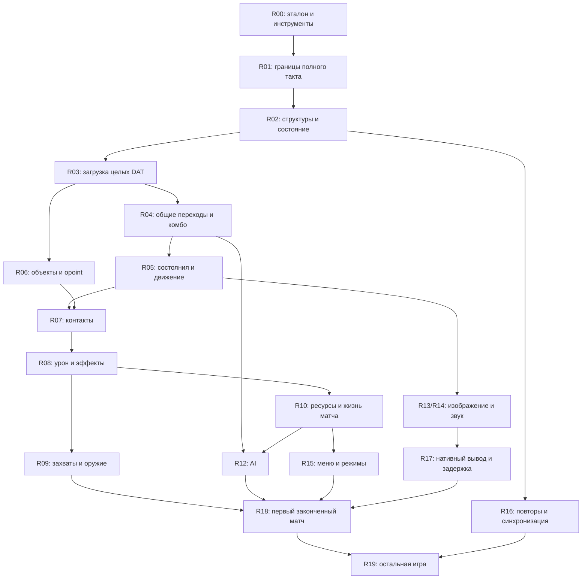

# Карта исследования и переноса NTSD 2.4

Дата исходного среза: 2026-09-07. Код этого среза: `a9f2cfe`, приложение 0.4.0.
Это рабочая очередь исследования **механизмов оригинального движка**.
Продуктовые цели находятся в [PLAN.md](../PLAN.md), адреса — в
[ADDRESS_BOOK.md](research/ADDRESS_BOOK.md).

**Следующая задача: [R02.1 — состояние полного такта](research/R02.1.md).**
Она начата: [конструкторы, словарь и сырой снимок](research/STATE_LAYOUT.md).
Также перенесён [загрузочный пул](research/BOOTSTRAP.md) и найдены основные
области каталога. [Родитель каталога](research/CATALOG_REGISTRY.md) перенесён с
непрозрачными дочерними загрузчиками. [Object loader](research/OBJECT_LOADER.md)
теперь проверен отдельно на трёх исходных файлах и контрольном потоке.
[BG loader](research/BACKGROUND_LOADER.md) перенесён для всех 17 исходных арен
с отдельной загрузкой/выгрузкой слоёв. [Stage loader](research/STAGE_LOADER.md)
теперь также перенесён: весь исходный stage.dat, 25 стадий / 138 фаз, все байты
60 записей. [MSVCR80](research/CRT_SCANNER.md) теперь подтвердил целочисленное
переполнение и потребление знака; правило перенесено в общий сканер. Исследовательский
проход выполнил все 137 Object в исходном порядке. [Сырые Frame](research/RAW_FRAME_STORAGE.md),
перекрытия имени/указателя/индекса и десятый лист теперь перенесены: весь реестр
совпал с Swift, включая маски и старые выделения памяти. Далее соединить
дочерние загрузчики с родителем.
Инициализация выбранного матча/всего каталога и оставшиеся типы открыты.
R01.1 завершена как исследование обычного пути: [порядок стадий](research/TICK_PIPELINE.md),
[пропуски переноса](research/TICK_GAPS.md). Это не завершение переноса R01.
Далее: R03.1 → R01.2 (широкий эталон), R04.1 → R06.1. Условия перехода ниже.

## Эталон и архитектурное правило

Единственный поведенческий эталон:
`downloads/NTSD_2.4_2.0a_clean/NTSD 2.4_2.0a/NTSD 2.4.exe`.
SHA-256: `3f7ac67c5890ef979ee24a6dae5528056e7f631725c292cf9cb0a928ebeff71c`.

Целевая реализация: общий нативный движок, читающий исходные DAT/BMP/WAV,
с сохранением исключений, действительно обнаруженных в EXE. Поддержка нового
персонажа, использующего уже перенесённые правила, не должна требовать изменения
Swift-кода. Имена персонажей и названия техник не являются единицами переноса.
Наруто, Саске и другие исходные объекты служат примерами и проверками правил.

Важны три разных основания для условий в коде:

| Основание | Пример | Как с ним работать |
| --- | --- | --- |
| Общее правило EXE | `state`, `itr.kind`, `effect`, переход по `hit_Fa`, стоимость `mp` | Переносить общий обработчик с исходным порядком операций |
| Исключение EXE | Проверка ID 224 при отрисовке тени | Записать адрес, контекст и условия; сохранить правило, добавить проверку |
| Ограничение прототипа | `name == "Sasuke" && target == 261`, список двух снарядов | Отмечать как границу доступной реализации; заменять проверкой поддержанных механизмов по мере переноса |

Ограничения прототипа нельзя просто удалить: ранее недоступные кадры могут
требовать ещё не перенесённых правил. Неподдержанный механизм должен иметь
явную диагностику; откат всего такта сохраняется. Исходные данные не исправляем
ради обхода ошибки. Общий обработчик также сохраняет особые номера состояний
и кадров, если они являются правилами самого EXE.

## Как читать прогресс

Для каждого блока учитываются отдельно:

- **Разбор:** неизвестно → найдены адреса → описан ограниченный участок → описан
  весь объявленный объём. Одна инструкция сравнения ID не раскрывает всю ветку.
- **Перенос:** нет → ограниченная реализация → общий обработчик объявленного объёма.
- **Проверка:** S — статическое наблюдение; D — сравнение с выполнением оригинальных
  инструкций; W — воспроизводимая проверка целой игры в Windows. D относится только
  к перечисленным входам, полям и границам стенда. W пока отсутствует.

«Закрыто» означает выполнение критериев конкретной карточки. Если закрывается
узкий участок, остальная работа остаётся отдельной открытой карточкой. Наличие
Swift-кода, число кадров или количество совпавших тактов не дают процент готовности
полной игры. Расширение корпуса не меняет статус непроверенных ветвей.

## Существующая опора

Ниже перечислены принятые результаты. Полные числа игровых корпусов относятся
к прежним этапам; регрессия `swift test` повторно проверена вместе с R02.1.
Широкие трассы выполняют исходный EXE, без сравнения полного пути с Swift.
Корпуса пересекаются: числа **не суммируются**.

| Проверенная область | Принятый результат | Доказательство / граница |
| --- | --- | --- |
| Идентичность EXE и ресурсы | PE32; 163 импорта; извлечены 64 bitmap-ресурса | [ORIGINAL_ENGINE.md](ORIGINAL_ENGINE.md) |
| Расшифровка DAT | Побайтное совпадение четырёх файлов | [decoder-oracle.json](evidence/decoder-oracle.json) |
| Секции кадров | 15 044 исходных определения + 12 контрольных примеров | [FRAME_LOADER.md](FRAME_LOADER.md), [frame-corpus-oracle.json](evidence/frame-corpus-oracle.json); не загрузка целых объектов |
| Движение | 8 506 тактов / 58 сценариев | [MOVEMENT.md](MOVEMENT.md), [movement-oracle.json](evidence/movement-oracle.json) |
| Ближний бой и RNG | 12 215 тактов / 524 сценария, включая движение; 6 500 вызовов RNG отдельно | [COMBAT.md](COMBAT.md), [combat-oracle.json](evidence/combat-oracle.json) |
| Конвейер с объектами | 16 685 тактов / 575 сценариев, включая предыдущие; новых 4 470 / 51 | [PROJECTILES.md](PROJECTILES.md), [projectiles-oracle.json](evidence/projectiles-oracle.json) |
| Внешний таймер и фон | 36 отсчётов таймера с заменённым диспетчером; 120 списков отрисовки District | [MOVEMENT.md](MOVEMENT.md), [original-presentation.json](../native/Tests/NTSDCoreTests/Fixtures/original-presentation.json); не задержка ввода и не пиксели Windows |
| Граница обычного матча R01.1 | S: четыре функции, тело матча 6 822 инструкции; D: 32 наблюдения / 29 вызовов матча, шесть случаев | [TICK_PIPELINE.md](research/TICK_PIPELINE.md), [tick-trace.json](evidence/tick-trace.json); синтетическая загрузка, границы ОС/графики, не полное состояние и не сравнение с Swift |
| Конструкторы Actor/World R02.1 | S/D: 16 случаев, 24 512 байт и масок совпали с Swift | [STATE_LAYOUT.md](research/STATE_LAYOUT.md), [state-constructors.json](evidence/state-constructors.json); не начальное состояние целого матча |
| Сырой снимок R02.1 | D: 38 снимков по 409 областей, шесть прежних случаев | [state-trace.json](evidence/state-trace.json), [globals](evidence/state-global-accesses.json); неизвестные байты сохранены, provenance и нормализация ещё неполны |
| Загрузочный пул R02.1 | D против Swift: 8 случаев / 16 точек, все 400 Actor и World; S основных областей каталога | [BOOTSTRAP.md](research/BOOTSTRAP.md), [bootstrap.json](evidence/bootstrap.json), [catalog-layout.json](evidence/catalog-layout.json); загрузка файлов и начало выбранного матча ещё открыты |
| Родитель каталога R02.1 | D против Swift: 12 случаев, 48 записей / 83 232 байта и маски, 3446 запросов; исходные 137 объектов / 17 фонов | [CATALOG_REGISTRY.md](research/CATALOG_REGISTRY.md), [catalog-registry.json](evidence/catalog-registry.json); дочерние загрузчики непрозрачны, CRT ограничен, не загруженный каталог |
| Целый Object R02.1/R03.1 | D против Swift: 3 исходных файла + контроль, 6 загрузок с явными stdio/device-вариантами; 308 688 байт/масок заголовков/bitmap, 1233 определения кадров, shared sound/checksum | [OBJECT_LOADER.md](research/OBJECT_LOADER.md), [object-loader.json](evidence/object-loader.json); настоящий CRT, raw Frame pointers/padding, полный каталог и W открыты |
| Загрузка и ресурсы BG R02.1/R03.1 | D против Swift: все 17 исходных арен, повторные load/release и контроль; 149 вызовов, 5 759 520 байт/масок BG/bitmap, checksum и порядок ресурсов | [BACKGROUND_LOADER.md](research/BACKGROUND_LOADER.md), [background-loader.json](evidence/background-loader.json); отдельные stdio/device-контракты, не меню/пиксели/W |
| Целый Stage R02.1/R03.1 | D против Swift: 25 исходных стадий / 138 фаз и контроль; 6 загрузок, 436 checkpoints, 796 целых записей/масок | [STAGE_LOADER.md](research/STAGE_LOADER.md), [stage-loader.json](evidence/stage-loader.json); полный участок из 60 Stage при EOF, CRT-границы, не игровой режим или W |
| Числовой сканер VC80 R03.1 | D против Swift: 5364 случая / 16092 исполнения, все 867 целочисленных токенов исходников; 4 целых Object с настоящим scanf | [CRT_SCANNER.md](research/CRT_SCANNER.md), [crt-integers.json](evidence/crt-integers.json), [object-loader-msvcr80.json](evidence/object-loader-msvcr80.json); DLL .6195, C locale, границы `_read`/TLS, не Windows startup |
| Весь исходный Object-реестр R03.1 | Исполнение EXE + VC80: 137 объектов, 15388 определений, 808 bitmap, 400 звуков | [object-registry-research.json](evidence/object-registry-research.json); **без нативного сравнения**: 38 кадров с непрозрачными указателями, десятый лист; родитель/BG/Stage ещё отдельно |
| Сырой Frame и нативный Object-реестр R02.1/R03.1 | D всех 137 исходных Object и двух контролей; 71006 полных Frame, 14598 аллокаций, 37036545 байт/масок | [RAW_FRAME_STORAGE.md](research/RAW_FRAME_STORAGE.md), [object-loader-raw.json](evidence/object-loader-raw.json); supplied malloc addresses, header refs normalized separately; родитель/BG/Stage не соединены, W открыт |

349 групп кадров остаются за границей **сохранённой изолированной** проверки загрузчика: 290 — переполнение
числа, 54 — длинное имя, 5 — неожиданное завершение секции. Числа взяты из
`excluded` в отчёте загрузчика; это группы, а не 349 игровых механик.
В целом `weapon4.dat` теперь проверено поглощение кадра 49 незакрытым itr кадра 48;
исключение старого изолированного корпуса не удалено. Его 15 056 определений
повторно совпали после подключения общего Frame parser к непрерывному потоку.
Новый общий сканер уже воспроизводит переполнение по отдельному корпусу MSVCR80;
это не пересчитывает исторические исключения изолированного стенда.

## Реестр блоков

Все адреса в [справочнике](research/ADDRESS_BOOK.md) относятся к указанному SHA-256.
«Кандидат» означает направление поиска; назначение и границы ещё нужно доказать.

| ID / механизм | Разбор | Нативный перенос | Проверка сейчас | Что требуется для закрытия блока |
| --- | --- | --- | --- | --- |
| R00 — эталон, импорт и инструменты | Идентичность описана; декодирование ограничено четырьмя файлами | Импорт и упаковка работают | S, D для декодера | Сохранять воспроизводимость, хеши и неизменность эталона при каждом расширении |
| R01 — диспетчер, время, полный такт | R01.1: обычный путь и границы установлены, стадии описаны | Собран ограниченный конвейер; широкого соответствия нет | S адресного индекса; D синтетической трассы полного обработчика и прежних функций | R01.2 после R02/R03: обоснованная загрузка/снимок и широкий эталон с нативным сравнением |
| R02 — структуры, глобальное состояние, RNG | Конструкторы, пул, родитель каталога, все исходные Object/BG/Stage, полный Frame/heap, частичный словарь/снимок | Конструкторы/пул/родитель, Object/Frame/bitmap и BG/layer lifecycle/Stage с масками, RNG; новый storage ещё вне игрового цикла | D объявленных областей против Swift; сырой снимок шести случаев; S остальных областей каталога | Соединение каталога, выбранный матч, остальные типы/владельцы, provenance и полная нормализация снимка |
| R03 — загрузка DAT целиком | Режимы декодера, все исходные Object/BG/Stage, сырой Frame/аллокации; decimal scanf MSVCR80 .6195 | Общие Object/Frame/BG/Stage loaders, decoder и wrap32; практика ещё использует импорт | D всего исходного Object-реестра, Frame/heap, всех 17 BG и 25 Stage, integer CRT | Соединение с родителем и общий checksum; полные CRT/file I/O и Windows startup |
| R04 — ввод, комбо и переходы | Буферы, распознавание, часть перехода `mp` | Общие буферы; допуск одной техники | D ограниченного набора | Общий переход по полям DAT, стоимость, знаковые переходы и исходные приоритеты без допуска по имени персонажа |
| R05 — состояния, движение, планировщик | Часть type 0 и type 3 | Движение, часть атак, падение, ограниченные снаряды | D срезов | Обработчики востребованных состояний, воздушные/бегущие атаки, перекат, переходы при hitstop; далее остальные состояния реестра |
| R06 — реестр объектов, создание и удаление | Конструктор и часть `opoint` | Два бойца, голоса, змея и иглы | D среза | Общий реестр из DAT, распределение/повторное использование слотов, владельцы, команды, все требуемые виды создания и удаления |
| R07 — сбор контактов | Геометрия, порядок пар, часть фильтров | Два бойца и объекты без bdy | D среза | Общие фильтры для требуемых типов, bdy снарядов, команды/владельцы, приоритеты, arest/vrest и порядок нескольких контактов |
| R08 — урон, реакции, эффекты | Kind 0 / effect 0,1; kind 6; пассивный kind 4 | Ограниченный обработчик | D среза | Восстановленные ветви всех требуемых kind/effect, повреждение объектов, отражение и особые реакции; неподдержанные значения перечислены |
| R09 — захваты, оружие, связанные объекты | Форматы cpoint/wpoint загружены; семантика не закрыта | Нет общей реализации | D парсера не доказывает поведение | Связи захватчик/цель/оружие, перенос позиций, бросок, освобождение при смерти/удалении, исходный порядок обновлений |
| R10 — HP/MP, появление, смерть, исход боя | Стоимость одной техники и часть посмертных реакций | Практика с фиксированными условиями | D отдельных реакций | Восстановление/зарядка, начальное состояние матча, прекращение участия и условия завершения; без придуманных значений |
| R11 — исключения по ID и специальные сценарии | Есть подтверждённые инструкции; полного реестра нет | Несколько исходных исключений | S; отдельные окружающие сценарии D | Реестр веток по ID с местом в общем конвейере и отдельными проверками; ID не наделяются смыслом по названию DAT |
| R12 — AI | Найдены кандидаты ветвей по ID и условиям | Нет | S кандидатов | Выбор цели/действия, расход RNG, условия техник и переключения; одинаковые состояния дают исходные действия и дальнейший ход боя |
| R13 — сцена, камера, спрайты, HUD | District, камера, позиции, часть исключений | Исходные BMP, тренировочный HUD | D списков/поз; визуальная проверка macOS | Полный исходный порядок вывода, эффекты, HUD, прозрачность, масштаб и сравнение с изображением Windows |
| R14 — звук и музыка | Пути, события, встроенные WAV | AVFoundation, частичная презентация | D событий; сведение не проверено | Громкость/панорама, одновременные события, прекращение звуков, музыка, задержка и запись оригинального выхода |
| R15 — меню, настройки и режимы | Ресурсы извлечены; есть кандидаты диспетчера | Тренировочное окно | Нет проверки исходного потока экранов | Выбор персонажей/арены, начало/конец/рестарт, настройки; отдельно Battle, Stage и Tournament с исходными условиями |
| R16 — повторы и сеть | Префикс повтора и восстановление RNG | Только фиксированный seed практики | D seed/RNG | Формат ввода/состояний, запись/воспроизведение, синхронизация; протокол сети исследовать отдельной карточкой |
| R17 — macOS, ввод и задержка | Нативный host работает; сквозных измерений нет | AppKit/SpriteKit/AVFoundation | Сборка и ограниченные UI-проверки | Физический ввод → видимый ответ/звук, разные частоты дисплея, фокус, fullscreen, автономный запуск и состав bundle |
| R18 — первый завершённый матч | Цель определена | Частичная тренировка | W отсутствует | Наруто/Саске на District: объявленные действия и техники, исходный AI, ресурсы, завершение и повтор матча; сценарий целиком сопоставлен с Windows |
| R19 — вся согласованная игра | Полного перечня семантики пока нет | Нет общего покрытия | Нет | Закрытая матрица механик/объектов/режимов и оставшихся расхождений; проверка пользователем ощущения игры |

R11 ведётся попутно с каждым механизмом. Его не следует откладывать до конца
или использовать как место для любых непонятных условий нашего нового кода.

## Зависимости и последовательность

Стрелки показывают необходимые основания для переноса, а не запрет исследовать
независимые участки. Частичная готовность основания допустима только с явно
указанным объёмом конкретной карточки.

Маршрут основной работы:

1. **Основание:** R01.1, R02.1, R03.1. Определить реальный такт и данные, на которых
   он работает. Не считать все вызовы верхнего диспетчера игровыми тактами.
2. **Общий механизм:** R04.1, R06.1, затем очередные части R05/R07/R08.
   После каждого перенесённого правила расширять исходные примеры и проверки.
3. **Законченный бой:** R09/R10 и R12, необходимая часть R15. Одновременно с
   подходящими механизмами закрывать относящиеся к ним исключения R11.
4. **Первый матч:** R18 после проверки вывода, звука и ввода из R13/R14/R17.
5. **Расширение:** остальные механики, объекты и режимы в R19; отдельные части R16.

Подготовку Windows-эталона для R18 и измерений R17 начинать уже на первом этапе.
Если Windows-среда ещё недоступна, это ограничение только соответствующей
проверки W; анализ EXE и сравнения D продолжаются. В runtime macOS нет Windows EXE
или слоя совместимости.

## Первые пять карточек

| Очередь | Задача | Зависимость | Конкретный результат |
| --- | --- | --- | --- |
| 1 | **R01.1 — границы такта: исследование завершено** | Существующий эталон и дизассемблирование | [Стадии](research/TICK_PIPELINE.md), [пропуски](research/TICK_GAPS.md), воспроизводимая трасса; [карточка](research/R01.1.md) |
| 2 | **R02.1 — состояние такта: в работе** | Карта R01.1 | [Карточка](research/R02.1.md), [словарь](research/STATE_LAYOUT.md), [пул](research/BOOTSTRAP.md), [родитель каталога](research/CATALOG_REGISTRY.md): дочерние загрузчики/матч, оставшийся словарь и полный снимок открыты |
| 3 | **R03.1 — внешний загрузчик: в работе** | Объявленная готовая часть R02.1 | [Карточка](research/R03.1.md): целые Naruto/Sasuke/kunai + контроль совпали в явных CRT/device-границах; зависимости, остальной реестр и реальные числовые преобразования открыты; все исходные BG/Stage также перенесены отдельно |
| 4 | **R04.1 — общий переход в кадр** | R02.1 и проверенные записи R03.1 | Общий обработчик `0x40e2d0`, включая проверенные отрицательные/999/отсутствующие переходы и ветви стоимости; проверки на разных исходных файлах, без допуска по имени Sasuke |
| 5 | **R06.1 — общий реестр и создание** | R02.1/R03.1; сохранённый порядок R01.1 | Данные реестра вместо списка 224/440; создание по поддержанным правилам, reuse/owner/team, явное отклонение неподдержанного механизма, сохранение прежних сравнений |

Карточки 2 и 3 начаты; 4–5 пока остаются очередью. Их нельзя закрывать
одним снятием `guard`. R04.1 проверяет сам переход; поддержка всех возможных
последующих кадров и создаваемых объектов остаётся работой R05/R06/R08/R11.
Дополнение после R01.1: [R01.2](research/R01.2.md) объединяет результаты R02.1/R03.1
в широкий исполняемый эталон и диагностическое сравнение. Расхождения RNG,
ресурсов и порядка из R01.1 сохраняются явными задачами до переноса механизмов.

## Цикл работы над одной карточкой

1. Взять ближайшую задачу с готовыми основаниями; создать карточку по
   [шаблону](research/TASK_TEMPLATE.md). Объявить точные границы и вопрос.
2. Разобрать инструкции и их вызывающий код. Зафиксировать адреса, поля,
   условия, целочисленные переполнения, x87-порядок и неподтверждённые гипотезы.
3. Выполнить оригинальный участок на воспроизводимых входах. Описать все
   подменённые функции и различия искусственного начального состояния с матчем.
4. Перенести правило в общий нативный обработчик. Оригинальные ID-исключения
   получают записи R11; экспериментальные ограничения не выдаются за такие правила.
5. Сравнить исходное и новое состояние после каждого такта/операции, включая
   события, порядок объектов, RNG и накопленные эффекты. Разобрать первое расхождение.
6. Запустить подходящие регрессии. Обновлять принятые fixtures и evidence только
   после успешного независимого сравнения. Самопроверка Swift не заменяет эталон.
7. Обновить карточку, эту карту и адресный справочник; записать ограничения,
   связанные карточки, результаты и идентификатор коммита, когда он будет создан.

Если карточка оказывается слишком большой, выделить завершённый измеримый
участок и явные продолжения. Новые непонятные ветви остаются задачами исследования;
их нельзя обходить исправлением DAT, подменой RNG или приблизительной физикой.

## Завершение и отчёт о прогрессе

Для карточки переноса нужны: описанная спецификация с адресами; реализованный
общий механизм объявленного объёма; сравнение с EXE; регрессии; список оставшихся
ветвей; инструкция воспроизведения. Для исследовательской карточки вроде R01.1
нужен проверяемый результат анализа; она не закрывает перенос R01 целиком.

В отчёте после работы указывать:

- карточку и закрытый объём;
- уровень доказательства и ссылку на отчёт/fixture;
- какие исходные механизмы теперь доступны без изменения кода под персонажа;
- найденные пробелы, зависимости и одну следующую задачу.

Текущая граница подтверждённого **нативного** поведения остаётся `a9f2cfe`.
R01.1 выявила пропущенные стадии; R02.1 добавила точные конструкторы и сохранение
неизвестных байтов. Это не переносит полный такт автоматически. Продолжать R02.1.
