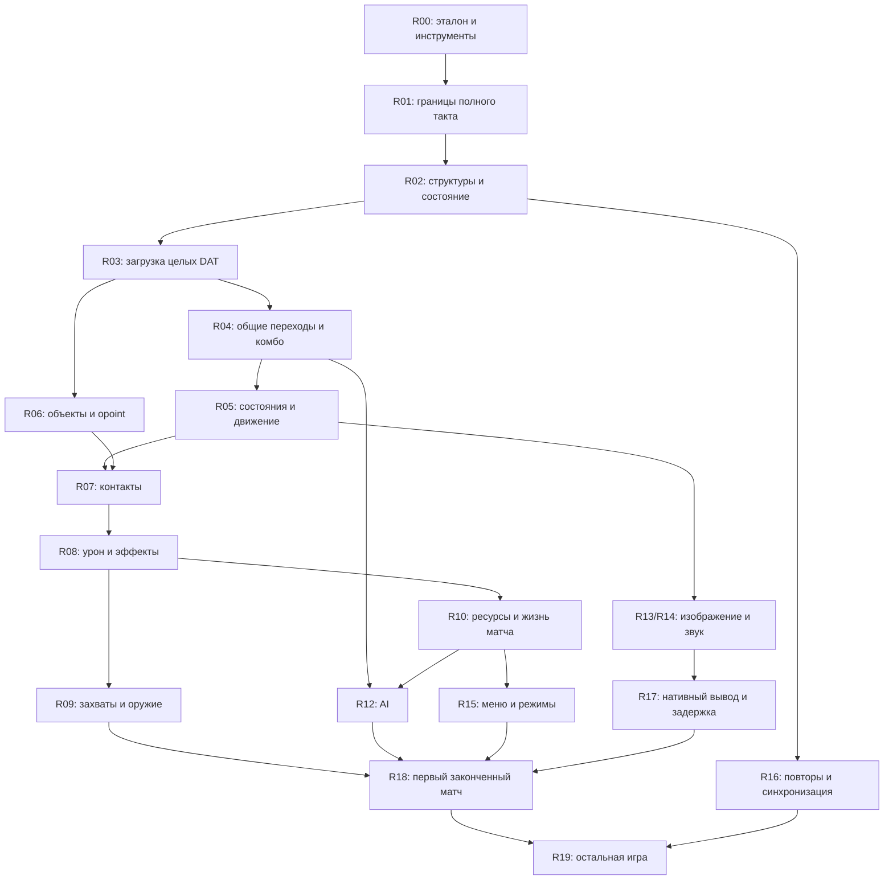

# Карта исследования и переноса NTSD 2.4

Дата исходного среза: 2026-09-07. Код этого среза: `a9f2cfe`, приложение 0.4.0.
Это рабочая очередь исследования **механизмов оригинального движка**.
Продуктовые цели находятся в [PLAN.md](../PLAN.md), адреса — в
[ADDRESS_BOOK.md](research/ADDRESS_BOOK.md).

**Следующая задача: [R02.1 — состояние полного такта](research/R02.1.md).**
**Ближайший шаг: [изменения из bundled lib.dll](research/LIB_RUNTIME.md),
затем полная инициализация, внешний цикл времени и подключение общего движка к приложению.**

[Хранилище растущих трасс каталога](research/APPLICATION_CATALOG_TRACE_STORAGE.md)
перенесено на подключённый APFS X5 через прежний путь. Тот же процесс78863
продолжен после7,046с паузы:11313 файлов/1,42ГБ сверены, все старые части и
индексы сохранены;264 новых части и рост счётчиков подтверждены независимо.
Резерв6ГБ и все890 входов не менялись, Native-код не затронут. Полного возврата
каталога ещё нет (последнее наблюдение6 Objects). Новые большие сырые корпуса
и изолированные сборки используют отдельную исследовательскую папку X5;
готовое приложение внешнего диска не требует. Следом — оставшиеся режимы и
собственная полная библиотечная инициализация/подготовка/внешний цикл/окно.

[Повторный выбор и Random](research/LIB_SELECTION_COMMANDS.md) теперь совпадают
в338 вызовах:336 настоящих возвратов и две границы Start.194 целых начальных
вызова воспроизводят прежний эталон. Проверены повторный Random/удержание,
сброс выбора и новый путь готовности двух людей и двух компьютеров; оба поздних
отката сохраняют предыдущие вызовы. Сырые4 и упакованные2 теста прошли;663 файла
пакета и все259 прежних эталонов проверены,263 файла с новым корпусом. Исходные
ожидания не менялись.194 одинаковых атомарных файла используют APFS-клоны,
сохраняя все байты и освобождая около1,16ГБ. Каталог5 отдельно продолжает работу,
последнее наблюдение5 Objects. Далее остальные режимы и собственное соединение
библиотечного меню/подготовки матча/внешнего цикла/окна; полная цель открыта.

[Выбор компьютеров и арены с библиотечным текстом](research/LIB_SELECTION_STAGE.md)
теперь совпадает в252 вызовах:250 настоящих возвратов и две границы Start перед
подготовкой матча. Проверены два компьютера, возвраты назад, Random, исключение
общей команды последним компьютером, District, сложность и музыка. Общий Native
сохраняет владельцев ресурсов/DC; оба поздних отката и прежние шесть тестов прошли.
Некорректный первый вход RNG, ошибка Python-типа и исправление адаптера теста
сохранены отдельно. Рабочий корпус построен заново с таблицей по алгоритму CRT.
Сырые и packaged-проверки прошли;256 старых эталонов неизменны,259 файлов с новым
индексом/двумя частями восстанавливают весь исходный корпус. Это контролируемые
входы; собственная полная библиотечная инициализация и полный матч ещё не доказаны.
Следующие границы — reselect/reroll, остальные режимы и соединение с подготовкой
матча/внешним циклом/окном. Отдельный каталог5 продолжает работать, достиг4 Objects.

[Последовательный выбор с библиотечным текстом](research/LIB_CHARACTER_ROSTER.md)
теперь совпадает в70 возвратах: Naruto/Sasuke, удержание, Random с сохранением
Object, обход каталога, команды, готовность и countdown. Общий код движка не
менялся; Native использует свой нормально загруженный полный каталог. Проверки
сырого и упакованного корпуса, включая два поздних отката, прошли.255 прежних
эталонов неизменны, добавлен256-й. Следующий шаг — целые дальнейшие стадии
выбора и собственная библиотечная цепочка, внешний цикл и окно.

Длинный каталог4 остановился на резерве диска после24 завершённых Objects,
сохранив результат. [Побайтно одинаковые трассы](research/APPLICATION_CATALOG_STORAGE_PLAN.md)
теперь используют APFS-клоны: все логические файлы/хеши сохранены, освобождено
место. После проверки завершённых процессов начат новый каталог5 с тем же кодом
и лимитами. Его полный возврат и полная цель ещё не подтверждены.

[Входы каталога для выбора персонажей](research/CHARACTER_ROSTER_INPUT_PLAN.md)
восстановлены из исходных файлов:137 записей, имена и42 портрета совпали с
прежним неизменным каталогом. При отсутствии имени конструктор записывает
`none`; ошибка первого аудита сохранена. Это проверка происхождения входов,
сам экран с конкретным выбором и библиотечным текстом ещё предстоит сравнить.
Все четыре проверки guarded-снимка20 теперь завершены: Native12.772s,
полное состояние,2142 промежуточных точки и происхождение чтений. Неизвестных
прочитанных байтов стека/каталога нет. Все255 эталонов и890 замороженных входов
неизменны. Полный исходный захват продолжает работать, достиг23 объектов;
его полный возврат, собственная цепочка и окно остаются открытыми.

[Свежие ресурсы в экране персонажей](research/FRESH_CHARACTER_MENU.md) теперь
доходят до настоящего возврата:28 контролируемых проходов совпали, две
NULL-SPARK границы сохраняют откат. Экран рисует свои CHARMENU/Random/countdown
и меняет400 Actor через общий код с библиотечным текстом. Музыка в menu1/menu3
не запускается; это проверенный gate, а не ошибка выделения wide buffer.
Шесть прежних и две новые проверки прошли, затем две packaged;254 старых
эталона неизменны. Конкретный выбор из нового каталога, дальнейшие стадии,
собственная полная цепочка и окно остаются открытыми. Полный guarded catalog
достиг21 объекта; для снимка20 завершены Native и два аудита, проверка чтений идёт.

[Свежая загрузка музыки и ресурсов до возврата меню](research/FRESH_LIBRARY_MENU.md)
теперь сравнена на одной исходной CPU:22 возврата, два перехода к повтору и два
отдельных отката NULL-SPARK. Семь поздних ошибок проверяют всех владельцев.
Аудит подтвердил, что экран пишет108 своих локальных байтов и не читает остатки
прошлых помощников; полные исходные маски сохранены. Новые и упакованные тесты
прошли после исправления этой границы сравнения;253 прежних эталона неизменны.
Исправленный захват каталога достиг20 объектов, их нативная проверка прошла;
три аудита исходной трассы и полный захват продолжаются. Собственная полная
цепочка, окно и матч остаются открытыми.

[Продолжение библиотечного меню до фактического ret4](research/LIB_MENU_CONTINUATION.md)
теперь объединяет экран, панель, сетевую надпись, громкость и вывод в одной
нативной операции.54 контролируемых возврата и два перехода к загрузке повтора
совпали; четыре границы панели и пять поздних ошибок проверяют полный откат.
Исходный пролог сам создаёт cookie/SEH, но раннее тело такта явно пропущено:
это ещё не собственный полный такт.11 release-тестов и две проверки упакованного
корпуса прошли;252 прежних эталона неизменны, добавлен253-й. Полный каталог
продолжает работать.4242e0 уже изучен как индикатор загрузки; следующий шаг —
собрать собственную инициализацию, меню и внешний цикл и подключить их к окну.

[Целый экран режима с включённой панелью](research/MODE_PANEL_SCREEN.md)
теперь выполняется одной нативной операцией.26 полных возвратов и два перехода
к загрузке повтора совпали; четыре границы панели проверяют откат всего экрана.
Панель получает текущее состояние ресурсов после освобождения фона, а ранний
клик по внешней ссылке сохраняет свой эффект для её последующей проверки мыши.
Все12 release-тестов прошли, включая прежние корпуса;251 старый эталон неизменен.
Собственная инициализация меню, внешний цикл времени и окно приложения остаются
следующими зависимостями; полный захват каталога продолжает работать.

[Отрисовка и ввод включённой панели меню](research/MENU_PANEL_DRAW.md)
перенесены:1 008 полных контролируемых вызовов совпали; четыре случая нулевого
таймера/отсутствия доступной строки проверяют явный откат отдельно. Сохранены
порядок эффектов, области клика, переходы строк и мигание. Из538 инструкций
тела выполнены536; пропущены два адреса выравнивания. Прочитанных неизвестных
байтов нет. Десять release-тестов и две проверки упакованного
эталона прошли;250 прежних эталонов неизменны, добавлен251-й. Следующий шаг —
включить эту панель в целый экран с живыми ресурсами и собственную цепочку меню.
Полный каталог ещё выполняется; окно, Windows и полный матч остаются открытыми.

[Экран режима с библиотечным текстом](research/LIB_MODE_SCREEN.md) теперь
использует общий нативный код экрана, прозрачный фон и сохранённый DC.
106 контролируемых полных возвратов и четыре продолжения до загрузки повтора
совпали; две границы панели/рабочего обработчика проверяют явный откат.
Строки создаёт сам нативный код, неизвестная локальная память не подставляется.
Прежние1 264 экрана,2 690 случаев выбора режима и276 вызовов текста сохранили
сравнения. Новые raw/packaged тесты и четыре поздних отката прошли;249 старых
эталонов неизменны, добавлен250-й. Собственный каталог ещё выполняется;
объединение с меню, окно приложения, Windows и полный матч остаются открытыми.

[Непрерывный вход в меню с музыкой и полными bitmap-помощниками](research/CHARACTER_MENU_MUSIC_SURFACE.md)
теперь выполняется одной нативной операцией.16 контролируемых проходов совпали;
пять случаев с неизвестными операндами явно отклоняются с полным откатом.
При первом отказе GetObject оригинал читает размеры из предшествующей строки
`graph.log`; нативный код сохраняет собственные байты этой строки и их маски.
Все219 сроков жизни полей проверены по трассе, неизвестные байты не подставлены.
15 release-тестов и две проверки упакованного эталона прошли;248 прежних
эталонов неизменны, добавлен249-й. Восемь поздних ошибок проверяют общий откат.
Полный каталог с установленной библиотекой ещё исполняется; собственный проход
меню, его возврат и проверка приложения в окне остаются открытыми.

Оба старых дополнительных захвата каталога завершились на той же проверке
границ WAV-буфера стенда после24 объектов и154 звуков. Полные
[снимки ошибок сохранены](evidence/application-catalog-control-wave-guard-errors.json);
совпавшие и полностью проверенные снимки20 объектов остаются неизменными.
Исправленный основной захват продолжает работать; полного возврата каталога
и нового нативного совпадения24 объектов эти ошибки не подтверждают.

[Полные bitmap-помощники ресурсов меню](research/CHARACTER_MENU_SURFACE.md)
сравнены в контролируемом вызове:23 готовых прохода совпали, две границы
NULL-SPARK и два отката из-за неизвестных начальных операндов учтены отдельно.
При отказе описания SPARK сохранены собственные размеры предшествующего
копирования: RFACE120×120 или CMC365×103. Полные записи, маски, порядок запросов
и происхождение прочитанных полей проверены;13 release-тестов прошли.
247 прежних эталонов неизменны, добавлен один; обе проверки упакованного
эталона также прошли без подмены пути загрузки.
Собственный полный каталог, объединение меню с этими помощниками и приложение
остаются следующими зависимостями.

Для двух дополнительных собственных снимков каталога по20 объектов завершены
[все проверки трасс, состояний и чтений](evidence/application-catalog-control20-completion.json),
а также нативные сравнения. Неопределённых прочитанных байтов в наблюдаемой
области нет; непрочитанная память остаётся неизвестной. Старые полные захваты
теперь остановлены ошибкой стенда выше; исправленный основной продолжается.

[Музыка и ресурсы меню](research/CHARACTER_MENU_STARTUP.md) теперь входят
в одну нативную операцию: музыка проверяет прежний режим до его перезаписи,
а поздняя ошибка сохраняет исходные globals, звуки, bitmap и буфер событий.
Оба первых и повторных входа в меню сохранили прежние сравнения; шесть release-
тестов и пять проверок отката прошли.247 эталонов неизменны. Полные bitmap-
помощники этих ресурсов, собственный каталог и приложение остаются открытыми.

[Исправление границ WAV-буферов стенда](research/CATALOG_WAVE_GUARDS.md)
проверено на155 парах полных исходных вызовов и нативном сравнении; все служебные
границы целы, прежние данные сохранены. Первый объект нового полного захвата
совпал с прежними состояниями и трассами, затем прошёл нативную проверку.
Это проверка стенда и первого снимка: полный каталог продолжает исполняться,
собственный проход проблемного WAV, окно, Windows и полный матч ещё открыты.

[Общий переход от загрузки к вводу и раунду](research/INITIAL_MATCH_ENTRY.md)
сохраняет интерфейс, звуки, команды, паузу и результат раунда. Исправлена потеря
интерфейса в одном пути проверок; все606 случаев ввода сохраняют его записи.
12 release-тестов прошли, включая полные прежние control/replay/round и повторное
меню;247 эталонов неизменны. Каталог остаётся отдельной зависимостью: первый
захват завершился ошибкой размера служебной области WAV-буфера стенда. Данные
сохранены; отдельный исправленный захват запущен. Два других снимка20 объектов
совпали с нативным кодом, их полные проверки трасс продолжаются.

[Нативное продолжение после каталога](research/INITIAL_LOADING_CONTINUATION.md)
сохраняет собственные ресурсы, паузу, команды и текущие globals до конца пула/UI.
Все80 чтений Object+90 подтверждают порядок после соответствующего конструктора.
Оба прежних полных сценария загрузки и десять сценариев пула/UI совпали;
14 release-тестов прошли,247 эталонов неизменны. Поздние нативные исключения
проверяют общий откат. Собственный полный каталог с установленной библиотекой
ещё исполняется; его возврат, окно, Windows и полный матч остаются открытыми.

[Единая операция создания пула и UI](research/INITIAL_POOL_INTERFACE.md)
теперь выдаёт память Actor последовательно и сохраняет порядок400+8 конструкторов.
В десяти прежних исходных цепочках совпали4080 полных состояний после конструкторов
и все итоговые World/Actor/bitmap записи. Семь поздних нативных исключений проверяют
откат общего контекста. Независимая сборка прошла12 тестов;247 эталонов неизменны.
Собственный каталог, его продолжение, окно и полный матч ещё не завершены.

[Полный загрузчик поверхностей начального интерфейса](research/INITIAL_INTERFACE_SURFACE.md)
совпал в десяти контролируемых цепочках World/пул/UI:85 bitmap-конструкторов,
1406 платформенных запросов,4095 полных записей и масок. Сохранены размеры при
отказе CreateSurface, порядок очистки и поздний нативный откат. Независимая
сборка из базовой версии прошла12 упакованных тестов;246 прежних эталонов
неизменны, добавлен один. Это отдельная зависимость: три собственных захвата
каталога продолжаются, полный возврат загрузки, окно и Windows остаются открытыми.

[Собственный пролог загрузки и общие WAV](research/APPLICATION_LOADING_PREFIX.md)
продолжили три цепочки выбора меню. Девять проходов дошли до настоящего запроса
памяти каталога4450ac; три отказа создания звукового буфера проверены как явные
отклонения с откатом. Совпали187 полных WAV-возвратов, PCM/маски, порядок очистки
и вывода; короткие чтения сохраняют три временные аллокации. Полные223 состояния
восстановлены из записей. Следующий шаг — сам каталог4122f0 с этими ресурсами и
установленным loading helper; полный возврат, окно и Windows остаются открытыми.

[Доставленный ввод и повторное меню](research/APPLICATION_MENU_INPUT.md)
продолжают все47 завершённых собственных родителей:47 idle-проходов и три
цепочки выбора одиночной игры через реальные WndProc callbacks. Совпали62
полные итерации; три следующих вызова дошли до41bc90/SP1000ea6c. В каждом клике
оригинал выполнил3000 rand и звук подтверждения, следующий World1 освободил фон
и установилWorld2. Полные состояния,маски,18835событий и9000 rand проверены.
Собственная нативная цепочка сохраняет предыдущие итерации при восьми поздних
отказах. Следующий шаг — весь41bc90 с этими ресурсами/RNG/вводом; его возврат,
окно, Windows и полный матч ещё не проверены.

[Собственное меню и возврат диспетчера](research/APPLICATION_MENU_RETURN.md)
теперь заканчивают47 первых due-итераций в43d110/SP1000effc; один NULL-курсор
остаётся отдельной границей с полным нативным откатом. World возвращает HRESULT
представления кадра, диспетчер — собственную1; baseline123456822/counter2.
Все43 прежних тела экрана воспроизведены вместе с альтернативой setting-1.
1159 событий,476 helpers,399 EXE PCs и1199 bitmap records сравниваются с полными
состояниями и масками. Частные слова cookie/SEH/сохранённых регистров не импортируются.
Следующий шаг — сохранить это собственное состояние при последующей доставке
ввода и переходах меню/loading/selection; worker, полная CRT/NLS и приложение
остаются открыты. Это ещё не полный матч или проверка окна/Windows.

Настоящий PE entry загружает `lib.dll` до CRT startup. Установщик библиотеки
меняет62 байта EXE в13 местах; прежние игровые цепочки исполняли EXE без этих
патчей. Их неизменные эталоны остаются контролями для такого режима и не
доказывают поведение приложения с библиотекой. Установка исследована отдельно;
text helper совпал на276 вызовах. [Подготовка и команда 3](research/LIB_STAGE_COMMANDS.md)
теперь передают собственный результат между контролируемыми вызовами.
[Управление с библиотекой](research/LIB_ACTOR_CONTROL.md) совпало на7168 полных
вызовах и800 событиях RNG/звука; сохранены поздний откат и25795 прежних случаев.
Новые состояния85/86 отсутствуют в54800 исходных загруженных словах состояния;
их ветки здесь проверены на заданных тестовых входах. Итоговые10 упакованных
тестов прошли24.813s/build172.66s, включая подготовку и команды. Остальные hooks
и полная цепочка запуска открыты; DLL в нативном runtime не нужна.

[Контакты с библиотекой](research/LIB_WORLD_CONTACTS.md) совпали на10661 полном
вызове; все7925 прежних результатов сохранены. Восстановлены группы `itr.kind`,
командная проверка состояния20 атакующего, оба направления, aliases и откат.
Проверены4524613688 байтов pool и столько же масок,3917 событий,193615 возвратов
helpers и142 исполненные инструкции DLL. Сырые6 тестов прошли14.567s/build175.45s;
один новый упакованный эталон сохраняет204 прежних. Новые kinds и state20
отсутствуют в исходном загруженном каталоге: это синтетические проверки,
а не доказательство достижимости или полного матча с библиотекой.
Итоговые8 упакованных тестов прошли51.661s/build175.11s, включая обе прежние
инициализированные цепочки. Все наши source/SwiftPM процессы завершены;
NTSDNative связан, окно и устройства на этом этапе не проверялись.

[Попадания с библиотекой](research/LIB_WORLD_HITS.md) соединяют оба hooks в18137
полных вызовах, включая300 обходов World. Совпали полные pool/маски/globals,
изменяемые ITR, CRT,20000 байт сохраняемого target buffer и38384 события.
Сохранены настоящий шаг0xb2 для чтения previousFrame и необычная константа Z
из байтов DLL. Она меняет164 прежних результата kind8: отдельные164 запуска
EXE без библиотеки подтвердили, что отличаются только164 слова binary Z.
Остальные15526 прежних результатов не изменились. Это не164 неизменных контроля.

В исходных DAT есть13 записей с effect>=6000. Полный загруженный каталог
содержит2175 неизвестных потенциальных слов0xb2; это статическая граница,
а не2175 исполненных аварий. Контролируемые проверки всех400 previousFrame
её не закрывают; нативное неизвестное чтение и поздняя ошибка дают полный откат.
Итоговые7 упакованных тестов прошли68.432s/build175.93s, включая прежние
инициализированные цепочки;205 эталонов неизменны, добавлены два. Все наши
процессы завершены. Остаются transforms/loading, полное соединение с библиотекой,
окно, устройства, Windows, законченный матч и весь исходный игровой объём.

[Экран загрузки с библиотекой](research/LIB_LOADING.md) теперь исполняется
целиком:318 вызовов,20727 совпавших событий,5082 возврата helpers. Перенесены
таймер и цвета Loading files, восемь ссылок, рамки, щелчки/звук, общий вывод
и хвост обработки одного оконного сообщения. Все253 достижимые инструкции
caller выполнены; старый блок имени файла обходится установленным переходом.
Сохранены92 неизвестных байта каждой fill-структуры как явная граница входа.
Шесть связанных вызовов несут собственные timer/phase/click/DC, поздние ошибки
проверяют полный откат. Сырые4 теста прошли11.687s/build176.07s;207 прежних
эталонов неизменны, добавлен один. Итоговые6 упакованных тестов прошли24.923s/
build177.75s, включая оба прежних initial-loading контроля. Все наши source/
SwiftPM процессы завершены; NTSDNative связан, окно на этом этапе не открывалось.
Полная начальная загрузка с библиотекой,
фоновый worker, transforms, приложение и устройства остаются открытыми.

[Статические игровые конструкторы](research/STARTUP_STORAGE.md) совпали в12
контролируемых вызовах настоящей таблицы CRT:36 конструкторов,25584 байта
и маски,4992 записанных байта. Сохранены нетронутая память, собственные
повторные вызовы и полный поздний откат. Итоговые3 упакованных теста прошли
0.570s/build0.28s, включая прежний звуковой корпус;208 старых эталонов неизменны.

Отдельный настоящий запуск MSVCR80 дошёл до первого GetStringTypeW перед
входом EXE. Сохранены1274 исполненные инструкции CRT и настоящий производитель
_acmdln. Это пока запрос о единственном UTF16 NUL, без ответа Windows NLS;
он не доказывает завершённый CRT startup. Отдельный отказ при отсутствии
KERNEL32 остаётся отказом. Окно, устройства и полное соединение приложения
на этом этапе не проверялись; следующая зависимость описана в
[CRT_STARTUP_PLAN](research/CRT_STARTUP_PLAN.md).

[Создание окна и поверхностей](research/WINDOW_INITIALIZATION.md) перенесено
целиком в контролируемых границах43bec0:280 вызовов,4574 запроса, полные globals,
маски и1182 структуры. Сохранены повторные попытки, порядок Release и реальные
особенности ошибок: внешний wrapper возвращает1 даже после внутреннего0.
Проверены поздний откат и отсутствие требуемого входного состояния.501 инструкция
исполнена;38 недостижимых по знаковым проверкам не включены в покрытие.

Итоговые5 упакованных тестов прошли20.203s/build0.28s.210 прежних эталонов
сохранены; добавлен один. Это модель запросов к платформе с явным непрозрачным
содержимым стековых структур, ещё без настоящих оконных callbacks и устройства.
Текущее NTSDApp по-прежнему использует practice-движок. Соединение WinMain,
полный CRT/NLS, библиотечная игровая цепочка и проверка окна остаются открытыми.

[Оконный ввод](research/WINDOW_INPUT.md) теперь совпадает в4369 полных вызовах
для клавиатуры/мыши/джойстика и3 отдельных конструкторах.385 связанных вызовов
используют собственный нативный выход. Проверены203184416 байтов и маски,
5908 запросов и порядок23835 записей; выполнены424 инструкции WndProc/561 EXE.
Сохранены NUL/index alias от обычных360 B, обе скрытые последовательности,
unsigned16 mouse и signed wrapped joystick thresholds. ESC освобождает звук,
музыку и оба replay buffer, затем использует caller HWND; общий cleanup
сохраняет прежнее поведение меню. Проверен полный поздний откат.

Итоговые9 упакованных тестов прошли59.951s/build0.24s;211 прежних эталонов
неизменны, добавлен один. Первая попытка новых тестов остановилась на формате
transport до сравнения; исправлен только reader, исходные байты и правила
сохранены. Все наши процессы завершены. Другие оконные сообщения, DirectShow,
Winsock, перевод ввода macOS и подключение общего движка к приложению открыты.
NTSDApp остаётся practice; этот результат не доказывает оконную/Windows/device
проверку, полный матч или готовность всей игры.

[Жизненный цикл окна](research/WINDOW_LIFECYCLE.md) совпал в318 полных callbacks
и2 отдельных инициализациях. Две связанные цепочки несут собственные18 вызовов
через перемещение, сворачивание, две смены режима и закрытие. Совпали3624 запроса,
1757 записей и полные14770944 байта/маски; сохранены порядок Release, реальные
ошибки повторного создания и поздний откат. Внутренний43bdd0 выделен из wrapper,
поэтому при смене режима нет лишнего ShowWindow или записи instance.

Итоговые9 упакованных тестов прошли23.195s/build0.28s;212 прежних эталонов
сохранены, добавлен один. С учётом прежнего ввода исполнены567 из576 статических
инструкций WndProc; оставшиеся относятся к Winsock/DirectShow и недостижимой
отрицательной ветви43bdd0. Доставка вложенных callbacks во время Windows API,
настоящие устройства и соединение приложения остаются открытыми. Следующие
обязательные consumers на том этапе — события400/401;400 проверен ниже,
401 проверен в NETWORK_NOTIFICATION ниже. Эти consumers нельзя заменять default-return.

[Музыкальные уведомления](research/GRAPH_EVENTS.md) теперь совпадают в371 полном
callback400 и4 отдельных созданиях графа. Пять последующих вызовов сохраняют
собственный выход инициализатора с четырьмя исходно нулевыми слотами. Проверены
17327744 байта и маски,2358 запросов,1588 записей и211 seek с точным binary64+0.
Только E_ABORT завершает очередь; остальные статусы обрабатывают сохранённые
поля и освобождают параметры. Init и seek общие с прежним музыкальным кодом.
Полный поздний откат и неизвестные нужные locals/interfaces проверены отдельно.

Итоговые13 упакованных тестов прошли40.526s/build0.26s;213 прежних эталонов
неизменны, добавлен один. Преждевременный запуск до копирования нового ресурса
дал5 ошибок поиска файла до сравнения; журнал сохранён, повтор после завершения
процесса и подготовки export прошёл. Исходные результаты и правила не менялись.
Все наши процессы завершены. Совместный inventory теперь568/576 инструкций
WndProc; это не все исходы ветвей и не полный нативный оконный обработчик.
Следующий consumer того этапа — Winsock401/402ec0 — проверен ниже. Настоящее звучание, reentrancy,
устройства/Windows, соединение приложения и полный игровой объём остаются открытыми.

[Серверное сетевое уведомление](research/NETWORK_NOTIFICATION.md) совпало в415
полных callbacks401/402ec0:19216160 байтов и маски,3692 запроса и1119304 байта
пакетов. Сохранены единственный recv77, частичный нулевой хвост, live имена
с перекрытиями, send14/77/3001 и исходное игнорирование numeric errors.
READ/CONNECT/CLOSE здесь только показывают сообщение. Четыре последующих
уведомления сохраняют собственный результат accept; listener/menu/client/peer
ещё не соединены. Все415 cookie checks выполнены без повреждения защиты;
724 memset исполнялись из настоящей CRT. Неизвестные native данные дают откат.

Итоговые10 упакованных тестов прошли11.552s/build0.28s, включая прежние graph
и1020 menu probes.214 прежних эталонов сохранены, добавлен один. Исходных
аварий, отказов инструментов или исправлений правил ради тестов не было.
Все наши процессы завершены; foreign transforms не изменены. Совместный
inventory574/576 инструкций WndProc оставляет две отрицательные debug-ветки
43bdd0, но не доказывает все исходы или единый оконный router. Дальше остаются
client428420 (проверен ниже), exit402d70, полное соединение меню/сети/callbacks, CRT/WinMain/lib, приложение,
настоящие устройства/Windows и весь игровой объём. NTSDApp всё ещё Practice.

[Клиентское подключение](research/NETWORK_CLIENT.md) совпало в392 полных действиях
428420, включая357 завершённых handshake. Дополнительные клиент и сервер
обмениваются четырьмя собственными пакетами/3169 байт через объявленный FIFO;
в native принимаются байты другого native участника. Всего394 вызова сравнивают
4137 запросов/38012 записей и19413344 байта хранения. Исполнены193/195 инструкции
клиента; отсутствуют две alignment. Настоящий пролог даёт EBP19, но экран между
42709b и428420 ещё не исполнен, как и конечные presentation/epilogue.

Сохранены uncleared short recv, частичный RNG, порядок имён/seat flags и
игнорирование numeric errors. Собственные `_` остаются, принятые заменяются NUL,
поэтому полные банки имён двух участников различаются. Первый независимый
verifier ошибочно требовал их равенство; исправлена только эта проверка,
ошибка сохранена. Исходные и нативные байты/правила не менялись. Адрес402d70
ранее был ошибочно назван подключением: это exit/sendto/cleanup, пока открытый.

Итоговые10 упакованных тестов прошли14.426s/build0.28s, включая сервер и прежнее
меню.215 старых эталонов неизменны, добавлен один; проверены весь transport,
837 blob records,392 atomic cases,10 vendor files и555 файлов изолированной
сборки. Все наши процессы завершены, foreign transforms не менялись. Окно,
устройства, Windows/TCP, полная инициализация/меню/матч и вся игра остаются
открытыми; NTSDApp по-прежнему Practice.

[Выход из сетевого сеанса](research/NETWORK_EXIT.md) теперь совпадает в56 полных
возвратах402d70. Дополнительное собственное подключение клиента передаёт native
состояние двум вызовам выхода. Всего57 вызовов:171 запрос/733 записи,2647680 байт
хранения; все79 инструкций выхода исполнены,56 cookie checks прошли.

Пакет содержит20 байт текста и ненулевой префикс четырёх байтов адреса, всего
20..24 байта. При sendto-1 оригинал закрывает listener, сохраняя поля и пропуская
WSACleanup; повтор может снова отправить пакет. При обычном выходе очищаются
только44f1b4/44f1b0. Даже повтор после очистки вызывает closeSocket(0)/cleanup.
Неизвестные обязательные данные и поздние ошибки дают полный нативный откат.

Итоговые14 упакованных тестов прошли5.678s/build0.32s, включая клиент и сервер.
216 прежних эталонов неизменны, добавлен один; весь transport/88 blobs/56 atomic
cases/10 vendor hashes/558 файлов сборки проверены. Ошибок исходного выполнения,
отказов или исправления правил ради тестов не было; все процессы завершены.
Следующий сетевой шаг — полные меню1/2/3, ввод hostname и422f60, output/epilogue
и соединение с listener/peer. Окно/устройства/Windows и полный игровой объём
остаются открытыми; приложение всё ещё Practice.

[Преобразование клавиш](research/MENU_CHARACTER.md) теперь совпадает в10492
целых вызовах422f60 по AL и порядку11048 чтений Shift/2890 GetKeyState запросов.
Сохранены signed AX, повторный запрос Caps Lock, точный Shift100 и навигационные
цифры. Все46144 globals остаются неизменными;305 инструкций исполнены,13 других
образуют недостижимый повторный блок. Высокие байты EAX проверены отдельно как
source ABI, caller потребляет только AL. Неизвестные требуемые inputs отклоняются.

Итоговые17 упакованных тестов прошли5.912s/build0.30s;217 прежних эталонов
сохранены, добавлен один. Raw/packed/JSON/SHA/257 blobs/10492 atomic cases/
10 vendor hashes/561 файл сборки проверены, все source/SwiftPM jobs завершены.
Текущее Practice запущено, встроенный capture показывает District/бойцов/HUD;
процесс захвата завершился0. CUA channel startup недоступен, поэтому управление,
задержка, звук и animation timing этим не проверены. Новый decoder пока не
подключён к приложению. Далее [полные сетевые меню](research/NETWORK_MENU_PLAN.md),
hostname, библиотечный text route, output/return и собственные listener/peer joins.
Полная игра, Windows и clean-Mac acceptance остаются открытыми.

[Сетевые меню](research/NETWORK_MENU.md) теперь соединены с библиотечным
выводом и настоящим возвратом caller. Две свежие цепочки содержат по944
запуска,938 сетевых экранов и переход к41bc90. Проверены все300 клавиш,
границы кнопок, таймер, собственный hostname, отложенное подключение, ошибки
сети и освобождение фона. Три частичных ответа явно отклоняются из-за
неизвестного остатка стека; это не успешные совпадения.

Два дополнительных корпуса со включённым звуком сравнивают по20 возвратов
и27 COM-запросов, включая ошибки. Итого1944 совпавших UI и три отдельных
отклонения. Семь эталонов сохраняют218 прежних и промежуточные223 pins;
теперь225. Итоговые23 теста прошли23.957s/build50.08s без raw overrides.
Полные raw/packed bytes, JSON, SHA, blobs и vendor files проверены.
Собственная инициализация звука/listener, частичные буферы и подключение
к runtime остаются открытыми. Ранняя среда сохраняет CW0, не выполняет CRT
FPU startup и не является Windows/device проверкой. Приложение всё ещё Practice.

[Инициализация звуков меню](research/MENU_SOUND_STARTUP.md) теперь соединяет
whole401970 с пятью настоящими WAV-загрузками в43d08e..43d100. Совпали112
полных участков; десять остановок CreateSoundBuffer отдельно отклонены нативно
с откатом. Сохранены560 полных WAV-возвратов в успешных участках,20 утёкших
временных аллокаций,8542 события во всём корпусе и порядок глобальных записей.
Нативный результат удерживает собственные пять буферов. Последние5 упакованных
тестов прошли22.466s/build0.29s вместе с прежними WAV/сетевым меню;225 старых
эталонов неизменны,226 текущих. Все146 blobs и573 файла изолированной сборки
проверены. Участок задаёт HWND/API/предшествующее состояние явно и не является
полным WinMain. Подключение этого производителя к меню ещё открыто. Текущее
Practice-приложение отрисовало District/Наруто/Саске/HUD и завершилось0; новые
меню и звук, управление, задержки, реальные устройства и Windows этим не проверены.

[Цикл сообщений приложения](research/APPLICATION_MESSAGE_LOOP.md) продолжает
собственный полный запуск до43d21f/ret16:63 возврата с явно заданными границами
ОС/игрового диспетчера и одна отдельная остановка перед требуемым43e9a0.
Совпали215 завершённых итераций,131 настоящий callback и896 событий; все100
инструкций цикла исполнены. Сохранены приоритет сообщений, старый MSG после
ошибки GetMessage, собственный baseline и signed wrap счётчика458580.

Нативный поздний отказ в обработчике отпускания сохраняет уже принятое нажатие,
MSG, baseline и счётчик. Итоговые9 упакованных тестов прошли3.774s/build0.24s;
235 прежних эталонов неизменны,236 текущих. Полные байты/JSON/SHA/305 blobs,
64 части и597 файлов изолированной сборки проверены. Исходные52 промежуточных
случая сохранены; исправление проверки различает baseline до эпилога и ESI,
восстановленный для caller. Алгоритм и исходные ожидаемые данные не менялись.
Все свои процессы завершены. Требуются whole43e9a0/43e890, worker, ранний CRT/NLS,
соединение приложения и устройств. CUA pipe недоступен, окно/ввод не проверены;
полная игра и реальный Windows этим этапом не подтверждаются.

[Подготовка вывода43e8e0](research/APPLICATION_ART_SETUP.md) теперь совпадает
в231 полном контролируемом вызове:693 запроса, полные globals и обе локальные
структуры с масками. Первая query-ошибка игнорируется; очистка заново читает
455608 после callback. Знак результата очистки выбирает исходный текст и0/1.
Шесть вызовов сохраняют собственные данные; четыре поздние ошибки дают откат.
Все43 инструкции helper/clear исполнены. Итоговые5 упакованных тестов прошли
4.695s/build0.32s;236 прежних эталонов неизменны,237 текущих. Все свои процессы
завершены. Это отдельная зависимость43e9a0: собственный стек, весь диспетчер,
восстановление поверхностей, окно, устройства и полная игра остаются открытыми.

[Восстановление поверхностей](research/APPLICATION_RECOVERY.md) совпадает в318
полных возвратах с настоящими освобождением и повторным созданием вывода.
Три собственные инициализации и14 продолжений сохраняют состояние и стек.
Одна отдельная попытка после ошибки создания читает нулевую поверхность;
нативный отказ с откатом не считается совпавшим возвратом. Сохранены5113
запросов,2236 записей globals и840 структур. Общий код освобождения обслуживает
также прежний Alt+Enter; его эталонные результаты не изменились.
Итоговые13 упакованных тестов прошли23.211s/build0.3s,237 прежних эталонов
неизменны,238 текущих. Все свои процессы завершены. CUA pipe недоступен;
окно и устройства не проверены. Полный43e9a0, его собственный World/worker,
ранний CRT/NLS, библиотечное соединение, все матчи и игровой объём открыты.

[Собственный вход в диспетчер](research/APPLICATION_DISPATCH_ENTRY.md) теперь
продолжает восемь цепочек WinMain/loop через43e9a0 в настоящий World458b00.
Обе поверхности получены при собственном запуске; аргумент0/1 после resize
не используется как поверхность. Исходник и Native доходят до первого запроса
памяти1f50 для ресурса меню. Результат выделения ещё не предоставлен: World,
диспетчер и кадр остаются незавершёнными. Нативный откат сохраняет запуск,
предыдущий callback, MSG, baseline, счётчик и владение памятью.

Совпали40 событий,48 записей и полные globals/маски;135 новых инструкций EXE.
Стек18432 байта восстановлен по непрерывным исходным записям, но1696 приватных
байтов запросов оставлены неизвестными нативно. Сравниваются160 собственных
байтов и все маски; полного равенства приватных структур не заявлено.
Итоговые9 упакованных тестов прошли4.441s/build0.30s;238 прежних эталонов
неизменны,239 текущих. Все свои процессы завершены, CUA native pipe недоступен.
Следующий шаг — настоящее выделение и43ee50/front resources, затем меню/World
и остальной диспетчер. Ранний CRT/NLS, библиотечные transforms, окно/устройства,
Windows, все матчи и полная игра остаются открытыми.

[Загрузка bitmap и поверхностей](research/BITMAP_SURFACE_LOADING.md) теперь
исполняет целиком43ed10, копирование4013d0 и настоящий CRT memset.59 отдельных
возвратов совпали; ещё два исходных возврата используют неизвестные приватные
поля и отклоняются Native с откатом. Это не61 успешное совпадение.

Восемь собственных цепочек запуска продолжают первый запрос памяти: семь
прошли ресурсы до настроек427089, одна остановлена перед metadata write через
нулевой MENU_CLIP. Выполнены177 конструкторов; размеры сохраняются даже после
ошибки CreateSurface. Порядок всех6795 записей таблиц каждой полной ресурсной
ветви и61 записи остановленной ветви совпадает. Полный World/диспетчер ещё
не вернулся; итерация Native откатывается, сохраняя уже принятый запуск и callback.

Итоговые10 упакованных тестов прошли6.257s/build0.27s.239 прежних эталонов
неизменны,240 текущих; все свои процессы завершены. Полные байты/маски,546 blobs,
69 частей и24 исходных изображения проверены.33448 приватных байтов запросов
остаются неизвестными нативно. CUA pipe недоступен, окно и устройства не проверены.
Следующий шаг — настоящее чтение настроек423480 на этом собственном состоянии,
затем экран/World и остальной диспетчер. Полная игра остаётся незавершённой.

[Собственное чтение настроек](research/APPLICATION_SETTINGS.md) продолжает
эту цепочку через весь423480 до42709b/SP1000ea74.17 свежих вызовов вернулись;
ещё один остановлен перед fscanf с отсутствующим FILE. Все семь ресурсных
родителей полностью воспроизведены, CRT и стек не заменялись.

Все825 чтений временного буфера используют записи текущего вызова. Нативный
буфер остаётся0/false до записи, старые приватные значения из эталона не берутся.
Сохранённая поверхность имеет единственного производителя4246fd; Native
передаёт собственный GameEntry.target и ESI=-1 следующему экрану.888 возвратов
CRT,1197 событий и958 нативных контрольных точек совпали в объявленных границах.
18 проверок отката полной итерации и семь поздних отказов сохраняют принятый
запуск, callback и владение ресурсами. Старые240 эталонов неизменны.

Следующий шаг — реальный выбор/вывод раннего экрана с42709b, затем возврат
World/диспетчера. CUA pipe остаётся недоступен; это не оконная или Windows-проверка.
Полный матч, все исходные возможности и готовое приложение ещё не подтверждены.

[Собственное тело раннего экрана](research/APPLICATION_SCREEN_BODY.md) продолжает
все39 входов основного экрана и четыре случая ошибок вывода до4275cb/SP1000ea74.
Реальный DLL installer предшествует отдельно заданному входу WinMain; старые
родительские records совпадают целиком.129 текстовых вызовов проходят библиотечный
SetBkMode,86 рисунков — полный bitmap/clip. Все1074 records и6650 событий
совпадают,4128 приватных local bytes остаются неизвестными нативно. Target
происходит от4246fd; строки создаёт тело, selector для следующего dispatch —
4275bc.43 полных отката итерации и семь поздних отказов сохраняют владение.
Далее — собственные4275cb/427915 и отдельная setting-1 ветка; worker, полный
диспетчер, окно/Windows/устройства и вся исходная игра остаются открытыми.

[Собственный ранний экран](research/APPLICATION_FRONT_SCREEN.md) теперь
продолжает настройки через selector, заливку, полный загрузчик фона и рисунок:
39 исходных цепочек дошли до427127, одна — до4275cb, ещё одна остановлена перед
чтением NULL bitmap. Все41 запуска свежие;17 прежних settings-родителей совпали
целиком, два новых проходят реальные значения1/-1 через парсер настроек.

Исполнены40 новых конструкторов с полным43ed10/4013d0; все13 исходных фонов,
1023 старых/новых bitmap records и1266 событий сравниваются.3772 приватных байта
заливки и5524 байта структур image API остаются неизвестными нативно.82 чтения
неинициализированных bitmap-слов сохраняют объявленную A5-память и false-маски.
После рисунка Native сохраняет операцию Sleep для следующей ветви; адрес
исследовательской функции не импортируется. Два запроса потока не доказывают
выполнение worker.41 проверка отката и девять поздних отказов сохраняют запуск,
callback, MSG, таймер и владение ресурсами.241 старый эталон неизменен.

Следующий шаг — actual4236d0/тело427127 или альтернативная ветвь4275cb.
World/диспетчер ещё не вернулся; CUA недоступен, окно и устройства не проверены.
Полное приложение и исходный игровой объём остаются активной целью.

[Непрерывный запуск WinMain](research/WINMAIN_STARTUP.md) соединяет43cf40..43d100:
RNG, создание окна и DirectDraw, панель и настройки, календарь, музыку, курсор,
джойстики и все пять WAV.23 полные нативные цепочки совпали. Пять исходных
остановок и семь случаев неизвестной памяти отдельно отклонены с полным откатом.
Собственные HWND, период4 и буферы переходят между children без снимков эталона;
настоящий CRT сохраняет один PTD/стек. Это ещё не возврат WinMain.

Для fullscreen hCursor не имеет производителя после входа; при ошибке joystick
caps исходные числа приходят из прежних cookie/frame/return/FILE слов CRT.
Эти байты сохранены как свидетельства и не импортируются в нативную калибровку.
Совпали6325 событий и119 полных WAV результатов, включая проверенные префиксы
отказов. Отдельный исходный корпус содержит7266 событий и4046 исполненных PCs.
Все11 упакованных тестов прошли24.347s/build0.29s.234 прежних эталона неизменны,
235 текущих; проверены полные сырые/упакованные байты,1029 blobs и594 файла
изолированной сборки. Все свои процессы завершены. CUA native pipe недоступен;
окно/ввод не проверены, composer ещё не подключён к Practice. Ранний CRT/NLS,
неизвестная память, цикл сообщений/worker/dispatcher, устройства и полная цель
остаются открытыми.

[Стартовый вывод](research/STARTUP_OUTPUT.md) теперь соединяет весь43cfb4..43d078:
собственные часы/календарь, два формата даты, signed32 wrap периода, полную музыку
и курсор. Совпали49 полных вызовов; девять остановок отдельно отклонены с откатом.
Исходный `_time64(0)` доказанно производит ECX0 для отказа выделения tm; прежний
неизвестный standalone результат не импортируется. Сохранены globals между всеми
1414 событиями, маски и собственные повторные выделения. Все64 инструкции caller
исполнены на одном CPU/стеке вместе с настоящим sprintf и music helpers.

Итоговые9 упакованных тестов прошли40.055s/build0.26s, включая прежние календарь,
панель и обе музыкальные цепочки.233 прежних эталона неизменны,234 текущих;
сырой/упакованный корпус,122 blobs и591 файл изолированной сборки проверены.
Все свои процессы завершены. CUA снова недоступен из-за native pipe; окно/ввод
не проверены. Это контролируемый вход после панели, ещё не полный WinMain или
подключение к Practice-приложению. Windows, устройства и полная цель открыты.

[Календарная зависимость запуска](research/CALENDAR_TIME.md) совпала на10844
полных возвратах VC80:20 вызовов часов,10807 дат и17 возвратов NULL/errno22.
Три исходные остановки отдельно отклоняются нативно с откатом. Сохранены
unsigned FILETIME wrap, собственный tm, timezone/TZ/DST и переход правил2007;
неизвестный результат allocation failure не импортируется как указатель.
Дополнительный неизменяемый корпус закрыл пробел точных соседних секунд:
198 границ DST, пять секунд у каждой,1089 полных вызовов с собственными
исходными датами. Все пять сырых и упакованных тестов прошли;231 прежний
эталон неизменен, всего233. Далее — полный43cfb4..43d078 с двумя форматированиями даты, музыкой
и курсором. Host timezone, WinMain, Windows и проверки приложения остаются открытыми.

[Общий запуск панели](research/STARTUP_PANEL.md) теперь исполняет настоящий
43cf94..43cfb4 с reader/content/bitmap/defaults на одном CPU/стеке. Совпали212
полных вызовов; восемь чтений неизвестных локальных байтов явно отклонены с
полным откатом. Нативный content получает собственные данные предыдущего reader
в общем участке памяти; остальные байты CRT остаются неизвестными.

32 пары вызовов проверяют собственную замену bitmap, включая ошибки и повторную
выдачу адресов. Сохранены676 child returns/39704 события полных вызовов; отдельные
префиксы отклонённых добавляют6/88. Итоговые13 тестов прошли5.019s/build0.30s,
230 старых эталонов неизменны, всего231. Далее — дата/время/музыка/cursor и полный
WinMain. CUA снова сообщил об ошибке native pipe; окно/ввод не проверены. Полная
игра, Windows, устройства, задержки и чистая macOS остаются открытыми.

[Чтение начальных сведений панели](research/MENU_INFO_READING.md) теперь
совпадает в194 полных вызовах43c4a0. Два отсутствующих файла приводят к чтению
неизвестного локального байта и явно отклоняются нативно с откатом. Восстановлены
ширины полей даты, сохранение индекса/периода после ошибки преобразования и
формирование путей до проверки результата. Неизвестный стек не импортируется.

Ещё16 цепочек соединяют собственное чтение, запись кэша и повторное чтение:
32 reader/16 writer returns,51 запроса записи и240 принятых байтов. Второе
чтение получает собственный результат записи, включая короткие/ошибочные
операции. Итоговые7 упакованных тестов прошли2.242s/build0.26s;228 прежних
эталонов неизменны, всего230. Следом нужен весь43cf94..43cfb4 с выбором content/
panel/defaults. WinMain, приложение, Windows, полный матч и вся игра остаются
открытыми; этот этап не проверял окно или устройства.

[Начальное состояние ввода](research/INPUT_STARTUP.md) теперь соединено с
пятью WAV-загрузками и последующими1900 сообщениями джойстиков. Совпали56
полных участков; четыре возврата оригинала с неизвестными полями характеристик
отдельно отклонены нативно с откатом. Восстановлены256 начальных байт клавиш,
сохраняемые флаги четырёх записей, два запроса устройств, общий буфер характеристик
и signed midpoint. Сообщения используют собственные произведённые границы осей.
Исходные58 случаев сохранены; два дополнительных проверяют успешный захват.
Итоговые8 тестов прошли10.981s/build0.25s без raw overrides.226 прежних эталонов
неизменны,228 текущих;577 файлов изолированной сборки проверены. Окно Practice
запустилось и отдельно отрисовало сцену, но автоматизация ввода не подключилась.
Новый ввод/звук ещё не включён в приложение; WinMain, устройства, задержки,
Windows, полный матч и весь игровой объём остаются открытыми.

[Подготовлен сборщик Windows NLS](research/WINDOWS_REFERENCE_PREPARATION.md)
для x86 и ARM64.18 проверок самого сборщика используют явно искусственные
ответы API; оригинальный CRT в них не исполняется. Настоящий ответ Windows
для UTF16 NUL ещё не получен. Переход по ссылке загрузки был отклонён web-tool
как unsafe/non-retryable; ошибка сохранена, обходных повторов не было.
Остаётся получить доступ к разрешённому Windows ISO/экземпляру и выполнить
[ограниченный захват](research/WINDOWS_REFERENCE_PLAN.md). Нативное приложение,
эталоны игры и выводы о готовности полного матча этим этапом не меняются.

[ACTIVE_GAMEPLAY_CAPTURE](research/ACTIVE_GAMEPLAY_CAPTURE.md) завершает обе
контрольные серии из48 вызовов с движением, атакой, защитой, прыжком и отпусканием
клавиш после всего neutral16 родителя. Каждый вариант совпал по6484388 записям/
27160941109 байтам и маскам,1549 снимкам,49308/51996 событиям активных вызовов.
Проверены полные137 Object/130 строк оружия, состояние повторов, создание и
удаление временного slot50 в одном проходе, порядок звуков и поздний откат.
Все55568 исходных FPU-наблюдений сохраняют CW023f. HP остаётся500; эта серия
не доказывает нанесение урона, результат раунда или полный матч.
Сырые2 release-теста прошли159.390s/build169.00s; упакованные2 —153.680s/
build166.35s. Добавлены только два полных48 эталона,196 прежних не изменены;
все7811 blobs/1314 manifests и восстановленные сырые байты проверены.
История промежуточных16/17 сравнений и исправлений harness сохранена в
[ACTIVE_GAMEPLAY_PLAN](research/ACTIVE_GAMEPLAY_PLAN.md). Обе source-задачи
завершены; окно, устройства, Windows и DLL-enabled приложение здесь не проверены.

[APPLICATION_TIMER](research/APPLICATION_TIMER.md) отдельно переносит решение
времени:2025 исходных случаев/8163 запроса,59 исполненных инструкций. Свежие
чтения часов, clamp baseline, recovery и Sleep сохраняются; тела диспетчера,
восстановления поверхности и ОС этим не проверены.
[APPLICATION_SERVICE_KEYS](research/APPLICATION_SERVICE_KEYS.md) отдельно
совпадает на3964 служебных сканированиях/9278 записях globals, включая28
связанных вызовов. Сохранены A/B/C, удержание клавиш и порядок F1/F2/F3.
Оба этапа проверяют поздний нативный откат и упакованные эталоны. Полный
внешний43e9a0, происхождение его World458b00, приложение и устройства открыты.

[CONTINUOUS_GAMEPLAY_CAPTURE](research/CONTINUOUS_GAMEPLAY_CAPTURE.md) соединяет
ввод, раунд и игровой блок под одной нативной транзакцией. Оба варианта совпали
на16 последовательных вызовах:2050892 записей/6526992869 байт и масок,
442 контрольные точки состояния и15102 FPU-наблюдения на вариант. Настоящие
счётчики450b8c/450bbc растут2..17; финальные кадры3/2,HP500/MP205. Поздний отказ
проверяет откат всего вызова. Исходная метка `tick` ошибочно обозначала флаг
записи450b80; анализ исправлен, исходные корпуса и журналы неизменны.
Сырые2 release-теста прошли61.109s/build163.45s; опубликованы2 новых эталона,
188 прежних сохранены. Изолированные2 теста упакованных данных прошли
61.572s/build173.90s без сырых подстановок и параллельных изменений HUD.
Это ещё не полный матч, внешний43e9a0, устройство или окно общего движка.

[PAUSED_GAMEPLAY](research/PAUSED_GAMEPLAY.md) соединяет собственные pause,
single-step и resume после всего16-вызовного родителя. Оба варианта совпали:
14 новых возвратов,8 с паузой;3000280 записей/9685070146 байт и масок,
651 снимок состояния и20368 FPU-наблюдений на вариант. Ввод F1/F2/F1 меняет
родные latch-поля; счётчики записи/времени доходят до23, не растут на паузе.
Прямой фон, World/HUD, PAUSE и общий output/dispatcher составляют одну
транзакцию; поздний отказ проверяет откат paused и unpaused ветвей.
Сырые2 release-теста прошли72.131s/build173.90s; упакованные2 теста прошли
72.523s/build167.30s без сырых подстановок. [PAUSED_HUD](research/PAUSED_HUD.md) остаётся отдельным1789-case
сравнением callee. Полный playback prefix, все paused ветви, матч и приложение
с устройствами этим не закрыты.

[GAMEPLAY_BODY](research/GAMEPLAY_BODY.md) теперь соединяет неприостановленное
нативное тело от собственного результата раунда до output/dispatcher clear.
Оба принятых own пути совпали по19 семантическим снимкам и1012/1068 событиям.
Поздний отказ после полного вывода проверяет откат предшествующей симуляции.
Это ещё не общий loaded caller с вводом/паузой/меню и не16 повторных вызовов.

[GAMEPLAY_RETURN](research/GAMEPLAY_RETURN.md) теперь соединяет оба свежих
инициализированных пути через mode label, запись сообщения, present и включённый
звук, затем настоящие422ab8/ret4 и428805/ret4. Каждый путь совпал с Native по
577173 records/912855320bytes+masks,67снимкам и1614FPU checkpoints;703/711 helpers.
Новый участок даёт794 упорядоченных события,76Blts и один реальный play.
Сохранённые регистры, SEH, нормальные cookie checks и полные родители проверены;
нативный поздний откат сохраняет состояние.186прежних fixtures неизменны,
добавлены два. Предыдущие170контролируемых output вызовов также проходят.

Отдельно проверены запуск и изображение нынешнего окна macOS, использующего
старый OriginalMelee prototype. Новый общий движок ещё нужно подключить к нему.
Непрерывные такты, полный матч, внешний цикл43e9a0, Windows, устройства,
задержки ввода/вывода и чистая macOS остаются открытыми.

[Компрессор повторов](research/REPLAY_COMPRESSION.md) теперь перенесён:
815 исходных вызовов совпали с публичным Swift API по31390143 байтам/маскам,
кодам возврата и порядку внутренних выделений. Сохранены частичный выход,
ошибки, различия ABI и явная граница освобождения частной памяти Native.
Выполнены все51+11 инструкций wrappers и3208 EXE PC. Маска вывода проверена
по самим REP-инструкциям; неполные сырые memory hooks сохранены отдельно.
Отдельный компрессор не доказывает сохранение файла или возврат такта.
[Исходный поток записи](research/REPLAY_STREAM.md) также перенесён на границе
файловых ответов:66 последовательностей,1772 записи/6664690 байт,330 состояний;
2950 настоящих MSVCP/CRT PC. Сохранены буфер4096, ошибки и побайтовый fallback,
исходное преобразование имени.
[Полная запись43dd60](research/REPLAY_WRITER.md) теперь также перенесена:
21 полный возврат совпал по буферам, globals, владению и24350 запросам записи/
58522686 байт. Ещё пять исходных сбоев явно отклоняются нативным кодом;
это не26 успешных совпадений. Сохранены ошибки компрессора, живой ключ,
селектор поиска и порядок close/free/free/clear/destruction. Следом весь
caller421cdc..422218; собственная цепочка результата и Windows остаются открытыми.

[Оба собственных продолжения после HUD](research/GAMEPLAY_NOTICES.md)
теперь совпали с Native до421cdc/SP1000e9bc: каждый481245 записей,
806849858 байт с масками,61 снимок и1604 FPU-наблюдения;536/544 helper-вызова.
Первый такт естественно проходит без сообщений и доступа к локальным строкам.
Неизвестный нативный буфер остаётся неизвестным; его байты не скопированы
из эталона. Все170 прежних fixtures сохранены, добавлены два новых.
Полный такт, приложение, законченный матч и Windows ещё не проверены.

[Диагностика и сообщения](research/POSTHUD_NOTICES.md):
Контролируемый caller теперь перенесён целиком:819 прямых совпадений и8
отдельно отмеченных расхождений Unicorn на signaling NaN с проверкой
по независимо исполненным quiet-NaN парам. Ещё4 исходных переполнения
портят cookie; Native явно отклоняет их с откатом. Это не827 прямых совпадений.
Проверяются полный пул/globals,340 байт локального стека с масками и19802
события;195/198 инструкций caller выполнены. Оба собственных запуска продолжены
выше; включённые диагностические ветви проверены отдельно. Windows/FPU/вывод открыты.

[Полный HUD](research/WORLD_HUD.md) реализует caller421a15..421a2d и
целую41ae60..41b12d/ret4: восемь ячеек, общий выбор портретов, HP/MP,
мигание лечения и командные значки. Все1753 исходных прохода совпали по
полному пулу/маскам/globals и276106 событиям рисования;223/223 инструкции
HUD выполнены. Аргумент стека не читается; target — global455608.
[Оба собственных запуска](research/GAMEPLAY_HUD.md) продолжены
до421a2d/SP1000e9bc: каждый449269 записей/771514704 байт с масками,
59 снимков и1603 FPU-наблюдения;536/544 helper-вызова. Разные исходные
bitmap backing дают124/180 событий, оба варианта точно совпали с Native.
Полный такт, интеграция в приложение, законченный матч и Windows остаются открытыми.

Новая зависимость следующего участка — [форматирование дробных координат](research/DIAGNOSTIC_NUMBERS.md) —
теперь перенесена:74424 настоящих VC80 sprintf дали точное совпадение
17-значного промежуточного представления и строк `%2.3f`/`%2.4f`.
Это отдельный CRT CPU; весь caller и его стек/вывод теперь проверены
в POSTHUD_NOTICES выше с явной оговоркой о signaling NaN. Продолжение
двух собственных цепочек проверено в GAMEPLAY_NOTICES до421cdc.

Предыдущие [команды и восстановление](research/POSTDRAW_COMMANDS.md)
переносят4214d5..421a15:3898 исходных случаев/3252 события,318/327 инструкций
тела. [Оба command consumer](research/GAMEPLAY_COMMANDS.md) сохранили
родительское состояние, не читаяSP34; HUD теперь продолжает их выше.

Предыдущая общая реализация:
[Полный жизненный цикл слотов](research/POSTDRAW_LIFECYCLE.md) теперь
реализует весь `41f550..4214cf`: создание и удаление завершаются перед
следующим слотом, вновь созданные поздние слоты обрабатываются в том же проходе.
5 432 исходных случая, включая 921 полный обход, совпали по пулу/маскам,
глобальным данным, шести сохранённым словам и 25 638 событиям. Выполнены
1 885 из 1 892 инструкций тела; остальные — выравнивание и недостижимая
ветка отрицательного количества. Это не проверка всех исходов ветвлений.
Оба инициализированных пути теперь подключены выше. Проверка отдельных
компонентов и их входных вариантов остаётся отдельным доказательством.

Предыдущий этап:
[Общий opoint и реакции после планировщика](research/POSTDRAW_OPOINT.md)
теперь переносят41fb0b..4203b4 и ранние ветки времени жизни.1991 исходный
вызов совпал по полному пулу/маскам/globals,2291 конструктору и точному выходу:
4203b4 без opoint,420e93 после попытки opoint,4214c6 после раннего lifetime.
Проверены исходные количества1..10 и35, дробный разброс и повторные Actor-ссылки.
Альтернативный4203b4..420e93, общий420e93..4213a9 и продвижение слота
теперь перенесены в полном обходе выше. Соединение с собственным тактом открыто.

[Префикс одного слота](research/POSTDRAW_SLOT_PREFIX.md) теперь переносит
41f550..41fb0b: цепочки трансформаций, создание частиц9996, HP/MP и весь
планировщик. В897 исходных вызовах совпали полные400Actor/World, маски,
globals, сохранённый индекс каталога и2334 события. Все329 инструкций
префикса выполнены. Действия после планировщика/opoint теперь описаны выше;
создание и удаление в полном обходе предшествуют следующему живому слоту.
Соединённый первый такт теперь дошёл до421cdc. Префикс нельзя выносить
в отдельный проход по всем Actor.

[Общий планировщик кадров](research/ACTOR_SCHEDULER.md) уже перенесён целиком:
6084 исходных вызова40d960 и756 звуковых запросов совпали с Native по Actor,
маскам и globals. Все316 инструкций планировщика и58 звукового helper выполнены;
проверены откаты после поздних ошибок. Новый API принимает исходный Object,
индивидуальной поддержки персонажей не добавлено. Окружающий префикс
теперь проверен выше; создание и удаление сохраняют исходный
порядок слотов. Первый собственный такт теперь соединён с этим обходом выше.

[Проверка числового чтения DAT](research/CATALOG_PRECISION.md) завершила текущий
аудит точности: весь исходный каталог при явных53 битах повторил прежний полный
снимок, а нативный загрузчик совпал по112 063 739 байтам и маскам. Все863 реальных
чтения%lf совпали по битам, позиции и EOF. Старые154 эталона сохранены; два
новых добавлены после сравнения. Граница отдельного CRT CPU остаётся явной.
Этот аудит позволил перенести полный планировщик; далее — восстановление,
создание и удаление в исходном порядке слотов, затем возврат первого полного
такта и подключение общей основы к приложению. Полный матч ещё не получен.

Ниже сохранена последовательность коррекции [точности FPU](research/FPU_PRECISION.md);
промежуточные «следующие шаги» уточняются результатами последующих этапов.
Оригинальный startup445a31 задаёт53-битную точность, прежние арифметические
корпусы объявляли CW037f/64 бита, а собственная цепочка наследовала CW0.
Получено32 различающихся результата на16 прицельных входах. Сначала восстановить
FPU context и исправить/перепроверить численную модель, затем расширять такт.
Исторические D остаются доказательством только своих объявленных CPU-контрактов.

[Первый этап коррекции](research/ARITHMETIC_PRECISION.md) проверил нативную
арифметику24/53/64 бит и целые53-битные обработчики физики Actor и импульсов.
Следом — новая собственная цепочка с настоящей инициализацией445a31/CRT,
повторная проверка остальных численных механизмов и контекста потока Windows.
Старые цепочки и их ограничения сохраняются; полный такт ещё не завершён.

[Новая инициализированная цепочка](research/INITIALIZED_GAMEPLAY.md) выполнила
настоящий445a31/CRT перед World и дошла до41f550 на том же CPU. Оба варианта
сохранили игровые состояния; по788 контрольных точек FPU удерживают53 бита.
Целые World physics/links/hits также перепроверены при53 битах. Далее — аудит
оставшейся прямой арифметики и преобразований, затем продолжение после41f550.
Windows startup/поток/устройства, интеграция в приложение и полный матч открыты.

[Арифметика управления](research/CONTROL_PRECISION.md) теперь получает точность
из состояния матча. Перепроверены32 662 прежних случая и27 744 новых проверки
при24/53/64 битах, включая последовательную обработку одной Actor-аллокации
через несколько слотов. Исходные13 арифметических инструкций покрыты; при53
битах есть24 отличия Actor и12 отличий World от64 бит. Обнаружена неоднозначность
неинициализированного FPCW исследовательского CPU: чтение0 не доказывает24 бита.
Далее — отдельные преобразования legacy/SSE2, оставшиеся потребители и CRT,
затем полный40d960 и продолжение после41f550. Старые эталоны сохраняются.

[Преобразования координат и камера](research/COORDINATE_PRECISION.md) теперь
проверены отдельно:63 006 вызовов исходного преобразования и4742 целых прохода
камеры/фона при53 битах совпали с Native. Обнаружена отдельная граница загрузки:
каталожный fscanf исполняется в собственной CRT VM с не записанным CW0,
хотя игровой CPU и settings CRT имеют023f. Контрольные точки основного CPU не
доказывают точность этого сканера. Ближайший шаг — исходные числовые сканы DAT
при явно заданных53 битах и проверка загруженных байтов; затем полный такт.

Она начата: [конструкторы, словарь и сырой снимок](research/STATE_LAYOUT.md).
Также перенесён [загрузочный пул](research/BOOTSTRAP.md) и найдены основные
области каталога. [Родитель каталога](research/CATALOG_REGISTRY.md) перенесён с
непрозрачными дочерними загрузчиками. [Object loader](research/OBJECT_LOADER.md)
теперь проверен отдельно на трёх исходных файлах и контрольном потоке.
[BG loader](research/BACKGROUND_LOADER.md) перенесён для всех 17 исходных арен
с отдельной загрузкой/выгрузкой слоёв. [Stage loader](research/STAGE_LOADER.md)
теперь также перенесён: весь исходный stage.dat, 25 стадий / 138 фаз, все байты
60 записей. [MSVCR80](research/CRT_SCANNER.md) теперь подтвердил целочисленное
переполнение и потребление знака; правило перенесено в общий сканер. Исследовательский
проход выполнил все 137 Object в исходном порядке. [Сырые Frame](research/RAW_FRAME_STORAGE.md),
перекрытия имени/указателя/индекса и десятый лист теперь перенесены: весь реестр
совпал с Swift, включая маски и старые выделения памяти.
[Совместный каталог](research/LOADED_CATALOG.md) теперь выполняет родителя с
настоящими Object/BG/Stage/bitmap/sound children. Весь исходный реестр при
text/a5 и raw/00, а также чередование/повторные ID совпали с Native Core по
полным записям/маскам и общей сумме/звукам при каждом дочернем возврате.
[Общая подготовка матча](research/MATCH_PREPARATION.md) теперь соединяет этот
каталог с World/400 Actor и участком `42d1ff..42d6ed`: 50 случаев совпали с Swift,
включая RNG, позиции, перезапуски, слои арен и сброс ввода. Входы меню/RNG пока
заданы явно. [Создание буфера повтора](research/REPLAY_INITIALIZATION.md) теперь
также перенесено: весь `43d2c0` через настоящий вызов меню, 50 целых буферов,
включая сброс счётчика RNG перед дальнейшим запуском.
[Пролог подтверждённого запуска](research/MATCH_PRELUDE.md) теперь также
сравнивается в цепочке до `42d704`: 50 случаев, режим/Stage-сбросы, имя повтора,
реальный VC80 sprintf, звуковой helper и очистка поверхности до device boundary.
[Продолжение меню](research/MATCH_CONTINUATION.md) теперь проверено до настоящего
`ret 12`: 222 возврата, общий подбор персонажей, все 30 схем команд в ветви
`450c2c==1`, команды 1–5 и полные записи/маски.
[Завершение меню](research/MENU_PRESENTATION.md) продолжает восстановленные
CRT initialization и главные пункты меню через настоящий ret4 и следующий
вызов World=1→2. Совпали1482 возврата,66 переходов,177955008 байт/масок,
5382 события и184 actual CRT formats; затем50 полных подготовок/записей.
Общий tail/volume/overlay/present/shutdown перенесён до платформенных границ.
Далее — остальные экраны/входы/ресурсы, ветвь World2 к429730, жизненный цикл
CRT, оставшиеся типы и широкий такт. Эта основа ещё не подключена к Practice.
[Непрерывная первая загрузка](research/INITIAL_LOADING.md) теперь соединяет
41bc90..41c581:36 common/800 registry WAVs,274 Objects,816 Actor/20 UI
constructors в двух полных исходных проходах. Совпали362760002 bytes/masks;
phase/pause, существующий sound-cache backing,4231 progress calls на проход
и настоящий44d05c=0 получены без подстановки загруженного состояния. Далее
41c581/419a60→429730, animated loading и остальные platform/menu inputs.
[Локальный ввод](research/LOCAL_INPUT.md) продолжает настоящую первую загрузку
до41c5e5:606 случаев/601 ret12,567956264 bytes/masks. Проверены keyboard/
joystick, phase/status/packing и запросы хвоста по всем137 исходным Object;
тела AI/object children остаются явными границами. Далее phase0 network/hotkeys,
remote/replay и пауза/меню к429730. OS polling и окно Practice ещё не соединены.
[Применение полученных команд](research/RECEIVED_INPUT.md) теперь проверяет
4198f0/4197a0 и caller41d469:1452 случая,757 remote/710 playback returns,
1373541288 bytes/masks. Совпали status−1 remote, все восемь playback, сырые
previous, phase0 current, полный байт записи и порядок повторных Actor-ссылок.
Основной первый phase1 путь непрерывен от загрузки; первый phase0 control
начинает с явно предоставленной41d469. Network/hotkeys, источник playback
packet, checksum/recording и пауза/меню к429730 остаются открытыми.
[Горячие клавиши и обмен](research/INPUT_CONTROL.md) теперь перенесены:
5 986 случаев после двух заново исполненных полных загрузок совпали с Swift.
Проверены общие helpers, оба порядка send/receive, проверки пакета, shared
shutdown и восстановление настроек после повтора. Первый phase0 путь теперь
также непрерывен от загрузки до received-input continuation. Реальная сеть,
playback startup, источник пакета/запись и дальнейший полный такт остаются открытыми.
[Команды и запись повтора](research/REPLAY_TICK.md) теперь продолжают этот путь
до41d714: 2 268 случаев, 630 чтений/1 026 записей пакета, 1 224 операции
контрольной суммы и 614 связанных цепочек ввода совпали с Swift. Перенесены
очистка обоих command buffers, источник43dc50, запись43db40, checksum error
и счётчик с исходным порядком операций/перекрытиями. Оба исходных родителя
заново воспроизведены; старая загрузка/local/control по-прежнему проверяются.
Продолжение после41d714 описано ниже. Ранний playback prefix/camera, файловый
жизненный цикл, Practice и W ещё открыты.
[Исход раунда](research/MATCH_ROUND.md) теперь переносит общий обработчик
после41d714 до выходов41e339/4229cc/422a95: 4 148 случаев после двух свежих
loading/input/replay цепочек совпали с Swift, включая90 настоящих конструкторов.
Проверены живые команды всех400 мест, таймеры80/145/350, подтверждение,
восстановление по исходному каталогу и оригинальное исключениеID50→6.
Паузная ветвь пока заканчивается перед отрисовкой41d73b. Далее нужны её
настоящие render helpers, menu4229cc→429730 и игровые проходы после41e339.
[Включённая музыка](research/MUSIC_PLAYBACK.md) теперь продолжает основной
4229cc→429730 через настоящий402020 до4297ae:748 случаев после двух свежих
loading/input/replay/round родителей совпали с Swift. Проверены2 450 helper
returns,11 912 событий,438 allocation requests и438 actual CRT formats.
Music44d010 остаётся1; control menu entry явно предоставлен после паузной
остановки. Shared release/volume используются прежним меню;14 старых fixtures
сохраняются. Музыкальный вывод/Windows ещё не проверены.
[Ресурсы меню](research/MENU_RESOURCES.md) теперь продолжают4297ae..429e5a:
374 случая после свежих loading/input/round/music родителей совпали с Swift.
Проверены2098 настоящих43ee50,3376 checkpoints,8936 событий, все11 global
stores и частичная SPARK-разметка. Старые wrappers и нетронутые bytes/masks
сохраняются;12 null-SPARK проб останавливаются перед разыменованием. Все16
прежних fixtures неизменны. Далее настоящий dispatch429e5a/431d10, паузный
вывод и gameplay; пиксели, Practice и Windows ещё открыты.
[Общий bitmap draw](research/BITMAP_DRAWING.md) отдельно переносит всё тело
43f010/43ef70 до Blt/ret24:3971 случай,3330 clip returns и2297 Blt совпали
с Swift. Сохранены отрицательные/wrapped индексы,198 двойных рисований,
чтения untouched backing и20 invalid-access boundaries. Это изолированный
корпус с явными входами; непрерывный menu caller, ранние ресурсы и пиксели
ещё не проверены.
[Ранние ресурсы меню](research/FRONT_MENU_RESOURCES.md) теперь отдельно
продолжают настоящий World constructor и4246b0 до вызова настроек423480:
290 случаев,4090 реальных43ee50 и995170 записей родителя совпали с Swift.
Проверены24 wrappers/23 DIB,151 буквальный UI rectangle и шесть256-glyph таблиц,
частичные записи имён, null/error branches и сохранение старых выделений.
Все19 прежних fixtures неизменны. Следом нужны423480/сброс44d068 и ранний
экран, затем соединение с прежним loading/menu; пиксели и Windows открыты.
[Настройки](research/SETTINGS_LOADING.md) теперь продолжают оба свежих ранних
родителя через423480 и настоящие VC80 fscanf/fgets/feof на том же CPU/стеке
до42709b.188 случаев совпали с Swift, включая повтор последней строки при EOF,
перекрытия имён, сохранение старых данных и зависимость427092 от caller EBX.
Файловые/потоковые границы объявлены явно; все21 прежних fixtures неизменны.
Следом ранний экран42709b, фон423840 и настоящий bitmap caller42710f.
[Первый рисунок раннего экрана](research/FRONT_SCREEN_PRELUDE.md) теперь
продолжает свежие World/resources/settings до427127/4275cb на том же CPU/стеке.
356 случаев совпали с native:13 фонов,64 новых конструктора/66 actual sprintf,
354 заливки/474 bitmap Blt,26 thread requests и6 invalid-access boundaries.
Сохранены untouched bitmap/FX bytes и порядок запросов; все23 прежних fixtures
неизменны, старые settings source corpora воспроизведены целиком.
Следом4236d0 и тело раннего экрана; worker, реальный вывод и Windows открыты.
[Данные информационной панели](research/MENU_CONTENT.md) теперь переносят весь
43c780 отдельно:704 случая с actual VC80 sprintf/fgets/sscanf совпали с native.
Проверены24 ba/8 ta/un/y/end, сохранение частичных полей и1104-byte scratch,
6 границ без NUL; исходные ad0/ad1 отсутствуют, успешные входы контрольные.
Следом43cc60/43c690/43c710, затем соединение всего4236d0 с настоящим427127.
Старые25 fixtures неизменны; этот helper ещё не подключён к приложению.
[Bitmap информационной панели](research/MENU_PANEL_BITMAP.md) теперь переносит
весь43cc60 отдельно:118 случаев,102 constructors/100 destructors, fixed11-frame
atlas и44 повторные выдачи адреса совпали с native. Сохранены все live/dead
поколения и порядок освобождения/создания; исходные ad0/ad1 остаются отсутствующими.
Старые27 fixtures неизменны. Следом43c690/43c710, затем весь4236d0 через427127;
этот участок ещё не соединён с родителем или оконным интерфейсом.
[Запись настроек панели](research/MENU_INFO_WRITING.md) теперь переносит оба
43c690/43c710 отдельно:534 случая,1068 sprintf/518 fprintf/518 fclose,
2618 низкоуровневых writes/148 short/error совпали с native. Сохранены defaults
после failed open, FILE/buffer state и остаток после failed flush. Все29 прежних
fixtures неизменны; user-buffered FILE/descriptor IO — явные границы.
[Обновление панели целиком](research/MENU_PANEL_UPDATE.md) теперь соединяет
все четыре helper во всём4236d0 через настоящий427127 после свежего раннего
parent, с возвратом42712c.266 случаев совпали с native:828 child returns,
94 constructors/92 destructors,43156 records/734441674 bytes/masks. Проверены
signed version/toggle, сохранение старой даты при fallback, defaults затем cache,
все live/dead поколения и две остановки до unsupported scanf без Leave.
Старые31 fixtures неизменны; прежние content/bitmap source corpora воспроизведены
целиком. Следом тело42712c и альтернативы4275cb, затем соединение с поздним меню
и загрузкой. Worker, реальный вывод и Windows ещё открыты.
[Тело раннего экрана](research/FRONT_SCREEN_BODY.md) теперь продолжает свежий
parent через42712c..4275cb с настоящими text/sound/bitmap children.1142 случая,
8650 helper returns и180886 ordered events совпали с native. Перенесены исходные
строки/подсветка/ссылки, кнопка панели, shared GDI-text helper и полный bitmap
clipping. Сохранены192 caller local bytes/masks, World и25 ранних bitmap.
Старые33 pinned fixtures неизменны; две null-text остановки оставляют частичное
состояние. Selector−3/−1 продолжены отдельным исследованием ниже; соединение
main-menu/tail, реальный вывод, оконное меню и Windows открыты.
[Сохранение настроек](research/SETTINGS_WRITING.md) теперь переносит весь423230
отдельно:452 случая с actual VC80 fprintf/fclose совпали с native. Сохранены
перекрывающиеся имена, временное кодирование/восстановление, defaults и порядок
вывода44 чисел/metadata. Первый файл совпадает с исходным control.txt после
заявленной text translation. Исправлен общий printf: после ошибки sign prefix
оригинал может продолжить digits и вернуть положительный count. Прежние
menu-info/panel проверки проходят с тем же механизмом. Восемь null-FILE и две
no-NUL остановки остаются явными границами. Его настоящие menu callers
продолжены ниже; реальный file IO/Windows ещё открыты.
[Альтернативы раннего экрана](research/FRONT_SCREEN_ALTERNATE.md) теперь исполняют
4275cb..42790f вместе с настоящими bitmap/clip/sound/fill/worker-gate children
и writer423230 в обоих callers.1066 случаев/6842 helper returns совпали с native,
включая164 settings calls,148 возвратов и7992 actual fprintf. Сохранены signed
анимация/remainder, unsigned timer delta>150, hitboxes и порядок кликов; World,
25 bitmap, caller stack и полные writer snapshots. Общий worker gate используется
также prefix.24 остановки до null bitmap/fill/FILE сохраняют частичное состояние.
Далее соединить эти живые ранние ресурсы с427915/main-menu и42873e/tail до полного
возврата экрана. Меню приложения, реальный вывод, worker и Windows ещё открыты.
[Возврат раннего меню](research/FRONT_MENU_COMPLETION.md) теперь соединяет
свежий startup/body/dispatch с427915 и42873e до настоящего ret4.806 возвратов,
6996 helper returns,234000 actual DLL rand и395787072 bytes/masks совпали
с native. Все bitmap/clip children исполняются с25 ранними ресурсами; сохранены
network error exits, overlay/volume/present/shutdown и2 полных World1→2 с
освобождением настоящего фона. Общий MainMenu теперь принимает World/globals
без зависимости от загруженного match catalog; старый API делегирует ему.
Повторные полные screen iterations, остальные selectors, World2→41bc90 и
связь с приложением/Windows остаются открытыми.
[Повторные ранние вызовы](research/FRONT_MENU_LOOP.md) теперь соединяют
собственные результаты свежего первого ret4 с последующими полными4246b0.
238 вызовов/1094 фаз совпали с native:228 ret4,8 selector/FILE boundaries и2
настоящих входа41bc90. Внутренние PC/register inputs больше не подставляются;
нативный dispatcher сам выбирает prefix/update/body/alternate/main/tail.
Проверены последовательные настройки/анимация/waiting/clicks,30000 actual rand,
3945 helpers/24951 событий и376899720 bytes/masks. Ресурсы и CRT сохраняются;
новый фон и последующее освобождение используют общую ownership memory.
Следом соединить World2 с настоящим loading/catalog/input, затем остальные
selectors и приложение. Worker/status2 children в повторном потоке, вывод и W открыты.
[Загрузка от раннего меню](research/MENU_LOADING.md) теперь продолжает этот
же World2 через настоящий424741/41bc90 до41c581. Оба прохода собственного
раннего состояния совпали с native:36 common/800 registry WAVs,274 Objects,
816 Actor/20 UI constructors;363365426 bytes/masks после меню. Настоящий
MENU_WAIT использует ранний wrapper; все старые bitmap и CRT сохраняются.
Стек, регистры, World и globals не заменяются при подключении загрузочного
наблюдателя. Следом продолжить это объединённое состояние через input/round/menu
после41c581; animated loading, остальные selectors, приложение и W открыты.
[Продолжение собственного startup](research/MENU_STARTUP.md) теперь соединяет
41c581→local/control/received/replay/round→4229cc/429730→music→429e5a.
Оба ранних World продолжаются без новых game-state stimuli; оба natural пути
phase1/pause0. Совпали44 checkpoint,136 events,6824 records/11897268 bytes+masks,
2 local/2 received ret12,10 music helpers и22 bitmap constructors. Все ранние
wrappers/CRT сохранены; искусственных replay buffers нет. Следом — настоящий
dispatch429e5a и431d10 с уже существующими ранними и character-menu ресурсами.
Выбор персонажей, остальные пути такта, приложение и Windows ещё открыты.
[Общий ввод и выбор режима](research/MODE_SELECTION.md) отдельно переносят
431b70 и4322ad..4328f8 с настоящими sound/background/device releases:
2690 случаев,40350 records/176765280 bytes+masks совпали с native. Сохранены
приоритеты восьми мест, удержание/alias, signed navigation, исходный Quit и
46 границ перед playback.431d10 — экран режимов, предшествующий выбору персонажей.
Следом весь этот экран из собственного429e5a с рисованием/panel/help/tail;
данный самостоятельный корпус не подменяет собственный startup.
[Экран выбора режима](research/MODE_SCREEN.md) теперь продолжает этот
собственный429e5a через обычный431d10 и настоящий ret16:1264 случая,
113028 events/27570 helpers совпали с native. Проверены фон, исходные подписи,
все key codes0..255, highlights, курсор, links и общий ввод; retained World,
400 Actor, bitmap и CRT сохраняются. Поздние повторные callers объявлены явно.
Восемь playback boundaries останавливаются до файлового пути; enabled panel,
worker children и настоящий вывод остаются открытыми. Следом собственные
42e0d2/ret12→4229e2/present→41bc90/ret4→424746/held clear, затем следующий
внешний вход и menu3/1 выбора участников. UI приложения и Windows ещё открыты.
[Возврат после собственного меню](research/MENU_RETURN.md) теперь закрывает
этот первый ret12/ret4/ret4 на том же стеке.190 случаев совпали с native:
386 checkpoints/1142 events/586 helpers,297470304 bytes/masks после родителей.
Первый возврат естественный; поздние output caller probes останавливаются до
эпилога41bc90. Notice/volume/present/timer используют общие функции. Следом
полный следующий4246b0/World2→41bc90 с собственными phase/input/control,
затем подтверждение VS и menu3/1 выбора участников. App UI и W ещё открыты.
R01.1 завершена как исследование обычного пути: [порядок стадий](research/TICK_PIPELINE.md),
[пропуски переноса](research/TICK_GAPS.md). Это не завершение переноса R01.
Далее: R03.1 → R01.2 (широкий эталон), R04.1 → R06.1. Условия перехода ниже.

[Полная камера и фон](research/WORLD_CAMERA.md) теперь продолжает обе собственные
цепочки до41f496: весь41b5d0 с реальными41a250/41a050/43f010/43ef70/415160.
4742 controlled cases/full pool/masks/globals/101BG и ordered renderer events
совпали с native; оба собственных запуска дают64 events/8 Blt, camera/velocity0→1
и девять изменённых counters District. Проверен public rollback в конце рисования.
Ранние родители, ресурсы, Frame heap, музыка и replay сохранены. Отдельный DAT
survey описывает302 слоя17 арен, включая Ramen Place width750 и отрицательную
границу камеры. Следом41a5a0..41ae50 с40de30, остальные стадии и полный возврат;
Practice/UI, Windows/device, непрерывные игровые последовательности и матч открыты.

[Полное рисование World/Actor](research/WORLD_DRAWING.md) теперь продолжает обе
собственные цепочки до41f4ac:2679 controlled cases и whole41a5a0/40de30 с настоящими
Object sheet/width, bitmap/clip/rectangle children совпали с Native. Перенесены
порядок глубины, отражение, тени, подписи/жизни и продвижение sparks. В первом own
такте Actor8=75, поэтому рисуются только подписи1/2:20 events/2 Blt на цепочку;
состояние и все11 menu resources сохраняются. Проверен rollback после первого
spark.30 регрессионных и3 приёмочных теста прошли. Следом на собственном41f4ac:
mode branches, реальный CRT/GDI text caller,4196f0, полный400-slot post-draw loop
и возврат такта. Интеграция/непрерывный матч/Windows/cleanMac остаются открытыми.

[Импульсы после рисования](research/WORLD_IMPULSES.md) теперь продолжают обе
собственные цепочки до41f550: настоящий CRT sprintf,401290 и весь4196f0.
1030 controlled cases/9385 writes/256 CRT formats совпали с native при CW037f;
оба own запуска очищают pending0.1→+0 у двух бойцов при count0, без деления.
Полные snapshots и rollback совпали;4 приёмочных теста прошли,135 прежних
fixtures сохранены. FPU audit выше требует коррекции до дальнейшего расширения;
полный post-draw loop/планировщик/возврат, интеграция, матч и Windows ещё открыты.

## Эталон и архитектурное правило

Единственный поведенческий эталон:
`downloads/NTSD_2.4_2.0a_clean/NTSD 2.4_2.0a/NTSD 2.4.exe`.
SHA-256: `3f7ac67c5890ef979ee24a6dae5528056e7f631725c292cf9cb0a928ebeff71c`.

Целевая реализация: общий нативный движок, читающий исходные DAT/BMP/WAV,
с сохранением исключений, действительно обнаруженных в EXE. Поддержка нового
персонажа, использующего уже перенесённые правила, не должна требовать изменения
Swift-кода. Имена персонажей и названия техник не являются единицами переноса.
Наруто, Саске и другие исходные объекты служат примерами и проверками правил.

Важны три разных основания для условий в коде:

| Основание | Пример | Как с ним работать |
| --- | --- | --- |
| Общее правило EXE | `state`, `itr.kind`, `effect`, переход по `hit_Fa`, стоимость `mp` | Переносить общий обработчик с исходным порядком операций |
| Исключение EXE | Проверка ID 224 при отрисовке тени | Записать адрес, контекст и условия; сохранить правило, добавить проверку |
| Ограничение прототипа | `name == "Sasuke" && target == 261`, список двух снарядов | Отмечать как границу доступной реализации; заменять проверкой поддержанных механизмов по мере переноса |

Ограничения прототипа нельзя просто удалить: ранее недоступные кадры могут
требовать ещё не перенесённых правил. Неподдержанный механизм должен иметь
явную диагностику; откат всего такта сохраняется. Исходные данные не исправляем
ради обхода ошибки. Общий обработчик также сохраняет особые номера состояний
и кадров, если они являются правилами самого EXE.

[Повторный внешний цикл](research/MENU_CYCLE.md) теперь продолжает собственный
первый возврат через новые4246b0/41bc90 с настоящими phase/input/control/menu.
8 вызовов/6 полных возвратов совпали с native:110 checkpoints/546 событий,
40076 records/59398312 bytes+masks. Подтверждены отложенное нажатие и отпускание,
исходные phase0 Winsock calls при network0 и подтверждение VS через клавишу
из собственного control.txt. Финальный429e5a уже имеет menu3; следующим идёт
character-selection dispatcher, затем участники/арена/матч. UI и Windows открыты.

[Собственный выбор матча](research/MATCH_SELECTION.md) теперь продолжает
готовых Naruto/Sasuke через countdown/jump, нулевое число компьютеров и настройки
арены до42cf8a Start на District.100 новых целых4246b0 входов/98 полных возвратов
совпали с native:3026 checkpoints/16840 событий,1203502 records/
1589446344 bytes+masks. Неактивные места участвуют в общем подборе каталога;
музыкальный Random расходует тот же RNG каждый кадр. Дальше собственный пролог,
подготовка с enabled4025b0/402020, запись43d2c0 и следующий полный игровой вход.
Другие компьютеры/режимы/музыкальные варианты, приложение и Windows открыты.

[Собственный запуск матча](research/MATCH_LAUNCH.md) теперь продолжает этот
Start через пролог, полную подготовку с включённой музыкой, запись43d2c0,
весь возврат и следующий целый4246b0 до41e339. Оба прохода совпали с Native:
16секций/50checkpoints/45194records/397633900bytes+masks. Сохранены собственные
15слоёв District, десять UI bitmap и полный replay buffer. RNG35/35→39/39→39/0;
первый вход phase1 записывает пакет/checksum1000 и достигает gameplay с tick1.
Следом нужен **весь игровой такт после41e339** на этом собственном состоянии:
управление413080 с окружающим проходом, физика, контакты, создание/связи,
сортировка/камера/вывод и восстановление ресурсов. Старую Practice-композицию
нельзя объявлять полным тактом. UI приложения, Windows, чистая macOS и цель открыты.

[Общий ввод Actor](research/ACTOR_INPUT.md) переносит префикс413080..4132ef:
семь буферов/историю, девять комбо, DAT-переходы и оплату ресурсов на полном
сыром Actor.14 624 синтетических исходных случая совпали с Native по всем
байтам/маскам; нет обработчиков отдельных техник. Единственное исключение ID6
подтверждено EXE. Отдельно оба свежих собственных MATCH_LAUNCH продолжены
в оригинале через полные callers управления и физики до41eed1. Нативное
сравнение этой цепочки ещё открыто. Исходные скорости0.1 дают обоим первый
кадр219; обнуление Practice не эквивалентно. Далее переносить остаток413080
и окружающие состояния, затем полный такт с контактом/выводом/планировщиком.

[Целая функция управления Actor](research/ACTOR_CONTROL.md) теперь перенесена:
общий413080..4143cb, настоящий RNG и stereo accumulator417090. Совпали25 795
synthetic probes и5376 случаев на всех42 исходных type0 Object с собственным
заново проверенным каталогом Native:65 833 152 Actor bytes/masks и SHA полных
globals. Нет новых обработчиков персонажей. Последующий WORLD_CONTROL ниже
соединяет эту функцию с собственным матчем; ACTOR_PHYSICS/WORLD_PHYSICS ниже
продолжают физику. Контроль одного Actor,
исходные пробы frame0 и законченный матч имеют разную область доказательства.

[Полный проход управления World](research/WORLD_CONTROL.md) теперь соединяет
413080 с окружающими400 слотами и состояниями400/401/500/501.1491 synthetic
сценарий совпал по полному pool/mask/global SHA: выбор цели, знаковые границы,
alias, повторные ID, связанные объекты до/после текущего, все400 активных слотов.
Оба собственных MATCH_LAUNCH также продолжены Native до41e634 с проверкой
полного состояния, ресурсов, музыки и replay buffer. Историческое сравнение
WORLD_CONTROL останавливается41e634; следующая стадия описана ниже.
Это не подключение новой цепочки к оконному UI и не завершённый матч.

[Полная физика Actor](research/ACTOR_PHYSICS.md) переносит всю40e490,
каталожный sound helper и конечную арифметику с64-битной мантиссой x87/CW037f.
Совпали9344 synthetic и46089 случаев: все15363 присутствующих кадра137
исходных Object, по три объявленных входа движения. DAT и ожидаемые состояния
не менялись; проверены полные Actor bytes/masks, globals и звук. Произвольные
непрерывные последовательности и Windows startup FPU этим не доказаны.

[Полный физический проход World](research/WORLD_PHYSICS.md) соединяет40e490
с деактивацией, возрождением, созданием998 и обратными превращениями через весь
41e634..41eed1.515 synthetic сценариев/full400-slot pool и оба собственных
MATCH_LAUNCH совпали; сохранены исходные скорости0.1→landing219, ресурсы/музыка
и полный replay. Дальше тот же World проходит начальную Z-обработку417f80,
контакты/создание предметов, связи, вывод/планировщик и возврат полного такта.
Приложение, полный матч, Windows W и чистая macOS остаются открытыми.

[Полная417f80](research/WORLD_LINKS.md) теперь соединена со своим41eed1:
первый проход ограничивает Z, второй размещает/использует/бросает удерживаемые
объекты.3018 synthetic/full400-slot pool,3878 RNG requests и обе заново
воспроизведённые own launch цепочки совпали Native до41eed8. Исходные
ID122/123, wpoint, alias и порядок повторных RNG сохранены. Отдельный DAT survey
нашёл41 кадр с weaponact вне400-frame массива; достижимость таких связок
не доказана, значения не исправляются. Следом — caller44d05c==2/419380,
раздельные42e100/item-spawn passes, остальные связи/вывод/планировщик и полный такт.

[Полный сбор контактов](research/WORLD_CONTACTS.md) теперь продолжает собственный
41eed8 до41eefb: весь419380 с417200/417400/4171c0 и обязательным4064d0.
7925 controlled cases совпали с Native по всему400-slot pool/маскам/globals,
188787 helpers и3737 событиям. Два свежих полных own запуска также совпали:
67462 records/626775884 bytes+masks/920 helpers/66 checkpoints вместе с родителями.
Общий DAT ITR/BDY механизм сохраняет команды/владельцев/приоритеты, signed vrest,
nearest/multiple lists и RNG133/134; ID-ветви слияния7/8/51 следуют EXE.
Новая основа остаётся вне Practice. Следом на собственном41eefb — два прохода
42e100 с item-spawn между ними, остальные связи/повтор417f80/вывод/планировщик/
восстановление и полный такт; Windows и законченный матч остаются открытыми.

[Полное разрешение попаданий и предметы](research/WORLD_HITS.md) теперь
продолжают собственный матч до41f2ac: вся42e100 и caller41eefb..41f2ac,
сначала type0, затем предметы, затем signed type>0. Совпали7845 controlled cases,
19211 helpers и16750 событий; сохраняются общий DAT dispatch, урон/блок/падения,
захваты/подбор/отражение/силы, искры и раздельные game/CRT RNG. Сырые ITR оружия
могут изменяться оригиналом; Native хранит эти записи между проходами и тактами.
Оба собственных запуска сравнивают также все14586 записей Frame heap; суммарно
163328 records/732256514 bytes+masks/926 helpers/72 checkpoints в launch/gameplay
с проверкой отката. Ранние родители проверяются отдельно вложенными runners.
Первый собственный проход не содержит контактов, RNG146/200
даёт64: предмет не создаётся, RNG39/0→40/1. Следом на том же41f2ac — cpoint
418c30/4187b0, очистка связей, второй417f80, вывод/планировщик/восстановление
и полный возврат. Full-pool retained slot, естественные DAT-последовательности,
подключение к приложению, Windows и законченный матч ещё открыты.

[Полные проходы cpoint и повторное размещение предметов](research/WORLD_CPOINTS.md)
продолжают собственный матч до41f484: вся418c30/4187b0, очистка held-owner связей
и повтор417f80.2681 controlled cases,978 вложенных helper returns и176 RNG events
совпали Native. Сохранены последовательность действий в захвате, разные collision/
current Frames, урон, бросок, подмена Object у зависимых объектов и signed cover.
Первый собственный такт не имеет активного захвата; четыре стадии сохраняют всё
состояние, включая14586 Frame allocations и полный replay. Обе цепочки сообщают
418964 records/1013531154 bytes+masks/936 helpers/88 checkpoints в launch/gameplay;
ранние родители проверяются отдельно. Проверка публичного отката после реальной
очистки связи также пройдена. DAT survey всех137 Object/15363 Frame нашёл одно
условное чтение undefined throwvz у sourceID419/frame49; достижимость/Windows
backing остаются открыты. Следом41b5d0/41a5a0 камера/рисование на собственном World,
оставшиеся mode branches, планировщик/восстановление и полный возврат такта.

## Как читать прогресс

Для каждого блока учитываются отдельно:

- **Разбор:** неизвестно → найдены адреса → описан ограниченный участок → описан
  весь объявленный объём. Одна инструкция сравнения ID не раскрывает всю ветку.
- **Перенос:** нет → ограниченная реализация → общий обработчик объявленного объёма.
- **Проверка:** S — статическое наблюдение; D — сравнение с выполнением оригинальных
  инструкций; W — воспроизводимая проверка целой игры в Windows. D относится только
  к перечисленным входам, полям и границам стенда. W пока отсутствует.

«Закрыто» означает выполнение критериев конкретной карточки. Если закрывается
узкий участок, остальная работа остаётся отдельной открытой карточкой. Наличие
Swift-кода, число кадров или количество совпавших тактов не дают процент готовности
полной игры. Расширение корпуса не меняет статус непроверенных ветвей.

## Существующая опора

Ниже перечислены принятые результаты. Полные числа игровых корпусов относятся
к прежним этапам; регрессия `swift test` повторно проверена вместе с R02.1.
Широкие трассы выполняют исходный EXE, без сравнения полного пути с Swift.
Корпуса пересекаются: числа **не суммируются**.

| Проверенная область | Принятый результат | Доказательство / граница |
| --- | --- | --- |
| Идентичность EXE и ресурсы | PE32; 163 импорта; извлечены 64 bitmap-ресурса | [ORIGINAL_ENGINE.md](ORIGINAL_ENGINE.md) |
| Расшифровка DAT | Побайтное совпадение четырёх файлов | [decoder-oracle.json](evidence/decoder-oracle.json) |
| Секции кадров | 15 044 исходных определения + 12 контрольных примеров | [FRAME_LOADER.md](FRAME_LOADER.md), [frame-corpus-oracle.json](evidence/frame-corpus-oracle.json); не загрузка целых объектов |
| Движение | 8 506 тактов / 58 сценариев | [MOVEMENT.md](MOVEMENT.md), [movement-oracle.json](evidence/movement-oracle.json) |
| Ближний бой и RNG | 12 215 тактов / 524 сценария, включая движение; 6 500 вызовов RNG отдельно | [COMBAT.md](COMBAT.md), [combat-oracle.json](evidence/combat-oracle.json) |
| Конвейер с объектами | 16 685 тактов / 575 сценариев, включая предыдущие; новых 4 470 / 51 | [PROJECTILES.md](PROJECTILES.md), [projectiles-oracle.json](evidence/projectiles-oracle.json) |
| Внешний таймер и фон | 36 отсчётов таймера с заменённым диспетчером; 120 списков отрисовки District | [MOVEMENT.md](MOVEMENT.md), [original-presentation.json](../native/Tests/NTSDCoreTests/Fixtures/original-presentation.json); не задержка ввода и не пиксели Windows |
| Граница обычного матча R01.1 | S: четыре функции, тело матча 6 822 инструкции; D: 32 наблюдения / 29 вызовов матча, шесть случаев | [TICK_PIPELINE.md](research/TICK_PIPELINE.md), [tick-trace.json](evidence/tick-trace.json); синтетическая загрузка, границы ОС/графики, не полное состояние и не сравнение с Swift |
| Конструкторы Actor/World R02.1 | S/D: 16 случаев, 24 512 байт и масок совпали с Swift | [STATE_LAYOUT.md](research/STATE_LAYOUT.md), [state-constructors.json](evidence/state-constructors.json); не начальное состояние целого матча |
| Сырой снимок R02.1 | D: 38 снимков по 409 областей, шесть прежних случаев | [state-trace.json](evidence/state-trace.json), [globals](evidence/state-global-accesses.json); неизвестные байты сохранены, provenance и нормализация ещё неполны |
| Загрузочный пул R02.1 | D против Swift: 8 случаев / 16 точек, все 400 Actor и World; S основных областей каталога | [BOOTSTRAP.md](research/BOOTSTRAP.md), [bootstrap.json](evidence/bootstrap.json), [catalog-layout.json](evidence/catalog-layout.json); загрузка файлов и начало выбранного матча ещё открыты |
| Родитель каталога R02.1 | D против Swift: 12 случаев, 48 записей / 83 232 байта и маски, 3446 запросов; исходные 137 объектов / 17 фонов | [CATALOG_REGISTRY.md](research/CATALOG_REGISTRY.md), [catalog-registry.json](evidence/catalog-registry.json); дочерние загрузчики непрозрачны, CRT ограничен, не загруженный каталог |
| Целый Object R02.1/R03.1 | D против Swift: 3 исходных файла + контроль, 6 загрузок с явными stdio/device-вариантами; 308 688 байт/масок заголовков/bitmap, 1233 определения кадров, shared sound/checksum | [OBJECT_LOADER.md](research/OBJECT_LOADER.md), [object-loader.json](evidence/object-loader.json); настоящий CRT, raw Frame pointers/padding, полный каталог и W открыты |
| Загрузка и ресурсы BG R02.1/R03.1 | D против Swift: все 17 исходных арен, повторные load/release и контроль; 149 вызовов, 5 759 520 байт/масок BG/bitmap, checksum и порядок ресурсов | [BACKGROUND_LOADER.md](research/BACKGROUND_LOADER.md), [background-loader.json](evidence/background-loader.json); отдельные stdio/device-контракты, не меню/пиксели/W |
| Целый Stage R02.1/R03.1 | D против Swift: 25 исходных стадий / 138 фаз и контроль; 6 загрузок, 436 checkpoints, 796 целых записей/масок | [STAGE_LOADER.md](research/STAGE_LOADER.md), [stage-loader.json](evidence/stage-loader.json); полный участок из 60 Stage при EOF, CRT-границы, не игровой режим или W |
| Числовой сканер VC80 R03.1 | D против Swift: 5364 случая / 16092 исполнения, все 867 целочисленных токенов исходников; 4 целых Object с настоящим scanf | [CRT_SCANNER.md](research/CRT_SCANNER.md), [crt-integers.json](evidence/crt-integers.json), [object-loader-msvcr80.json](evidence/object-loader-msvcr80.json); DLL .6195, C locale, границы `_read`/TLS, не Windows startup |
| Весь исходный Object-реестр R03.1 | Исполнение EXE + VC80: 137 объектов, 15388 определений, 808 bitmap, 400 звуков | [object-registry-research.json](evidence/object-registry-research.json); **без нативного сравнения**: 38 кадров с непрозрачными указателями, десятый лист; родитель/BG/Stage ещё отдельно |
| Сырой Frame и нативный Object-реестр R02.1/R03.1 | D всех 137 исходных Object и двух контролей; 71006 полных Frame, 14598 аллокаций, 37036545 байт/масок | [RAW_FRAME_STORAGE.md](research/RAW_FRAME_STORAGE.md), [object-loader-raw.json](evidence/object-loader-raw.json); supplied malloc addresses, header refs normalized separately; родитель/BG/Stage не соединены, W открыт |
| Совместный каталог R02.1/R03.1 | D против Swift: два полных исходных реестра и контроль; 277 Object / 36 BG / 75 Stage, 306217431 байт/масок | [LOADED_CATALOG.md](research/LOADED_CATALOG.md), [loaded-catalog.json](evidence/loaded-catalog.json); настоящий parent/children/scanf, общие checksum/sounds и ресурсы; supplied allocator/file/device boundaries, не выбранный матч или W |
| Числовое чтение DAT при53 битах R02.1/R03.1 | D нового полного каталога112063739 байт/масок и863 реальных%lf; исходные919912 сканов повторили прежний полный capture | [CATALOG_PRECISION.md](research/CATALOG_PRECISION.md), [каталог](evidence/loaded-catalog53.json), [числа](evidence/dat-numeric53.json); отдельные EXE/CRT CPU с явнымCW027f, полный исходный DAT; общие CRT/Windows/thread ограничения сохраняются |
| Целый планировщик Actor R05 | D6084 вызовов40d960/actual416fb0 при53 битах,6424704 Actor bytes/masks,globalsSHA/756 sounds;316/316+58/58 инструкций | [ACTOR_SCHEDULER.md](research/ACTOR_SCHEDULER.md), [эталон](evidence/actor-scheduler.json); синтетические Frame/Actor inputs, общий Object API и полный откат; естественные DAT-последовательности и окружающий400-slot caller теперь проверен в lifecycle ниже |
| Префикс post-draw слота R02/R05/R06/R10 | D897 вызовов41f550..41fb0b,329/329 инструкций,273 constructors/1878 RNG/183 sounds; fullpool/masks/globals и retained SP+70 | [POSTDRAW_SLOT_PREFIX.md](research/POSTDRAW_SLOT_PREFIX.md), [эталон](evidence/postdraw-slot-prefix.json); исходный порядок transforms/частиц/HP/MP/scheduler, aliases и откат; полный обход теперь проверен в lifecycle ниже; own chain открыта |
| Общий opoint и ранний lifetime R05/R06/R10 | D1991 вызова41fb0b..4203b4 с ранними4213a9/4213b6,588 body/lifetime PCs,2291 constructors/6873 conversions; fullpool/masks/globals и3 точных выхода | [POSTDRAW_OPOINT.md](research/POSTDRAW_OPOINT.md), [эталон](evidence/postdraw-opoint.json); cached/current Frame, aliases, spread/hold/vrest и все исходные количества1..10/35; lifecycle теперь проверен ниже; полный такт/Windows открыты |
| Полный post-draw lifecycle R02/R05/R06/R10 | D5432 исходных случая,921 полный live-slot loop,1885/1892 body PCs,6360 constructors и25638 events; fullpool/masks/globals/6 retained words | [POSTDRAW_LIFECYCLE.md](research/POSTDRAW_LIFECYCLE.md), [эталон](evidence/postdraw-lifecycle.json); weapon/commands/death/fire и исходный порядок новых слотов; own chain подключена ниже, полный такт/Windows открыты |
| Собственный initialized post-draw R02/R05/R06/R10 | D оба свежих пути до4214d5/SP1000e9bc: каждый385317 records/700844396 bytes+masks/503helpers/55state checkpoints/1192FPU checkpoints | [GAMEPLAY_LIFECYCLE.md](research/GAMEPLAY_LIFECYCLE.md), [основной](evidence/gameplay-lifecycle.json), [контрольный](evidence/gameplay-lifecycle-control.json); весь parent воспроизведён, новые2sounds/4helpers, scratch не используется; первый такт ещё не вернулся |
| Команды предметов/ресурсов, лечение и очистка R02/R06/R10 | D3898 полных исходных проходов,318/327 body PCs,545 PCs с helpers; fullpool/маски/globals/retainedSP34 и3252 события | [POSTDRAW_COMMANDS.md](research/POSTDRAW_COMMANDS.md), [эталон](evidence/postdraw-commands.json); generic catalog/aliases/fullpool, два разных таймера и byteEB; Windows/полный матч открыты |
| Собственный initialized проход до HUD R02/R06/R10 | D оба свежих пути до421a15/SP1000e9bc: каждый417293 records/736179550 bytes+masks/503helpers/57state/1593FPU checkpoints | [GAMEPLAY_COMMANDS.md](research/GAMEPLAY_COMMANDS.md), [основной](evidence/gameplay-commands.json), [контрольный](evidence/gameplay-commands-control.json); parent воспроизведён,49 executed PCs+1stop, исходное состояние неизменно, SP34 не читается; первый такт ещё не вернулся |
| Полный HUD R02/R13 | D1753 целых caller421a15..421a2d/41ae60..41b12d,223/223 HUD PCs,276106 events/39462 Blts | [WORLD_HUD.md](research/WORLD_HUD.md), [эталон](evidence/world-hud.json); полный пул/маски/globals, портреты/HP/MP/team без ID handlers; real bitmap/clip/rectangle, pixels открыты |
| Диагностические числа R02/R13/R15 | D74424 целых VC80 sprintf `%2.3f`/`%2.4f`, каждый output и17-значный intermediate; все binary64 exponents/signs | [DIAGNOSTIC_NUMBERS.md](research/DIAGNOSTIC_NUMBERS.md), [эталон](evidence/diagnostic-numbers.json); свои integer scaling/rounding/table, отдельный CRT CPU, весь caller и Windows ещё открыты |
| Собственный initialized проход через HUD R02/R13 | Dоба свежих пути до421a2d/SP1000e9bc: каждый449269 records/771514704 bytes+masks/59state/1603FPU;536/544helpers | [GAMEPLAY_HUD.md](research/GAMEPLAY_HUD.md), [основной](evidence/gameplay-hud.json), [контрольный](evidence/gameplay-hud-control.json);124/180events, undefined backing сохранён; первый такт ещё не вернулся |
| Диагностика и сообщения после HUD R02/R15 | D819 прямых совпадений,8 отдельно отмеченных sNaN/Unicorn расхождений с QNaN-парами,4 cookie-overwrite отклонены Native;195/198callerPC,19802events | [POSTHUD_NOTICES.md](research/POSTHUD_NOTICES.md), [эталон](evidence/posthud-notices.json); полный caller/globals/pool/local bytes+masks, actual CRT/GDI/bitmap; Windows/FPU статус отдельно |
| Собственный initialized проход после HUD R02/R15 | Dоба свежих пути до421cdc/SP1000e9bc: каждый481245records/806849858bytes+masks/61state/1604FPU;536/544helpers | [GAMEPLAY_NOTICES.md](research/GAMEPLAY_NOTICES.md), [основной](evidence/gameplay-notices.json), [контрольный](evidence/gameplay-notices-control.json);10 actualPC+stop, исходные flags0/no local access; nil backing не импортирован. Полный такт ещё открыт |
| Следующий result writer R02/R15/R16 | S296caller/117writer; whole replay, prefix key, stream/cleanup и собственный producer stageDefeated | [RESULT_RECORDING_PLAN.md](research/RESULT_RECORDING_PLAN.md); writer/caller пока статические, отдельный проверенный компрессор описан ниже |
| Сжатие повторов R02/R16 | D815 полных43f4b0/43f400, все51+11 wrapper starts,3208EXE/0DLL PC;31390143bytes/masks и11388helper returns | [REPLAY_COMPRESSION.md](research/REPLAY_COMPRESSION.md), [эталон](evidence/replay-compression.json); native C1.1.4, частичный выход/ошибки, исходные REP masks при неполных raw hooks. Разные private ABI/heap cleanup явно отмечены; whole writer/own/Windows открыты |
| Поток записи повтора R02/R16 | D66 последовательностей/330 returns и ios states,1772 descriptor writes/6664690bytes;1626MSVCP+1324CRT actualPC | [REPLAY_STREAM.md](research/REPLAY_STREAM.md), [эталон](evidence/replay-stream.json); Native сравнивает path/mode/share, буферизацию и отказы. Open/descriptor/thread/allocator ответы заданы; private ABI/heap pressure, whole writer/own/Windows открыты |
| Общая подготовка матча R02.1 | D против Swift: загруженный каталог → bootstrap → 50 последовательных подготовок; 52102 записи, 79596336 байт/масок, 720 RNG calls, 796 bitmap / 766 releases | [MATCH_PREPARATION.md](research/MATCH_PREPARATION.md), [a5](evidence/match-preparation.json), [ramp](evidence/match-preparation-ramp.json); menu/RNG inputs supplied, music disabled, остановка до replay init; не весь запуск/такт/W |
| Создание буфера повтора R02.1/R16 | D против Swift: 50 полных буферов / 324583600 байт/масок, 50 alloc/free; связанная подготовка — 77252 записи / 115486336 байт/масок | [REPLAY_INITIALIZATION.md](research/REPLAY_INITIALIZATION.md), [a5](evidence/replay-initialization.json), [ramp](evidence/replay-initialization-ramp.json); реальный caller и весь 43d2c0, RNG reset; metadata/allocator inputs supplied, не запись тактов/playback/W |
| Пролог запуска R02.1 | D против Swift: 50 цепочек пролог → подготовка → запись; 4614400 global bytes/масок пролога, 130 actual CRT calls, 60 sound methods, 10 fills | [MATCH_PRELUDE.md](research/MATCH_PRELUDE.md), [a5](evidence/match-prelude.json), [ramp](evidence/match-prelude-ramp.json); реальные 42cf8a..42d1ff/401a30/415160 и sprintf; supplied time/menu/device, не полный UI/звук/пиксели/W |
| Продолжение меню R02.1/R15 | D против Swift: 222 возврата, 225298 записей / 327834160 байт/масок, 1998 RNG, 544 конструктора, 960 bitmap; все 30 схем команд | [MATCH_CONTINUATION.md](research/MATCH_CONTINUATION.md), [a5](evidence/match-continuation.json), [ramp](evidence/match-continuation-ramp.json); реальные 42d704..42e0f9/ret12, state/candidates/call order; ранний ввод/музыка/Windows output открыты |
| Генерация таблицы RNG R02.1 | D против Swift: 50 таблиц, 40 seed, 176178 actual CRT draws/state, 4614400 global bytes/масок; затем 77124 записей подготовки и 50 полных буферов записи | [RANDOM_INITIALIZATION.md](research/RANDOM_INITIALIZATION.md), [a5](evidence/random-initialization.json), [ramp](evidence/random-initialization-ramp.json); PE/BSS → настоящий CRT/table → match/replay, без таблицы из повтора; timer/thread/intervening draws/menu supplied, не полный startup/W |
| Главные пункты меню и мышь R02.1/R15/R16 | D против Swift:1020probes/450mouse messages,139759680bytes/масок,4150events,250menu-generated tables,46CRT formats,14network error exits; затем50match/recording chains | [MAIN_MENU.md](research/MAIN_MENU.md), [a5](evidence/main-menu.json), [ramp](evidence/main-menu-ramp.json); настоящий WndProc ret16, все5пунктов и сетевой init/address selection; draw/OS/empty-panel boundaries, не полный menu loop/сеть/W |
| Завершение меню R02.1/R14/R15 | D против Swift:1482returns/66World1→2,177955008bytes/масок,5382events,184CRT formats,8frees/12quit requests; затем50match/recording chains | [MENU_PRESENTATION.md](research/MENU_PRESENTATION.md), [a5](evidence/menu-presentation.json), [ramp](evidence/menu-presentation-ramp.json); real tail/ret4 и dispatcher branch, volume/overlay/text/present/shutdown до COM/GDI/free/PostMessage; раньше экраны и контекст429730 supplied, не полный loop/вывод/W |
| WAV и первая загрузка общих звуков R02.1/R14 | D против Swift:409 исходных файлов/431 случаев,3 прохода/54 child loads,75829038 байт/масок,6982 события | [WAVE_LOADING.md](research/WAVE_LOADING.md), [wave-loader.json](evidence/wave-loader.json); настоящий4014e0 и caller41be98..41bfeb, full PCM/format/ownership/globals, MMIO/COM boundaries;44d05c остаётся1, остальной loading path и вывод/W открыты |
| Первые UI bitmap R02.1/R13/R15 | D против Swift:13 проходов,10 embedded DIBs,114 bitmap/5304 Actor constructors,5470 записей/13029720 байт/масок,519 событий | [INITIAL_INTERFACE.md](research/INITIAL_INTERFACE.md), [initial-interface.json](evidence/initial-interface.json); настоящий пул→10 bitmap→44d05c=0, allocation/device/key failures и whole storage/ABI; catalog[0]/frame/43ed10/COM supplied, не полный startup/пиксели/W |
| Каталог с включённым звуком R02.1/R03.1/R14 | D против Swift:400 source +29 control WAV calls через реальные Frame/weapon callers;70367522 audio и194153692 catalog bytes/masks,6892 audio events | [CATALOG_SOUNDS.md](research/CATALOG_SOUNDS.md), [полный](evidence/catalog-sounds.json), [контроль](evidence/catalog-sounds-interleaved.json); same CPU/stack, cache/index/SetVolume/full PCM и весь каталог; MMIO/COM boundaries, не первый41bc90/микшер/W |
| Непрерывная первая загрузка R02.1/R03.1/R14 | D против Swift:2 full-source41bc90..41c581,36+800 WAVs,816 Actor/20 UI constructors,362760002 bytes/masks | [INITIAL_LOADING.md](research/INITIAL_LOADING.md), [основной](evidence/initial-loading.json), [контроль](evidence/initial-loading-control.json); real prologue/phase/pause/44d05c=0, full catalog/pool/UI, frozen progress; не полный tick/W |
| Локальный ввод R02.1/R04/R17 | D против Swift:606 cases/601 ret12,485214 records/567956264 bytes/masks,1512 AI/618 object requests | [LOCAL_INPUT.md](research/LOCAL_INPUT.md), [основной](evidence/local-input.json), [контроль](evidence/local-input-control.json); оба full-loading parent повторены; typed input/packing/dispatch, AI bodies и OS polling открыты |
| Hotkeys и обмен командами R02.1/R04/R16 | D против Swift: 5 986 случаев, 25 984 helpers, 996 send/1 096 receive, 152 сообщения, 4 restore/30 reset | [INPUT_CONTROL.md](research/INPUT_CONTROL.md), [основной](evidence/input-control.json), [контроль](evidence/input-control-control.json); обе первые цепочки непрерывны от загрузки, полные буферы/World/Actor/ABI; platform IO и playback startup открыты |
| Команды и запись повтора R02.1/R16 | D против Swift: 2 268 случаев, 630 чтений/1 026 записей пакета, 1 224 checksum operations, 614 связанных input chains | [REPLAY_TICK.md](research/REPLAY_TICK.md), [основной](evidence/replay-tick.json), [контроль](evidence/replay-tick-control.json); два свежих loading/local/control родителя, полные буферы/маски, ABI и исходные наложения/предел; playback startup, полный такт и W открыты |
| Исход раунда R02.1/R10/R11 | D против Swift: 4 148 случаев,90 конструкторов,3 491 team/480 stage scans,914 reset/22 restore | [MATCH_ROUND.md](research/MATCH_ROUND.md), [основной](evidence/match-round.json), [контроль](evidence/match-round-control.json); два свежих loading/input/replay родителя, общие правила и50→6, полные записи/ABI; paused rendering, тела menu/gameplay и W открыты |
| Включённая музыка R02.1/R14/R15 | D против Swift:748 случаев,2 450 helper returns,11 912 событий,438 alloc requests/CRT formats,36 310 764 байта/маски | [MUSIC_PLAYBACK.md](research/MUSIC_PLAYBACK.md), [основной](evidence/music-playback.json), [контроль](evidence/music-playback-control.json); свежие round parents, основной menu prefix с music=1, shared release/volume, retained buffers; control entry supplied, menu resources/body, device/file/codec и W открыты |
| Ресурсы меню R02.1/R13/R15 | D против Swift:374 случая,2098 constructor returns,3376 checkpoints,8936 событий,164726 полных записей/1463499872 байта и маски | [MENU_RESOURCES.md](research/MENU_RESOURCES.md), [основной](evidence/menu-resources.json), [контроль](evidence/menu-resources-control.json); свежие родители до музыки,11 общих bitmap, повторные загрузки и12 null-SPARK boundaries; dispatch/431d10, пиксели и W открыты |
| Общий bitmap draw R13/R02.1 | D против Swift:3971 случай,34 исходных DIB/76 constructors,3330 clip returns,2297 Blt,8038 полных записей/215838896 байт и масок | [BITMAP_DRAWING.md](research/BITMAP_DRAWING.md), [отчёт](evidence/bitmap-drawing.json); изолированные входы, whole/frame clipping/mirror,198 double-draw cases, backing provenance и20 invalid boundaries; native caller/device raster/startup/W открыты |
| Собственный экран режимов R02.1/R04/R15 | D против Swift:1264 случая,1256 ret16/8 playback boundaries,7546 draws/952 key names/56 фонов,113028 events/27570 helpers | [MODE_SCREEN.md](research/MODE_SCREEN.md), [A5](evidence/mode-screen.json), [control](evidence/mode-screen-control.json); собственный startup и полные состояния/маски; поздние callers явные, enabled panel/worker/playback files, внешний возврат, UI и W открыты |
| Собственный возврат после меню R02.1/R14/R15 | D против Swift:190 случаев,386 checkpoints/1142 events/586 helpers,164926 records/297470304 bytes/masks | [MENU_RETURN.md](research/MENU_RETURN.md), [A5](evidence/menu-return.json), [control](evidence/menu-return-control.json); первый ret12/ret4/ret4 и held clear, затем output probes до эпилога; следующий полный такт, UI и W открыты |
| Повторный внешний цикл R02.1/R04/R15 | D8 собственных вызовов/6 полных возвратов,110 checkpoints/546 событий,59398312 bytes+masks | [MENU_CYCLE.md](research/MENU_CYCLE.md), [A5](evidence/menu-cycle.json), [control](evidence/menu-cycle-control.json); реальные phase/input/VS и retained resources, последняя остановка429e5a перед character selection; app/UI/W открыты |
| Собственный выбор персонажей R02.1/R04/R15 | D68 экранов/68 полных возвратов,1816 checkpoints/11382 events,719848 records/965357588 bytes+masks | [CHARACTER_SCREEN.md](research/CHARACTER_SCREEN.md), [A5](evidence/character-screen.json), [control](evidence/character-screen-control.json); собственный input выбирает Naruto/Sasuke и готовность, общий каталог; другие modes/left/up/jump/team controls, computer/arena, app/UI/W открыты |
| Собственный выбор матча R02.1/R04/R14/R15 | D100 новых внешних входов/98 возвратов/2 Start boundaries,3026 checkpoints/16840 events,1203502 records/1589446344 bytes+masks | [MATCH_SELECTION.md](research/MATCH_SELECTION.md), [A5](evidence/match-selection.json), [control](evidence/match-selection-control.json); собственные countdown/zero CPUs/District, общий RNG/музыка; далее42cf8a→подготовка/replay/первый игровой вход, остальные CPU/modes, app/W открыты |
| Собственный запуск R02.1/R14/R16 | D16секций/50checkpoints,45194records/397633900bytes+masks,900events/862 launch/music/return helpers; два Start-возврата и два новых внешних входа до41e339 | [MATCH_LAUNCH.md](research/MATCH_LAUNCH.md), [a5](evidence/match-launch.json), [control](evidence/match-launch-control.json); собственные selected state, enabled music, UI/layers, calloc и первый packet/checksum; полный такт, app/UI/W открыты |

349 групп кадров остаются за границей **сохранённой изолированной** проверки загрузчика: 290 — переполнение
числа, 54 — длинное имя, 5 — неожиданное завершение секции. Числа взяты из
`excluded` в отчёте загрузчика; это группы, а не 349 игровых механик.
В целом `weapon4.dat` теперь проверено поглощение кадра 49 незакрытым itr кадра 48;
исключение старого изолированного корпуса не удалено. Его 15 056 определений
повторно совпали после подключения общего Frame parser к непрерывному потоку.
Новый общий сканер уже воспроизводит переполнение по отдельному корпусу MSVCR80;
это не пересчитывает исторические исключения изолированного стенда.

## Реестр блоков

Все адреса в [справочнике](research/ADDRESS_BOOK.md) относятся к указанному SHA-256.
«Кандидат» означает направление поиска; назначение и границы ещё нужно доказать.

| ID / механизм | Разбор | Нативный перенос | Проверка сейчас | Что требуется для закрытия блока |
| --- | --- | --- | --- | --- |
| R00 — эталон, импорт и инструменты | Идентичность описана; декодирование ограничено четырьмя файлами | Импорт и упаковка работают | S, D для декодера | Сохранять воспроизводимость, хеши и неизменность эталона при каждом расширении |
| R01 — диспетчер, время, полный такт | R01.1: обычный путь и границы установлены, стадии описаны | Собран ограниченный конвейер; широкого соответствия нет | S адресного индекса; D синтетической трассы полного обработчика и прежних функций | R01.2 после R02/R03: обоснованная загрузка/снимок и широкий эталон с нативным сравнением |
| R02 — структуры, глобальное состояние, RNG | Конструкторы, каталог, CRT/table, меню, запуск, весь post-draw loop/commands/recovery и startup precision53 | Собственная инициализированная цепочка через post-draw/recovery/HUD/notices до421cdc при53 битах; Practice отдельно | D полных записей/масок/вызовов; повторные53-bit проверки, исходные DAT,5432 lifecycle/3898 commands calls и1753 HUD calls, оба [initialized consumer](research/GAMEPLAY_NOTICES.md) | Результаты и возврат полного такта; прежнее время жизни строк, Windows/device/матч и остальные режимы |
| R03 — загрузка DAT целиком | Режимы декодера, все исходные Object/BG/Stage, Frame/аллокации, совместный parent/children; scanf MSVCR80 .6195 | Общие loaders соединены в OriginalLoadedCatalog, shared checksum/sound/bitmap; практика ещё использует импорт | D полного исходного каталога при text/a5 и raw/00, чередования, Frame/heap, integer CRT | Полные CRT/file I/O, Windows startup, владение ресурсами и подключение к матчу |
| R04 — ввод, комбо и переходы | Local/remote/playback input/control, hotkeys; весь Actor413080 и caller400/401/500/501 | Общий raw input,9 комбо, DAT-переходы, движение/атаки и стоимость; собственный World далее через физику до41eed1, Practice ещё не заменена | D606 local/1452 received/5986 control cases;14 624 префикса и31 171 [целого управления](research/ACTOR_CONTROL.md);1491 [World](research/WORLD_CONTROL.md) и оба собственных запуска | Оставшиеся стадии полного такта; расширять непрерывные игровые последовательности |
| R05 — состояния, движение, планировщик | Целые413080/40e490/40d960, physics caller и полный post-draw41f550..4214cf | Общие управление/физика/планировщик и live-slot lifecycle; ресурсный проход/HUD и собственный World до421cdc | D55 433 [Actor physics](research/ACTOR_PHYSICS.md),515 World physics,6084 [scheduler](research/ACTOR_SCHEDULER.md),5432 [lifecycle](research/POSTDRAW_LIFECYCLE.md) calls и оба initialized consumer | Остаток такта с421cdc, непрерывные DAT-последовательности, Windows и числовые границы |
| R06 — реестр объектов, создание и удаление | Общий каталог/400-slot pool, constructor, opoint, physics/item spawn и весь post-draw lifecycle и requested items | Общие DAT создания, opoint со spread/hold/vrest/alias, оружейные фрагменты, команды и поздние эффекты в живом порядке слотов | D loaders/preparation, [World physics](research/WORLD_PHYSICS.md),150 [hit/item](research/WORLD_HITS.md),1991 [opoint](research/POSTDRAW_OPOINT.md),5432 [lifecycle](research/POSTDRAW_LIFECYCLE.md) calls,3898 [commands](research/POSTDRAW_COMMANDS.md) и оба initialized consumer | Происхождение caller scratch при фактическом чтении (в первом own loop не используется) и дальнейшие естественные DAT-последовательности |
| R07 — сбор контактов | Весь419380 и417200/417400/4171c0; caller44d05c и fusion tail4064d0 | Общие raw ITR/BDY, кадры70/78/7c, команды/владельцы, приоритеты, signed arest/vrest, nearest/multiple buffers | D7925 [controlled cases](research/WORLD_CONTACTS.md) и обе собственные цепочки до41eefb; полный pool/маски/globals/RNG; последующие hits/items описаны в R08 | Все естественные DAT-последовательности, весь такт и Windows; доля достигнутых инструкций не доказывает эти области |
| R08 — урон, реакции, эффекты | Вся42e100..431b64 и caller41eefb..41f2ac; raw/copied ITR, guard, damage/fall, типы/ID, отражение и искры | Общий DAT hit dispatch: kinds0/1/2/3/4/5/6/7/8/9/10/11/14/15/16, исходные no-op значения, live heap и отдельные CRT/game RNG | D7845 [controlled cases](research/WORLD_HITS.md), включая150 whole caller cases, и обе собственные цепочки до41f2ac; первый own проход без попаданий | Непрерывные DAT-последовательности и весь матч, остальные стадии такта, Windows numeric/output; full-pool caller scratch и fault-domain отдельно |
| R09 — захваты, оружие, связанные объекты | Целая417f80, hit-side catch/pickup/force42e100, целые418c30/4187b0 и caller41f2ac..41f484 | Общие DAT wpoint/cpoint: действия в захвате, урон/подмена/бросок, размещение, cleanup и второй417f80; собственная цепочка до41f484 | D3018 [WorldLinks](research/WORLD_LINKS.md),7845 [WorldHits](research/WORLD_HITS.md),2681 [WorldCPoints](research/WORLD_CPOINTS.md) и обе собственные цепочки; DAT surveys отдельно | Непрерывные DAT-связки,41 out-of-array weaponact и sourceID419/frame49 undefined throwvz/достижимость, caller scratch provenance, оставшийся полный такт и W |
| R10 — HP/MP, появление, смерть, исход боя | Общие стоимости control, physics death/respawn/reversion, HP/MP41f994..41faf8; команды/лечение/очистка42179b..421a15; подсчёт команд/Stage и таймеры исхода | Общий World physics lifecycle, round control и восстановление HP/MP перед scheduler и оба поздних таймера; полный матч ещё открыт | D control/physics,4 148 round и897 [post-draw](research/POSTDRAW_SLOT_PREFIX.md) случаев,3898 [commands/recovery](research/POSTDRAW_COMMANDS.md) и оба own consumer; source fault без союзников отдельно | Зарядка и прочие изменения ресурсов, полный матч/Stage progression, результаты/награды; оставшийся общий цикл |
| R11 — исключения по ID и специальные сценарии | Есть подтверждённые инструкции; полного реестра нет; восстановление50→6 при завершении раунда | Несколько исходных исключений; общий round restoration с подтверждённой ветвьюID50 | S; отдельные сценарии D, новый round corpus проверяет50→6 и общий путь с90 конструкторами/alias cases | Полный реестр веток по ID с местом в общем конвейере и отдельными проверками; ID не наделяются смыслом по названию DAT |
| R12 — AI | Найдены кандидаты ветвей по ID и условиям | Нет | S кандидатов | Выбор цели/действия, расход RNG, условия техник и переключения; одинаковые состояния дают исходные действия и дальнейший ход боя |
| R13 — сцена, камера, спрайты, HUD | Полные41b5d0/41a250/41a050, границы/камера/фон, bitmap draw43f010/43ef70/415160 и целый HUD41ae60; полный41a5a0/40de30/40be70/40bf30/43f310 | Общий400-slot camera pass, DAT layers/parallax/counters, встроенная99, общий HUD и настоящие bitmap/fill requests; отдельно прежнее окно Practice | D4742 [WORLD_CAMERA](research/WORLD_CAMERA.md),2679 [WORLD_DRAWING](research/WORLD_DRAWING.md), 1753 [WORLD_HUD](research/WORLD_HUD.md), обе собственные цепочки до421a2d и3971 isolated bitmap cases; DAT survey302 слоя17 арен/362 листа137 Objects | Диагностика/результаты/режимы, естественные последовательности эффектов, pixel device/масштаб, подключение к приложению и Windows |
| R14 — звук и музыка | Общий WAV helper,18 initial sounds, enabled Frame/weapon registry, volume/shutdown и round stop402100 и enabled402020 до COM | AVFoundation, частичная презентация; отдельно общий WAV loader/ownership, catalog sound loading/SetVolume, initial caller и round sound/stop | D всех409 WAV, initial sounds,429 catalog WAV calls, volume/shutdown и142 round stop requests; MMIO/COM границы, 748 music cases/2 450 helpers; сведение не проверено | Caller fault traces, остальная громкость/панорама, одновременные события, codec/music selection, задержка и запись оригинального выхода |
| R15 — меню, настройки и режимы | Все5главных пунктов, mouse, tail/World1→2, подготовка,10 initial UI resources и24 ранних wrappers с UI/font metadata; весь4236d0, тело42712c, settings writer423230, selectors−3/−1, первый и повторные полные ранние вызовы с живыми bitmap и собственное loading/input/round/music продолжение и обычный431d10/ret16 с первым полным возвратом до внешнего caller | Тренировочное окно; отдельно общий ранний dispatcher с menu/state/presentation и UI/panel lifecycle, пока не UI приложения | D1020main-menu probes/450mouse messages,1482tail/dispatcher returns,13initial UI passes и290front-resource/188settings/356screen-prefix/704content/118panel-bitmap/534info-writing/266joined-update/1142screen-body/452settings-writing/1066alternate/806completion/238whole-call cases и2 menu→full-loading/2 full-startup chains и1264 mode-screen/190 menu-return/8 whole-cycle cases; prelude/continuation | Продолжить собственный429e5a→429f09/menu3→menu1 выбора участников, затем остальные selectors, worker/status2 children в повторном потоке, ранние экраны/вывод, World2→429730, выбор персонажей/арены, начало/конец/рестарт; Battle, Stage и Tournament |
| R16 — повторы и сеть | Префикс/RNG, буфер записи43d2c0, remote/playback input и caller, packet exchange/checks;43dc50/43db40 и checksum/counter до41d714; весь writer43dd60 с компрессором и потоком; сетевой init/address selection/bind/listen/error paths | Фиксированный seed практики; отдельно буфер/free, общие input/hotkeys/error shutdown/network logic, чтение/запись с исходными наложениями и пределом; native компрессор1.1.4, буферизация и полный writer с живым ключом/именем/селектором и cleanup | D seed/RNG, буферов,1452 received/5986 control/2268 replay tick,815 compression,66 stream и21 whole-writer совпадение;5 исходных сбоев отклоняются явно, menu network helpers; private ABI/heap pressure и заданные ответы ОС отделены | Caller результатов421cdc..422218 и собственное продолжение, ранний playback prefix/camera, запуск/файлы/завершение; OS transport, происхождение playback buffers, соединение/синхронизация и реальная сеть/W |
| R17 — macOS, ввод и задержка | Нативный host работает; сквозных измерений нет | AppKit/SpriteKit/AVFoundation | Сборка и ограниченные UI-проверки | Физический ввод → видимый ответ/звук, разные частоты дисплея, фокус, fullscreen, автономный запуск и состав bundle |
| R18 — первый завершённый матч | Цель определена | Частичная тренировка | W отсутствует | Наруто/Саске на District: объявленные действия и техники, исходный AI, ресурсы, завершение и повтор матча; сценарий целиком сопоставлен с Windows |
| R19 — вся согласованная игра | Полного перечня семантики пока нет | Нет общего покрытия | Нет | Закрытая матрица механик/объектов/режимов и оставшихся расхождений; проверка пользователем ощущения игры |

R11 ведётся попутно с каждым механизмом. Его не следует откладывать до конца
или использовать как место для любых непонятных условий нашего нового кода.

## Зависимости и последовательность

Стрелки показывают необходимые основания для переноса, а не запрет исследовать
независимые участки. Частичная готовность основания допустима только с явно
указанным объёмом конкретной карточки.

Маршрут основной работы:

1. **Основание:** R01.1, R02.1, R03.1. Определить реальный такт и данные, на которых
   он работает. Не считать все вызовы верхнего диспетчера игровыми тактами.
2. **Общий механизм:** R04.1, R06.1, затем очередные части R05/R07/R08.
   После каждого перенесённого правила расширять исходные примеры и проверки.
3. **Законченный бой:** R09/R10 и R12, необходимая часть R15. Одновременно с
   подходящими механизмами закрывать относящиеся к ним исключения R11.
4. **Первый матч:** R18 после проверки вывода, звука и ввода из R13/R14/R17.
5. **Расширение:** остальные механики, объекты и режимы в R19; отдельные части R16.

Подготовку Windows-эталона для R18 и измерений R17 начинать уже на первом этапе.
Если Windows-среда ещё недоступна, это ограничение только соответствующей
проверки W; анализ EXE и сравнения D продолжаются. В runtime macOS нет Windows EXE
или слоя совместимости.

## Первые пять карточек

| Очередь | Задача | Зависимость | Конкретный результат |
| --- | --- | --- | --- |
| 1 | **R01.1 — границы такта: исследование завершено** | Существующий эталон и дизассемблирование | [Стадии](research/TICK_PIPELINE.md), [пропуски](research/TICK_GAPS.md), воспроизводимая трасса; [карточка](research/R01.1.md) |
| 2 | **R02.1 — состояние такта: в работе** | Карта R01.1 | [Карточка](research/R02.1.md), [словарь](research/STATE_LAYOUT.md), [CRT/table](research/RANDOM_INITIALIZATION.md), [меню/mouse](research/MAIN_MENU.md), [tail/World1→2](research/MENU_PRESENTATION.md), [WAV](research/WAVE_LOADING.md), [initial UI](research/INITIAL_INTERFACE.md), [enabled catalog sounds](research/CATALOG_SOUNDS.md), [пролог](research/MATCH_PRELUDE.md), [подготовка](research/MATCH_PREPARATION.md), [replay init](research/REPLAY_INITIALIZATION.md), [продолжение](research/MATCH_CONTINUATION.md): [первый41bc90](research/INITIAL_LOADING.md): [локальный ввод](research/LOCAL_INPUT.md): [полученные команды](research/RECEIVED_INPUT.md): [hotkeys/обмен](research/INPUT_CONTROL.md): [replay tick](research/REPLAY_TICK.md): [исход раунда](research/MATCH_ROUND.md): [включённая музыка](research/MUSIC_PLAYBACK.md): [ресурсы меню](research/MENU_RESOURCES.md): [ранние ресурсы](research/FRONT_MENU_RESOURCES.md): [настройки](research/SETTINGS_LOADING.md): [первый рисунок](research/FRONT_SCREEN_PRELUDE.md): [данные панели](research/MENU_CONTENT.md): [bitmap панели](research/MENU_PANEL_BITMAP.md): [запись панели](research/MENU_INFO_WRITING.md): [обновление панели](research/MENU_PANEL_UPDATE.md): [тело экрана](research/FRONT_SCREEN_BODY.md): [сохранение настроек](research/SETTINGS_WRITING.md): [альтернативы](research/FRONT_SCREEN_ALTERNATE.md): [возврат](research/FRONT_MENU_COMPLETION.md): [повторные ранние вызовы](research/FRONT_MENU_LOOP.md): [загрузка от меню](research/MENU_LOADING.md): [собственный startup](research/MENU_STARTUP.md): [экран режимов](research/MODE_SCREEN.md): [полный первый возврат](research/MENU_RETURN.md): [повторный внешний цикл](research/MENU_CYCLE.md): [выбор участников](research/CHARACTER_SCREEN.md): [собственный Start](research/MATCH_SELECTION.md): [запуск до41e339](research/MATCH_LAUNCH.md): [общий ввод и первые исходные проходы](research/ACTOR_INPUT.md): далее собственный400-slot caller/физика/контакты/вывод/планировщик, дополнительные human/CPU/mode/music probes, paused render41d73b и игровые проходы41e339, ранний playback prefix, animated loading, остальные экраны/CRT lifetime, словарь и полный снимок |
| 3 | **R03.1 — внешний загрузчик: в работе** | Объявленная готовая часть R02.1 | [Карточка](research/R03.1.md): весь исходный каталог, реальные parent/children/scanf и общие ресурсы совпали; общие CRT/file I/O, Windows startup и владение/перезагрузка ресурсов открыты |
| 4 | **R04.1 — общий переход в кадр: в работе** | Объявленная готовая часть R02.1 и проверенные записи R03.1 | [ACTOR_CONTROL](research/ACTOR_CONTROL.md): общий переход и целый413080 перенесены;14 624 проверки префикса,25 795 synthetic и5376 случаев/42 исходных type0 Object; [WORLD_CONTROL](research/WORLD_CONTROL.md):1491 synthetic и оба собственных запуска до41e634 совпали; полный такт/непрерывные игровые последовательности открыты |
| 5 | **R06.1 — общий реестр и создание** | R02.1/R03.1; сохранённый порядок R01.1 | Данные реестра вместо списка 224/440; создание по поддержанным правилам, reuse/owner/team, явное отклонение неподдержанного механизма, сохранение прежних сравнений |

Карточки 2–4 начаты;5 пока остаётся очередью. Их нельзя закрывать
одним снятием `guard`. R04.1 проверяет сам переход; поддержка всех возможных
последующих кадров и создаваемых объектов остаётся работой R05/R06/R08/R11.
Дополнение после R01.1: [R01.2](research/R01.2.md) объединяет результаты R02.1/R03.1
в широкий исполняемый эталон и диагностическое сравнение. Расхождения RNG,
ресурсов и порядка из R01.1 сохраняются явными задачами до переноса механизмов.

## Цикл работы над одной карточкой

1. Взять ближайшую задачу с готовыми основаниями; создать карточку по
   [шаблону](research/TASK_TEMPLATE.md). Объявить точные границы и вопрос.
2. Разобрать инструкции и их вызывающий код. Зафиксировать адреса, поля,
   условия, целочисленные переполнения, x87-порядок и неподтверждённые гипотезы.
3. Выполнить оригинальный участок на воспроизводимых входах. Описать все
   подменённые функции и различия искусственного начального состояния с матчем.
4. Перенести правило в общий нативный обработчик. Оригинальные ID-исключения
   получают записи R11; экспериментальные ограничения не выдаются за такие правила.
5. Сравнить исходное и новое состояние после каждого такта/операции, включая
   события, порядок объектов, RNG и накопленные эффекты. Разобрать первое расхождение.
6. Запустить подходящие регрессии. Обновлять принятые fixtures и evidence только
   после успешного независимого сравнения. Самопроверка Swift не заменяет эталон.
7. Обновить карточку, эту карту и адресный справочник; записать ограничения,
   связанные карточки, результаты и идентификатор коммита, когда он будет создан.

Если карточка оказывается слишком большой, выделить завершённый измеримый
участок и явные продолжения. Новые непонятные ветви остаются задачами исследования;
их нельзя обходить исправлением DAT, подменой RNG или приблизительной физикой.

## Завершение и отчёт о прогрессе

Для карточки переноса нужны: описанная спецификация с адресами; реализованный
общий механизм объявленного объёма; сравнение с EXE; регрессии; список оставшихся
ветвей; инструкция воспроизведения. Для исследовательской карточки вроде R01.1
нужен проверяемый результат анализа; она не закрывает перенос R01 целиком.

В отчёте после работы указывать:

- карточку и закрытый объём;
- уровень доказательства и ссылку на отчёт/fixture;
- какие исходные механизмы теперь доступны без изменения кода под персонажа;
- найденные пробелы, зависимости и одну следующую задачу.

Текущая граница подтверждённого **игрового поведения оконного Practice** остаётся `a9f2cfe`.
R01.1 выявила пропущенные стадии; R02.1 добавила точные конструкторы и сохранение
неизвестных байтов. Это не переносит полный такт автоматически. Продолжать R02.1.
