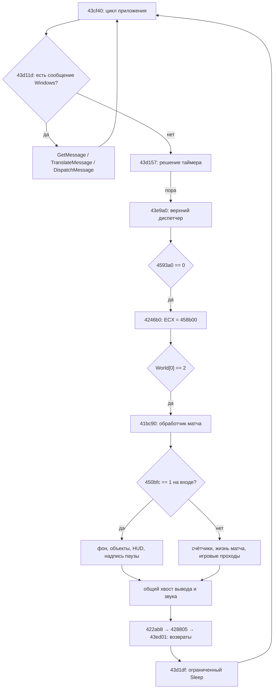

# R01.1 — границы и порядок такта оригинала

Эталон: SHA-256 `3f7ac67c5890ef979ee24a6dae5528056e7f631725c292cf9cb0a928ebeff71c`.
Исследование начато с коммита `c9a5263`, 2026-09-07.
Связанные документы: [карточка](R01.1.md), [пропуски переноса](TICK_GAPS.md).

**Установлена граница обычной обработки матча: `0x41bc90..0x422ab8`,
`ECX = World`, один стековый аргумент поверхности вывода, `ret 4`.**
Называть эту функцию чистой симуляцией нельзя: внутри находятся ввод, состояние
матча, игровые проходы, отрисовка, HUD и обработка звука. Пауза проходит через
тот же вход, но обходит игровые проходы.

## Доказательства и их пределы

- **S:** [inspect_tick.py](../../tools/inspect_tick.py) заново дизассемблирует
  идентифицированный EXE через `llvm-objdump`, сверяет байты с PE и сохраняет
  индекс вызовов, переходов и возвратов четырёх функций. В теле матча 6 822
  инструкции, 334 call sites, 1 085 прямых внутренних переходов и один обычный
  `ret 4` в `0x422ab8`. Косвенных jump в этом теле не найдено. Это индекс,
  а не доказательство достижимости всех ветвей или отсутствия исключений SEH.
- **D, исследовательский стенд:** [oracle_tick_trace.py](../../tools/oracle_tick_trace.py)
  выполняет исходные диспетчеры и обработчик матча от входов до возвратов.
  Получены 32 наблюдения в шести случаях, содержащие 29 вызовов обработчика
  матча. Четыре из них проходят паузу, ещё два — паузу вокруг команды шага.
  Временной случай исполняет также исходный участок внешнего таймера.
- **Не подтверждено:** загрузка целого матча, все внутренние ветви, эквивалентность
  Swift этому широкому пути, пиксели, сведение звука, задержка и целая игра Windows.
  Частичная загрузка DAT и заменённые внешние вызовы перечислены ниже.

Принятые отчёты: [адресный индекс](../evidence/tick-address-index.json),
[трассы](../evidence/tick-trace.json). Они содержат хеши полных воспроизводимых
артефактов из `build/`. Это отдельное доказательство; прежние 16 685 тактов не
переклассифицируются как проверка полного матча.

## Путь от времени до матча



В графе опущены внутренние ветви меню и результатов; их адресные границы ниже.
Условие паузы снимается после обновления очереди паузы, до обработки команд
текущего вызова. Поэтому надпись «на входе» означает вход в обработку этого
матча после `0x41bcf3`, а не неизменяемое значение до вызова функции.

| Связь | Основание |
| --- | --- |
| CRT → `0x43cf40` | Единственный найденный прямой call site `0x4453da`; ранний возврат `0x43cf91`, обычный выход из цикла `0x43d21f` |
| Таймер → `0x43e9a0` | `0x43d182` в ветке 33 мс, `0x43d1c3` в ветке 3 мс; оба передают один аргумент, очищаемый вызывающей стороной |
| Верхний диспетчер → `0x4246b0` | `0x43eca6` проверяет `[0x4593a0] == 0`; `0x43ecb5` задаёт `ECX=0x458b00`, `0x43ecba` вызывает функцию |
| Диспетчер режима → `0x41bc90` | `0x42473b` проверяет `[ECX] == 2`, `0x424741` вызывает обработчик; `[ECX] == 1` ведёт в инициализацию и затем устанавливает 2 |
| Матч → возврат | Все прямые переходы тела остаются внутри границы; единственный обычный `ret 4` — `0x422ab8` |

`0x43e9a0` также обрабатывает служебную последовательность клавиш, очистку
поверхности и другие состояния. При `[0x4593a0] == 1` есть путь загрузки
`data/data.txt` и вызов `0x4151d0`; при значении 2 — `0x414b70`.
Это не дополнительные игровые такты. Начальную загрузку мира выполняет и
ветка самого матча при `[0x44d05c] == 1`: каталог создаётся в `0x41bff0`,
загружается через `0x4122f0`, Actor выделяются по **0x420 байт** в `0x41c070`.
Размер каталога в этой аллокации — `0x4d823a8`; обе структуры требуют R02/R03.

## Время, фазы и пауза

Внешний цикл загружает `timeGetTime` из IAT `0x447250` в EDI (`0x43cf45`).
При отсутствии сообщений нормальная ветка `[0x44d02c] != 0` вызывает диспетчер
при **unsigned `(now - baseline) > 33`**, затем увеличивает baseline на 33.
Если разность больше 100, перед увеличением baseline становится `now - 100`.
Ветка с нулевым флагом использует 3 вместо 33. После решения исходный код
вызывает Sleep, только если рассчитанный остаток положителен, максимум на 5 мс.
Возврат к циклу — `0x43d1ef..0x43d20f`. Время не передаётся физике как delta-time.

В исследовательском случае отсчёты `[0, 33, 34, 66, 67, 100]` дают
`[0, 0, 1, 0, 1, 1]` вызовов матча. Здесь диспетчер действительно выполняется;
старый `oracle_presentation.py` вместо него считает вызовы. Обработка очереди
Windows, ожидание реального дисплея и полный набор режимов времени остаются
вне исполнения нового стенда. Единственное прямое чтение timeGetTime внутри
самого тела матча — `0x422a8a`, в ветке возврата из диалога; это не таймер физики.
GetTickCount не читается напрямую этим телом. Вложенные платформенные пути
нельзя считать исследованными этим поиском.

| Поле | Наблюдённая роль и место |
| --- | --- |
| `0x450b90` | `(old + 1) % 2` со знаковой арифметикой в `0x41bcda..0x41bcf3`; чередует фазы ввода и служебного обмена. Симуляция идёт в обеих фазах |
| `0x450bfc` | 1 выбирает паузу; 2 разрешает текущую обработку и записывает 1 в `0x41d79e..0x41d7a6` |
| `0x44fb60`, `0x44fcb0` | При фазе 0 первое копируется в pause, второе — в первое (`0x41bcfa..0x41bd0c`) |
| `0x450b84`, `0x450b80` | Ветки воспроизведения и записи входов; R16. Оба выключены в обычных трассах |
| `0x44f1af` | Выбирает сетевые ветви обмена; в трассах ноль. Сами два socket thunks всё ещё вызываются на фазе 0 |
| `0x44d020` | Ненулевое значение в `0x41dd6e` уводит в `0x429730` через `0x4229cc`, минуя игровые проходы; перечисление состояний диалога — R15 |
| `0x451160` | Режим, передаваемый вводу, контролю, контактам, рисованию и планировщику. Трассы используют 0; ветви 1/4 вызывают дополнительные обработчики |
| `0x450bd0`, `0x450bd4`, `0x450bd8` | На неприостановленном пути: счётчики modulo 12, modulo 3 и переключатель 0/1 (`0x41d7ac..0x41d7ee`) |

Команда `0x416df0(&0x44d020)` при нулевом состоянии диалога задаёт очередь
`followingPause=1, pendingPause=0`. В трассе из исходной паузы последующие четыре
вызова дают **пауза → обновление → обновление → пауза**. Нельзя переносить её
как один вызов нынешнего Swift tick. Полный разбор горячих клавиш — R04/R15.

## Стадии неприостановленного пути

Циклы ниже читают активность слота из `World+4+i` и указатель из
`World+0x194+4*i`. Диапазон — 0…399. Проверки делаются во время обхода;
созданный или удалённый объект меняет дальнейший обход текущего такта.
Таблица описывает границы стадий; внутренние специальные состояния остаются
самостоятельными задачами, а не подразумеваемыми реализованными правилами.

| Порядок / адрес | Условия, чтения и изменения |
| --- | --- |
| 1. `0x41bcd0..0x41c581` | Фаза и очередь паузы; воспроизведение/камера; при `44d05c=1` загрузка и создание начального мира |
| 2. `0x41c5e0 → 0x419a60` | Локальные входные слоты, когда локально сохранённый признак паузы равен 0. Аргументы: фаза, режим, буфер команд |
| 3. `0x41c5e5..0x41d469` | Только фаза 0: socket thunks, локальные горячие клавиши или сетевой обмен. `44f1af=0` выбирает локальную ветку, но не убирает первые вызовы thunks |
| 4. `0x41d490 → 0x4198f0` | Нормализованные входы; аргументы: `0x44f198`, фаза, буфер команд. Затем условные чтение/запись повтора и счётчик `450b8c` |
| 5. `0x41d734..0x41d79e` | При сохранённой паузе: фон → объекты → HUD → надпись паузы → общий хвост. Контроль, физика, контакты и восстановление не выполняются |
| 6. `0x41d7ac..0x41e339` | Периодические счётчики; команды/состояние раунда, команды игроков при переходах. `44d020 != 0` — диалог. `450bdc >= 350` — ветка пересоздания/перехода; подробные результаты и режимы — R10/R15 |
| 7. `0x41e345..0x41e62e` | По активным слотам: `0x413080(phase, mode)`, затем специальные состояния. State 400/401 при `450bd8=0` вызывает `0x403270` с аргументом 1/2; state 500/501 читает/меняет ссылки трансформации |
| 8. `0x41e640..0x41eecb` | По активным слотам: `0x40e490`, затем встроенные в цикл специальные состояния, создание и замена определений. Исполнить только callee физики недостаточно |
| 9. `0x41eed3 → 0x417f80` | Ограничение глубины перед контактами |
| 10. `0x41eed8..0x41eef6` | При `44d05c=2` сбор контактов пропускается, флаг сбрасывается; иначе `0x419380(mode)` |
| 11. `0x41ef0b..0x41ef53` | Первая обработка попаданий `0x42e100(i)` **только для type 0**. Одновременно считается количество type 1/2/4/6 в `0x45115c` |
| 12. `0x41ef55..0x41f276` | Если предметов меньше 4, вызов исходного RNG `(146, 200)` в `0x41ef6c`; нулевой результат разрешает попытку создания. Каталог кандидатов ID 100…199, особые фильтры 122/123 и режимов; исходная аллокация слота начинается с 50. Полная семантика — R06/R11 |
| 13. `0x41f27e..0x41f2aa` | Вторая обработка попаданий `0x42e100(i)` **только для signed type > 0**, включая снаряды. Она идёт независимо от того, создался ли предмет |
| 14. `0x41f2ae`, `0x41f2b3` | `0x418c30`, затем `0x4187b0`: обработчики связей, использующие блок кадра `+0x88` (cpoint). Точные значения полей и все эффекты — R09 |
| 15. `0x41f2b8..0x41f477` | Проверка живой взаимной связи Actor `+0x98/+0x9c/+0xa0`; недействительные ссылки снимаются |
| 16. `0x41f47f`, `0x41f491`, `0x41f4a7` | Повторное ограничение Z → границы/камера/фон `0x41b5d0` → объекты `0x41a5a0`. Исходная сортировка объектов для вывода находится внутри последней функции |
| 17. `0x41f4ac..0x41f53e` | Дополнительные обработчики: mode 1 → `0x437860`, mode 4 → `0x43a860`; затем форматирование и вывод строки диагностики. Эти вызовы нельзя автоматически считать только графикой |
| 18. `0x41f540 → 0x4196f0` | Применение накопленных импульсов **после** рисунка объектов |
| 19. `0x41f550..0x4214cf` | Один последовательный обход слотов: специальные состояния/создания до планировщика; восстановление HP/MP для type 0; `0x40d960(mode, slot)` в `0x41fb06`; реакции после планировщика; opoint; другие создания; удаление. Нельзя разбить это на независимые обходы всех объектов |
| 20. `0x4214d5..0x421799` | Создание предметов по запросу `450bb8=1` из каталога исходных ID |
| 21. `0x4217b0..0x421a0f` | По активным слотам: запрос удаления/ресурсов; таймеры Actor `+0xe0/+0xe4`; лечение; state 1700; сброс `+0x2e8/+0x2ec/+0x2f0=1000`, `+0x2e4=0`, byte `+0xeb=0` |
| 22. `0x421a15..0x422994` | Сброс `450bc0/450bb8`; HUD `0x41ae60`; условная диагностика и результаты. При `450bdc<100` увеличивается `450bbc`; unsigned `450bdc-101 > 248` обходит таблицу результатов. Внутренняя ветка записи результата — R10/R15/R16 |
| 23. `0x422994..0x4229c7` | `0x41b130` обновляет строку режима/вывод; `0x4028a0` обрабатывает громкость и уведомления; `0x43e940` показывает поверхность; `0x419e60` обрабатывает накопленный звук; затем эпилог |

Отдельная ветка `0x4229cc..0x422a95` обслуживает диалог через `0x429730`,
показывает поверхность и при возврате к `44d020=0` сохраняет timeGetTime в
`451154`. Это не продолжение обычного симуляционного прохода.

## Два проверяемых расхождения с прежним срезом

1. В подготовленном неподвижном бою двух персонажей исходный широкий путь расходует RNG на
   проверку появления предмета. В четырёх исследованных вызовах счётчик RNG
   становится 1, 2, 3, 4; прежний `Projectiles.tick2` этот вызов не содержит.
   Даже отсутствие созданного предмета не означает отсутствие влияния на RNG.
2. При исходных HP=400, recoverableHP=500 и MP=100 у Наруто через 12 вызовов
   HP=401, MP=107. MP увеличивается на вызовах 3/6/9/12, HP — на 12-м.
   Последнее увеличение MP равно 1, поскольку HP уже увеличено перед вычислением.
   Это свидетельство порядка и выбранного случая, **не полная спецификация
   регенерации**: условия клонов, отрицательных значений, ID 51/52 и другие
   ветви ещё требуют исследования R10/R11.

`sliceComparison` отчёта повторяет те же начальные HP/MP и отсутствие нажатий
через прежний `Projectiles.tick2`: там все 12 наблюдений сохраняют RNG counter=0,
HP=400, MP=100. Сравниваются именно эти три поля; различия остальных условий
старого и нового стенда не скрываются за заявлением полной эквивалентности.

## Инициализация и внешние границы трассы

Стенд наследует ограниченные определения/заголовки и исходный RNG из
`Projectiles`, создаёт два активных Actor конструктором `0x4061d0`, задаёт
позиции 350/550, y=0, z=490 и команды 1/2. Для остальных 398 слотов конструктор
также выполняется. Actor размещены с шагом стенда 0x500; **оригинальная
аллокация — 0x420, не 0x500**. Копируются используемые 0x7d8 байт World в
исходный статический адрес `0x458b00`; dword состояния World задаётся равным 2.
Полный исходный конструктор World этим не заменён доказанным аналогом.

Селекторы явно задаются в коде и сохраняются в корпусе: режим/диалог/загрузка/
пауза, оба входных слота и фаза. Остальная память происходит из отображённых
секций EXE и существующего стенда; полная карта defaults ещё не восстановлена.
Обычные случаи не нажимают клавиш и не включают AI. В дополнительном случае
исходный объект 440 помещён в слот 50 с кадром 1 для проверки второго прохода.
Полного каталога предметов, bitmap-заголовков и слоёв арены в стенде нет.

Исполняются исходные `43e9a0`, `4246b0`, `41bc90`, функции контроля, физики,
контактов, связей, камеры, сортировки/отрисовки объектов, планировщика и HUD.
Не перехватываются и не переставляются отдельные игровые стадии.

| Заменённая граница | Что делает стенд |
| --- | --- |
| `0x401250`, `0x401290`, `0x43f010`, `0x43f310` | Записывает аргументы очистки/текста/bitmap/прямоугольника, возвращает EAX=0 с исходной очисткой стека; нет устройства и пикселей |
| `0x43e940` | Записывает способ показа поверхности, возвращает 0; нет ожидания/ошибок DirectDraw |
| `0x43f396`, `0x43f3d8` | Два WSOCK32 thunks: фиксированный результат 0; для переданного указателя количества входных байт — 0. Это управляемая граница «нет событий», не исполнение Windows sockets |
| timeGetTime / Sleep в случае таймера | Управляемые отсчёты и запись длительности Sleep; нет реального ожидания |
| Унаследованные CRT/audio | Ограниченные fscanf/malloc/sprintf и memset; звук кадра/встроенный звук перехватываются; CRT rand для искр возвращает 0. Подробности в существующих oracle scripts |
| Debug sprintf из `0x41f516` | Поддержан только обнаруженный формат из шести signed `%d`; прочие неизвестные форматы завершают исследование ошибкой |

Audio-enable остаётся выключенным: `0x419e60` выполняет исходный быстрый возврат.
Всякий неизвестный импорт, формат или недопустимый доступ останавливает запуск;
страница `fs:[0]` не разрешает случайные чтения нулевых игровых указателей.

## Воспроизведение и продолжение

При наличии импортированных исходных ресурсов (`build/imported/game.json`):

```bash
python3 tools/inspect_tick.py
uv run tools/oracle_tick_trace.py
```

Индекс: `build/research/tick-address-index.json`; трассы, аргументы границ,
наблюдаемые globals и места записей: `build/original/tick-trace.json`.
Команды также обновляют компактные отчёты в `docs/evidence/`.

Следующий обязательный шаг — [R02.1](R02.1.md): полное состояние объявленного
такта, типы и инициализация. После него и R03.1 — [R01.2](R01.2.md): убрать
необоснованные defaults стенда, получить полный снимок и сравнение широкого
пути с нативным кодом. Windows-эталон W остаётся отдельной незакрытой проверкой.
